# Aula 04 - Exploração e Visualização

Uma parte fundamental do kit de ferramentas do cientista de dados é a visualização de dados. Embora seja muito fácil criar visualizações, é muito mais difícil produzir boas visualizações.

Existem dois usos principais para visualização de dados:

    Para explorar dados;
    Para comunicar dados.

Nesta aula, nos concentraremos em desenvolver as habilidades que você precisará para começar a explorar os seus próprios dados e produzir as visualizações que usaremos ao longo do curso.

Como a maioria dos tópicos que veremos, a visualização de dados é um rico campo de estudo que merece o seu próprio curso.

No entanto, vamos tentar dar uma ideia do que contribui para uma boa visualização e o que não contribui.


## Objetivos

1. Aprender Matplotlib
2. Aprender conceitos básicos de visualizar dados
3. Um pouco mais de filtro e seleção de dados

## Resultado Esperado

1. Junto com a aula passada, ferramentas simples para exploração de dados
1. Muito pode ser feito sem modelos (lembre do John-Snow Experiment)
1. Plots + Filtros!


```python
# -*- coding: utf8

import matplotlib.pyplot as plt
import numpy as np
import pandas as pd

# Colocando alguns defaults para embelezar os plots!
plt.rcParams['figure.figsize']  = (18, 10)
plt.rcParams['axes.labelsize']  = 20
plt.rcParams['axes.titlesize']  = 20
plt.rcParams['legend.fontsize'] = 20
plt.rcParams['xtick.labelsize'] = 20
plt.rcParams['ytick.labelsize'] = 20
plt.rcParams['lines.linewidth'] = 4
```


```python
plt.ion()

plt.style.use('seaborn-colorblind')
plt.rcParams['figure.figsize']  = (12, 8) # não sei o motivo, mas o use acima reseta o size.
```

## EDA

Vamos iniciar explorando algumas chamadas sobre como fazer merge e tratar missing data. Alguns passos simples para
a Limpeza de Dados.


```python
people = pd.DataFrame(
    [["Joey",      "blue",       42,  "M"],
     ["Weiwei",    "blue",       50,  "F"],
     ["Joey",      "green",       8,  "M"],
     ["Karina",    "green",  np.nan,  "F"],
     ["Fernando",  "pink",        9,  "M"],
     ["Nhi",       "blue",        3,  "F"],
     ["Sam",       "pink",   np.nan,  "M"]], 
    columns = ["Name", "Color", "Age", "Gender"])
people
```


<div>
<style scoped>
    .dataframe tbody tr th:only-of-type {
        vertical-align: middle;
    }

    .dataframe tbody tr th {
        vertical-align: top;
    }

    .dataframe thead th {
        text-align: right;
    }
</style>
<table border="1" class="dataframe">
  <thead>
    <tr style="text-align: right;">
      <th></th>
      <th>Name</th>
      <th>Color</th>
      <th>Age</th>
      <th>Gender</th>
    </tr>
  </thead>
  <tbody>
    <tr>
      <th>0</th>
      <td>Joey</td>
      <td>blue</td>
      <td>42.0</td>
      <td>M</td>
    </tr>
    <tr>
      <th>1</th>
      <td>Weiwei</td>
      <td>blue</td>
      <td>50.0</td>
      <td>F</td>
    </tr>
    <tr>
      <th>2</th>
      <td>Joey</td>
      <td>green</td>
      <td>8.0</td>
      <td>M</td>
    </tr>
    <tr>
      <th>3</th>
      <td>Karina</td>
      <td>green</td>
      <td>NaN</td>
      <td>F</td>
    </tr>
    <tr>
      <th>4</th>
      <td>Fernando</td>
      <td>pink</td>
      <td>9.0</td>
      <td>M</td>
    </tr>
    <tr>
      <th>5</th>
      <td>Nhi</td>
      <td>blue</td>
      <td>3.0</td>
      <td>F</td>
    </tr>
    <tr>
      <th>6</th>
      <td>Sam</td>
      <td>pink</td>
      <td>NaN</td>
      <td>M</td>
    </tr>
  </tbody>
</table>
</div>


```python
email = pd.DataFrame(
    [["Deb",  "deborah_nolan@berkeley.edu"],
     ["Sam",  np.nan],
     ["John", "doe@nope.com"],
     ["Joey", "jegonzal@cs.berkeley.edu"],
     ["Weiwei", "weiwzhang@berkeley.edu"],
     ["Weiwei", np.nan],
     ["Karina", "kgoot@berkeley.edu"]], 
    columns = ["User Name", "Email"])
email
```


<div>
<style scoped>
    .dataframe tbody tr th:only-of-type {
        vertical-align: middle;
    }

    .dataframe tbody tr th {
        vertical-align: top;
    }

    .dataframe thead th {
        text-align: right;
    }
</style>
<table border="1" class="dataframe">
  <thead>
    <tr style="text-align: right;">
      <th></th>
      <th>User Name</th>
      <th>Email</th>
    </tr>
  </thead>
  <tbody>
    <tr>
      <th>0</th>
      <td>Deb</td>
      <td>deborah_nolan@berkeley.edu</td>
    </tr>
    <tr>
      <th>1</th>
      <td>Sam</td>
      <td>NaN</td>
    </tr>
    <tr>
      <th>2</th>
      <td>John</td>
      <td>doe@nope.com</td>
    </tr>
    <tr>
      <th>3</th>
      <td>Joey</td>
      <td>jegonzal@cs.berkeley.edu</td>
    </tr>
    <tr>
      <th>4</th>
      <td>Weiwei</td>
      <td>weiwzhang@berkeley.edu</td>
    </tr>
    <tr>
      <th>5</th>
      <td>Weiwei</td>
      <td>NaN</td>
    </tr>
    <tr>
      <th>6</th>
      <td>Karina</td>
      <td>kgoot@berkeley.edu</td>
    </tr>
  </tbody>
</table>
</div>


```python
people.merge(email, 
             how = "inner",
             left_on = "Name", right_on = "User Name")
```


<div>
<style scoped>
    .dataframe tbody tr th:only-of-type {
        vertical-align: middle;
    }

    .dataframe tbody tr th {
        vertical-align: top;
    }

    .dataframe thead th {
        text-align: right;
    }
</style>
<table border="1" class="dataframe">
  <thead>
    <tr style="text-align: right;">
      <th></th>
      <th>Name</th>
      <th>Color</th>
      <th>Age</th>
      <th>Gender</th>
      <th>User Name</th>
      <th>Email</th>
    </tr>
  </thead>
  <tbody>
    <tr>
      <th>0</th>
      <td>Joey</td>
      <td>blue</td>
      <td>42.0</td>
      <td>M</td>
      <td>Joey</td>
      <td>jegonzal@cs.berkeley.edu</td>
    </tr>
    <tr>
      <th>1</th>
      <td>Joey</td>
      <td>green</td>
      <td>8.0</td>
      <td>M</td>
      <td>Joey</td>
      <td>jegonzal@cs.berkeley.edu</td>
    </tr>
    <tr>
      <th>2</th>
      <td>Weiwei</td>
      <td>blue</td>
      <td>50.0</td>
      <td>F</td>
      <td>Weiwei</td>
      <td>weiwzhang@berkeley.edu</td>
    </tr>
    <tr>
      <th>3</th>
      <td>Weiwei</td>
      <td>blue</td>
      <td>50.0</td>
      <td>F</td>
      <td>Weiwei</td>
      <td>NaN</td>
    </tr>
    <tr>
      <th>4</th>
      <td>Karina</td>
      <td>green</td>
      <td>NaN</td>
      <td>F</td>
      <td>Karina</td>
      <td>kgoot@berkeley.edu</td>
    </tr>
    <tr>
      <th>5</th>
      <td>Sam</td>
      <td>pink</td>
      <td>NaN</td>
      <td>M</td>
      <td>Sam</td>
      <td>NaN</td>
    </tr>
  </tbody>
</table>
</div>


Como podemos tratar?

1. Missing data nas cores?
2. Missing data nos e-mails?


```python
people['Age'] = people['Age'].fillna(people['Age'].mean())
people
```


<div>
<style scoped>
    .dataframe tbody tr th:only-of-type {
        vertical-align: middle;
    }

    .dataframe tbody tr th {
        vertical-align: top;
    }

    .dataframe thead th {
        text-align: right;
    }
</style>
<table border="1" class="dataframe">
  <thead>
    <tr style="text-align: right;">
      <th></th>
      <th>Name</th>
      <th>Color</th>
      <th>Age</th>
      <th>Gender</th>
    </tr>
  </thead>
  <tbody>
    <tr>
      <th>0</th>
      <td>Joey</td>
      <td>blue</td>
      <td>42.0</td>
      <td>M</td>
    </tr>
    <tr>
      <th>1</th>
      <td>Weiwei</td>
      <td>blue</td>
      <td>50.0</td>
      <td>F</td>
    </tr>
    <tr>
      <th>2</th>
      <td>Joey</td>
      <td>green</td>
      <td>8.0</td>
      <td>M</td>
    </tr>
    <tr>
      <th>3</th>
      <td>Karina</td>
      <td>green</td>
      <td>22.4</td>
      <td>F</td>
    </tr>
    <tr>
      <th>4</th>
      <td>Fernando</td>
      <td>pink</td>
      <td>9.0</td>
      <td>M</td>
    </tr>
    <tr>
      <th>5</th>
      <td>Nhi</td>
      <td>blue</td>
      <td>3.0</td>
      <td>F</td>
    </tr>
    <tr>
      <th>6</th>
      <td>Sam</td>
      <td>pink</td>
      <td>22.4</td>
      <td>M</td>
    </tr>
  </tbody>
</table>
</div>


```python
email.dropna()
```


<div>
<style scoped>
    .dataframe tbody tr th:only-of-type {
        vertical-align: middle;
    }

    .dataframe tbody tr th {
        vertical-align: top;
    }

    .dataframe thead th {
        text-align: right;
    }
</style>
<table border="1" class="dataframe">
  <thead>
    <tr style="text-align: right;">
      <th></th>
      <th>User Name</th>
      <th>Email</th>
    </tr>
  </thead>
  <tbody>
    <tr>
      <th>0</th>
      <td>Deb</td>
      <td>deborah_nolan@berkeley.edu</td>
    </tr>
    <tr>
      <th>2</th>
      <td>John</td>
      <td>doe@nope.com</td>
    </tr>
    <tr>
      <th>3</th>
      <td>Joey</td>
      <td>jegonzal@cs.berkeley.edu</td>
    </tr>
    <tr>
      <th>4</th>
      <td>Weiwei</td>
      <td>weiwzhang@berkeley.edu</td>
    </tr>
    <tr>
      <th>6</th>
      <td>Karina</td>
      <td>kgoot@berkeley.edu</td>
    </tr>
  </tbody>
</table>
</div>


Voltando para os dados de nomes.


```python
df = pd.read_csv('https://media.githubusercontent.com/media/icd-ufmg/material/master/aulas/04-EDA-e-Vis/baby.csv')
df
```


<div>
<style scoped>
    .dataframe tbody tr th:only-of-type {
        vertical-align: middle;
    }

    .dataframe tbody tr th {
        vertical-align: top;
    }

    .dataframe thead th {
        text-align: right;
    }
</style>
<table border="1" class="dataframe">
  <thead>
    <tr style="text-align: right;">
      <th></th>
      <th>Id</th>
      <th>Name</th>
      <th>Year</th>
      <th>Gender</th>
      <th>State</th>
      <th>Count</th>
    </tr>
  </thead>
  <tbody>
    <tr>
      <th>0</th>
      <td>1</td>
      <td>Mary</td>
      <td>1910</td>
      <td>F</td>
      <td>AK</td>
      <td>14</td>
    </tr>
    <tr>
      <th>1</th>
      <td>2</td>
      <td>Annie</td>
      <td>1910</td>
      <td>F</td>
      <td>AK</td>
      <td>12</td>
    </tr>
    <tr>
      <th>2</th>
      <td>3</td>
      <td>Anna</td>
      <td>1910</td>
      <td>F</td>
      <td>AK</td>
      <td>10</td>
    </tr>
    <tr>
      <th>3</th>
      <td>4</td>
      <td>Margaret</td>
      <td>1910</td>
      <td>F</td>
      <td>AK</td>
      <td>8</td>
    </tr>
    <tr>
      <th>4</th>
      <td>5</td>
      <td>Helen</td>
      <td>1910</td>
      <td>F</td>
      <td>AK</td>
      <td>7</td>
    </tr>
    <tr>
      <th>5</th>
      <td>6</td>
      <td>Elsie</td>
      <td>1910</td>
      <td>F</td>
      <td>AK</td>
      <td>6</td>
    </tr>
    <tr>
      <th>6</th>
      <td>7</td>
      <td>Lucy</td>
      <td>1910</td>
      <td>F</td>
      <td>AK</td>
      <td>6</td>
    </tr>
    <tr>
      <th>7</th>
      <td>8</td>
      <td>Dorothy</td>
      <td>1910</td>
      <td>F</td>
      <td>AK</td>
      <td>5</td>
    </tr>
    <tr>
      <th>8</th>
      <td>9</td>
      <td>Mary</td>
      <td>1911</td>
      <td>F</td>
      <td>AK</td>
      <td>12</td>
    </tr>
    <tr>
      <th>9</th>
      <td>10</td>
      <td>Margaret</td>
      <td>1911</td>
      <td>F</td>
      <td>AK</td>
      <td>7</td>
    </tr>
    <tr>
      <th>10</th>
      <td>11</td>
      <td>Ruth</td>
      <td>1911</td>
      <td>F</td>
      <td>AK</td>
      <td>7</td>
    </tr>
    <tr>
      <th>11</th>
      <td>12</td>
      <td>Annie</td>
      <td>1911</td>
      <td>F</td>
      <td>AK</td>
      <td>6</td>
    </tr>
    <tr>
      <th>12</th>
      <td>13</td>
      <td>Elizabeth</td>
      <td>1911</td>
      <td>F</td>
      <td>AK</td>
      <td>6</td>
    </tr>
    <tr>
      <th>13</th>
      <td>14</td>
      <td>Helen</td>
      <td>1911</td>
      <td>F</td>
      <td>AK</td>
      <td>6</td>
    </tr>
    <tr>
      <th>14</th>
      <td>15</td>
      <td>Mary</td>
      <td>1912</td>
      <td>F</td>
      <td>AK</td>
      <td>9</td>
    </tr>
    <tr>
      <th>15</th>
      <td>16</td>
      <td>Elsie</td>
      <td>1912</td>
      <td>F</td>
      <td>AK</td>
      <td>8</td>
    </tr>
    <tr>
      <th>16</th>
      <td>17</td>
      <td>Agnes</td>
      <td>1912</td>
      <td>F</td>
      <td>AK</td>
      <td>7</td>
    </tr>
    <tr>
      <th>17</th>
      <td>18</td>
      <td>Anna</td>
      <td>1912</td>
      <td>F</td>
      <td>AK</td>
      <td>7</td>
    </tr>
    <tr>
      <th>18</th>
      <td>19</td>
      <td>Helen</td>
      <td>1912</td>
      <td>F</td>
      <td>AK</td>
      <td>7</td>
    </tr>
    <tr>
      <th>19</th>
      <td>20</td>
      <td>Louise</td>
      <td>1912</td>
      <td>F</td>
      <td>AK</td>
      <td>7</td>
    </tr>
    <tr>
      <th>20</th>
      <td>21</td>
      <td>Jean</td>
      <td>1912</td>
      <td>F</td>
      <td>AK</td>
      <td>6</td>
    </tr>
    <tr>
      <th>21</th>
      <td>22</td>
      <td>Ruth</td>
      <td>1912</td>
      <td>F</td>
      <td>AK</td>
      <td>6</td>
    </tr>
    <tr>
      <th>22</th>
      <td>23</td>
      <td>Alice</td>
      <td>1912</td>
      <td>F</td>
      <td>AK</td>
      <td>5</td>
    </tr>
    <tr>
      <th>23</th>
      <td>24</td>
      <td>Esther</td>
      <td>1912</td>
      <td>F</td>
      <td>AK</td>
      <td>5</td>
    </tr>
    <tr>
      <th>24</th>
      <td>25</td>
      <td>Ethel</td>
      <td>1912</td>
      <td>F</td>
      <td>AK</td>
      <td>5</td>
    </tr>
    <tr>
      <th>25</th>
      <td>26</td>
      <td>Margaret</td>
      <td>1912</td>
      <td>F</td>
      <td>AK</td>
      <td>5</td>
    </tr>
    <tr>
      <th>26</th>
      <td>27</td>
      <td>Marie</td>
      <td>1912</td>
      <td>F</td>
      <td>AK</td>
      <td>5</td>
    </tr>
    <tr>
      <th>27</th>
      <td>28</td>
      <td>Mary</td>
      <td>1913</td>
      <td>F</td>
      <td>AK</td>
      <td>21</td>
    </tr>
    <tr>
      <th>28</th>
      <td>29</td>
      <td>Elizabeth</td>
      <td>1913</td>
      <td>F</td>
      <td>AK</td>
      <td>9</td>
    </tr>
    <tr>
      <th>29</th>
      <td>30</td>
      <td>Margaret</td>
      <td>1913</td>
      <td>F</td>
      <td>AK</td>
      <td>8</td>
    </tr>
    <tr>
      <th>...</th>
      <td>...</td>
      <td>...</td>
      <td>...</td>
      <td>...</td>
      <td>...</td>
      <td>...</td>
    </tr>
    <tr>
      <th>5647396</th>
      <td>5647397</td>
      <td>Brooks</td>
      <td>2014</td>
      <td>M</td>
      <td>WY</td>
      <td>5</td>
    </tr>
    <tr>
      <th>5647397</th>
      <td>5647398</td>
      <td>Calvin</td>
      <td>2014</td>
      <td>M</td>
      <td>WY</td>
      <td>5</td>
    </tr>
    <tr>
      <th>5647398</th>
      <td>5647399</td>
      <td>Cameron</td>
      <td>2014</td>
      <td>M</td>
      <td>WY</td>
      <td>5</td>
    </tr>
    <tr>
      <th>5647399</th>
      <td>5647400</td>
      <td>Dalton</td>
      <td>2014</td>
      <td>M</td>
      <td>WY</td>
      <td>5</td>
    </tr>
    <tr>
      <th>5647400</th>
      <td>5647401</td>
      <td>Dawson</td>
      <td>2014</td>
      <td>M</td>
      <td>WY</td>
      <td>5</td>
    </tr>
    <tr>
      <th>5647401</th>
      <td>5647402</td>
      <td>Edward</td>
      <td>2014</td>
      <td>M</td>
      <td>WY</td>
      <td>5</td>
    </tr>
    <tr>
      <th>5647402</th>
      <td>5647403</td>
      <td>Elias</td>
      <td>2014</td>
      <td>M</td>
      <td>WY</td>
      <td>5</td>
    </tr>
    <tr>
      <th>5647403</th>
      <td>5647404</td>
      <td>Gage</td>
      <td>2014</td>
      <td>M</td>
      <td>WY</td>
      <td>5</td>
    </tr>
    <tr>
      <th>5647404</th>
      <td>5647405</td>
      <td>Hayden</td>
      <td>2014</td>
      <td>M</td>
      <td>WY</td>
      <td>5</td>
    </tr>
    <tr>
      <th>5647405</th>
      <td>5647406</td>
      <td>Jasper</td>
      <td>2014</td>
      <td>M</td>
      <td>WY</td>
      <td>5</td>
    </tr>
    <tr>
      <th>5647406</th>
      <td>5647407</td>
      <td>Jose</td>
      <td>2014</td>
      <td>M</td>
      <td>WY</td>
      <td>5</td>
    </tr>
    <tr>
      <th>5647407</th>
      <td>5647408</td>
      <td>Kaiden</td>
      <td>2014</td>
      <td>M</td>
      <td>WY</td>
      <td>5</td>
    </tr>
    <tr>
      <th>5647408</th>
      <td>5647409</td>
      <td>Kaleb</td>
      <td>2014</td>
      <td>M</td>
      <td>WY</td>
      <td>5</td>
    </tr>
    <tr>
      <th>5647409</th>
      <td>5647410</td>
      <td>Kasen</td>
      <td>2014</td>
      <td>M</td>
      <td>WY</td>
      <td>5</td>
    </tr>
    <tr>
      <th>5647410</th>
      <td>5647411</td>
      <td>Kyson</td>
      <td>2014</td>
      <td>M</td>
      <td>WY</td>
      <td>5</td>
    </tr>
    <tr>
      <th>5647411</th>
      <td>5647412</td>
      <td>Lukas</td>
      <td>2014</td>
      <td>M</td>
      <td>WY</td>
      <td>5</td>
    </tr>
    <tr>
      <th>5647412</th>
      <td>5647413</td>
      <td>Myles</td>
      <td>2014</td>
      <td>M</td>
      <td>WY</td>
      <td>5</td>
    </tr>
    <tr>
      <th>5647413</th>
      <td>5647414</td>
      <td>Nathaniel</td>
      <td>2014</td>
      <td>M</td>
      <td>WY</td>
      <td>5</td>
    </tr>
    <tr>
      <th>5647414</th>
      <td>5647415</td>
      <td>Nolan</td>
      <td>2014</td>
      <td>M</td>
      <td>WY</td>
      <td>5</td>
    </tr>
    <tr>
      <th>5647415</th>
      <td>5647416</td>
      <td>Oakley</td>
      <td>2014</td>
      <td>M</td>
      <td>WY</td>
      <td>5</td>
    </tr>
    <tr>
      <th>5647416</th>
      <td>5647417</td>
      <td>Odin</td>
      <td>2014</td>
      <td>M</td>
      <td>WY</td>
      <td>5</td>
    </tr>
    <tr>
      <th>5647417</th>
      <td>5647418</td>
      <td>Paxton</td>
      <td>2014</td>
      <td>M</td>
      <td>WY</td>
      <td>5</td>
    </tr>
    <tr>
      <th>5647418</th>
      <td>5647419</td>
      <td>Raymond</td>
      <td>2014</td>
      <td>M</td>
      <td>WY</td>
      <td>5</td>
    </tr>
    <tr>
      <th>5647419</th>
      <td>5647420</td>
      <td>Richard</td>
      <td>2014</td>
      <td>M</td>
      <td>WY</td>
      <td>5</td>
    </tr>
    <tr>
      <th>5647420</th>
      <td>5647421</td>
      <td>Rowan</td>
      <td>2014</td>
      <td>M</td>
      <td>WY</td>
      <td>5</td>
    </tr>
    <tr>
      <th>5647421</th>
      <td>5647422</td>
      <td>Seth</td>
      <td>2014</td>
      <td>M</td>
      <td>WY</td>
      <td>5</td>
    </tr>
    <tr>
      <th>5647422</th>
      <td>5647423</td>
      <td>Spencer</td>
      <td>2014</td>
      <td>M</td>
      <td>WY</td>
      <td>5</td>
    </tr>
    <tr>
      <th>5647423</th>
      <td>5647424</td>
      <td>Tyce</td>
      <td>2014</td>
      <td>M</td>
      <td>WY</td>
      <td>5</td>
    </tr>
    <tr>
      <th>5647424</th>
      <td>5647425</td>
      <td>Victor</td>
      <td>2014</td>
      <td>M</td>
      <td>WY</td>
      <td>5</td>
    </tr>
    <tr>
      <th>5647425</th>
      <td>5647426</td>
      <td>Waylon</td>
      <td>2014</td>
      <td>M</td>
      <td>WY</td>
      <td>5</td>
    </tr>
  </tbody>
</table>
<p>5647426 rows × 6 columns</p>
</div>


```python
cols = ['Year', 'Count']
df[cols]
```


<div>
<style scoped>
    .dataframe tbody tr th:only-of-type {
        vertical-align: middle;
    }

    .dataframe tbody tr th {
        vertical-align: top;
    }

    .dataframe thead th {
        text-align: right;
    }
</style>
<table border="1" class="dataframe">
  <thead>
    <tr style="text-align: right;">
      <th></th>
      <th>Year</th>
      <th>Count</th>
    </tr>
  </thead>
  <tbody>
    <tr>
      <th>0</th>
      <td>1910</td>
      <td>14</td>
    </tr>
    <tr>
      <th>1</th>
      <td>1910</td>
      <td>12</td>
    </tr>
    <tr>
      <th>2</th>
      <td>1910</td>
      <td>10</td>
    </tr>
    <tr>
      <th>3</th>
      <td>1910</td>
      <td>8</td>
    </tr>
    <tr>
      <th>4</th>
      <td>1910</td>
      <td>7</td>
    </tr>
    <tr>
      <th>5</th>
      <td>1910</td>
      <td>6</td>
    </tr>
    <tr>
      <th>6</th>
      <td>1910</td>
      <td>6</td>
    </tr>
    <tr>
      <th>7</th>
      <td>1910</td>
      <td>5</td>
    </tr>
    <tr>
      <th>8</th>
      <td>1911</td>
      <td>12</td>
    </tr>
    <tr>
      <th>9</th>
      <td>1911</td>
      <td>7</td>
    </tr>
    <tr>
      <th>10</th>
      <td>1911</td>
      <td>7</td>
    </tr>
    <tr>
      <th>11</th>
      <td>1911</td>
      <td>6</td>
    </tr>
    <tr>
      <th>12</th>
      <td>1911</td>
      <td>6</td>
    </tr>
    <tr>
      <th>13</th>
      <td>1911</td>
      <td>6</td>
    </tr>
    <tr>
      <th>14</th>
      <td>1912</td>
      <td>9</td>
    </tr>
    <tr>
      <th>15</th>
      <td>1912</td>
      <td>8</td>
    </tr>
    <tr>
      <th>16</th>
      <td>1912</td>
      <td>7</td>
    </tr>
    <tr>
      <th>17</th>
      <td>1912</td>
      <td>7</td>
    </tr>
    <tr>
      <th>18</th>
      <td>1912</td>
      <td>7</td>
    </tr>
    <tr>
      <th>19</th>
      <td>1912</td>
      <td>7</td>
    </tr>
    <tr>
      <th>20</th>
      <td>1912</td>
      <td>6</td>
    </tr>
    <tr>
      <th>21</th>
      <td>1912</td>
      <td>6</td>
    </tr>
    <tr>
      <th>22</th>
      <td>1912</td>
      <td>5</td>
    </tr>
    <tr>
      <th>23</th>
      <td>1912</td>
      <td>5</td>
    </tr>
    <tr>
      <th>24</th>
      <td>1912</td>
      <td>5</td>
    </tr>
    <tr>
      <th>25</th>
      <td>1912</td>
      <td>5</td>
    </tr>
    <tr>
      <th>26</th>
      <td>1912</td>
      <td>5</td>
    </tr>
    <tr>
      <th>27</th>
      <td>1913</td>
      <td>21</td>
    </tr>
    <tr>
      <th>28</th>
      <td>1913</td>
      <td>9</td>
    </tr>
    <tr>
      <th>29</th>
      <td>1913</td>
      <td>8</td>
    </tr>
    <tr>
      <th>...</th>
      <td>...</td>
      <td>...</td>
    </tr>
    <tr>
      <th>5647396</th>
      <td>2014</td>
      <td>5</td>
    </tr>
    <tr>
      <th>5647397</th>
      <td>2014</td>
      <td>5</td>
    </tr>
    <tr>
      <th>5647398</th>
      <td>2014</td>
      <td>5</td>
    </tr>
    <tr>
      <th>5647399</th>
      <td>2014</td>
      <td>5</td>
    </tr>
    <tr>
      <th>5647400</th>
      <td>2014</td>
      <td>5</td>
    </tr>
    <tr>
      <th>5647401</th>
      <td>2014</td>
      <td>5</td>
    </tr>
    <tr>
      <th>5647402</th>
      <td>2014</td>
      <td>5</td>
    </tr>
    <tr>
      <th>5647403</th>
      <td>2014</td>
      <td>5</td>
    </tr>
    <tr>
      <th>5647404</th>
      <td>2014</td>
      <td>5</td>
    </tr>
    <tr>
      <th>5647405</th>
      <td>2014</td>
      <td>5</td>
    </tr>
    <tr>
      <th>5647406</th>
      <td>2014</td>
      <td>5</td>
    </tr>
    <tr>
      <th>5647407</th>
      <td>2014</td>
      <td>5</td>
    </tr>
    <tr>
      <th>5647408</th>
      <td>2014</td>
      <td>5</td>
    </tr>
    <tr>
      <th>5647409</th>
      <td>2014</td>
      <td>5</td>
    </tr>
    <tr>
      <th>5647410</th>
      <td>2014</td>
      <td>5</td>
    </tr>
    <tr>
      <th>5647411</th>
      <td>2014</td>
      <td>5</td>
    </tr>
    <tr>
      <th>5647412</th>
      <td>2014</td>
      <td>5</td>
    </tr>
    <tr>
      <th>5647413</th>
      <td>2014</td>
      <td>5</td>
    </tr>
    <tr>
      <th>5647414</th>
      <td>2014</td>
      <td>5</td>
    </tr>
    <tr>
      <th>5647415</th>
      <td>2014</td>
      <td>5</td>
    </tr>
    <tr>
      <th>5647416</th>
      <td>2014</td>
      <td>5</td>
    </tr>
    <tr>
      <th>5647417</th>
      <td>2014</td>
      <td>5</td>
    </tr>
    <tr>
      <th>5647418</th>
      <td>2014</td>
      <td>5</td>
    </tr>
    <tr>
      <th>5647419</th>
      <td>2014</td>
      <td>5</td>
    </tr>
    <tr>
      <th>5647420</th>
      <td>2014</td>
      <td>5</td>
    </tr>
    <tr>
      <th>5647421</th>
      <td>2014</td>
      <td>5</td>
    </tr>
    <tr>
      <th>5647422</th>
      <td>2014</td>
      <td>5</td>
    </tr>
    <tr>
      <th>5647423</th>
      <td>2014</td>
      <td>5</td>
    </tr>
    <tr>
      <th>5647424</th>
      <td>2014</td>
      <td>5</td>
    </tr>
    <tr>
      <th>5647425</th>
      <td>2014</td>
      <td>5</td>
    </tr>
  </tbody>
</table>
<p>5647426 rows × 2 columns</p>
</div>


```python
df[cols].groupby('Year').sum()
```


<div>
<style scoped>
    .dataframe tbody tr th:only-of-type {
        vertical-align: middle;
    }

    .dataframe tbody tr th {
        vertical-align: top;
    }

    .dataframe thead th {
        text-align: right;
    }
</style>
<table border="1" class="dataframe">
  <thead>
    <tr style="text-align: right;">
      <th></th>
      <th>Count</th>
    </tr>
    <tr>
      <th>Year</th>
      <th></th>
    </tr>
  </thead>
  <tbody>
    <tr>
      <th>1910</th>
      <td>516318</td>
    </tr>
    <tr>
      <th>1911</th>
      <td>565810</td>
    </tr>
    <tr>
      <th>1912</th>
      <td>887984</td>
    </tr>
    <tr>
      <th>1913</th>
      <td>1028553</td>
    </tr>
    <tr>
      <th>1914</th>
      <td>1293322</td>
    </tr>
    <tr>
      <th>1915</th>
      <td>1690022</td>
    </tr>
    <tr>
      <th>1916</th>
      <td>1786510</td>
    </tr>
    <tr>
      <th>1917</th>
      <td>1855696</td>
    </tr>
    <tr>
      <th>1918</th>
      <td>2013381</td>
    </tr>
    <tr>
      <th>1919</th>
      <td>1954834</td>
    </tr>
    <tr>
      <th>1920</th>
      <td>2101157</td>
    </tr>
    <tr>
      <th>1921</th>
      <td>2170892</td>
    </tr>
    <tr>
      <th>1922</th>
      <td>2127307</td>
    </tr>
    <tr>
      <th>1923</th>
      <td>2141692</td>
    </tr>
    <tr>
      <th>1924</th>
      <td>2218838</td>
    </tr>
    <tr>
      <th>1925</th>
      <td>2172403</td>
    </tr>
    <tr>
      <th>1926</th>
      <td>2137286</td>
    </tr>
    <tr>
      <th>1927</th>
      <td>2160249</td>
    </tr>
    <tr>
      <th>1928</th>
      <td>2105481</td>
    </tr>
    <tr>
      <th>1929</th>
      <td>2040623</td>
    </tr>
    <tr>
      <th>1930</th>
      <td>2070844</td>
    </tr>
    <tr>
      <th>1931</th>
      <td>1958859</td>
    </tr>
    <tr>
      <th>1932</th>
      <td>1964421</td>
    </tr>
    <tr>
      <th>1933</th>
      <td>1857674</td>
    </tr>
    <tr>
      <th>1934</th>
      <td>1933466</td>
    </tr>
    <tr>
      <th>1935</th>
      <td>1946981</td>
    </tr>
    <tr>
      <th>1936</th>
      <td>1936249</td>
    </tr>
    <tr>
      <th>1937</th>
      <td>1986759</td>
    </tr>
    <tr>
      <th>1938</th>
      <td>2068294</td>
    </tr>
    <tr>
      <th>1939</th>
      <td>2059878</td>
    </tr>
    <tr>
      <th>...</th>
      <td>...</td>
    </tr>
    <tr>
      <th>1985</th>
      <td>3245530</td>
    </tr>
    <tr>
      <th>1986</th>
      <td>3227500</td>
    </tr>
    <tr>
      <th>1987</th>
      <td>3265895</td>
    </tr>
    <tr>
      <th>1988</th>
      <td>3340519</td>
    </tr>
    <tr>
      <th>1989</th>
      <td>3475179</td>
    </tr>
    <tr>
      <th>1990</th>
      <td>3566331</td>
    </tr>
    <tr>
      <th>1991</th>
      <td>3502689</td>
    </tr>
    <tr>
      <th>1992</th>
      <td>3442170</td>
    </tr>
    <tr>
      <th>1993</th>
      <td>3363860</td>
    </tr>
    <tr>
      <th>1994</th>
      <td>3307185</td>
    </tr>
    <tr>
      <th>1995</th>
      <td>3249146</td>
    </tr>
    <tr>
      <th>1996</th>
      <td>3224919</td>
    </tr>
    <tr>
      <th>1997</th>
      <td>3193018</td>
    </tr>
    <tr>
      <th>1998</th>
      <td>3229407</td>
    </tr>
    <tr>
      <th>1999</th>
      <td>3233110</td>
    </tr>
    <tr>
      <th>2000</th>
      <td>3296850</td>
    </tr>
    <tr>
      <th>2001</th>
      <td>3250984</td>
    </tr>
    <tr>
      <th>2002</th>
      <td>3238053</td>
    </tr>
    <tr>
      <th>2003</th>
      <td>3288978</td>
    </tr>
    <tr>
      <th>2004</th>
      <td>3293984</td>
    </tr>
    <tr>
      <th>2005</th>
      <td>3305315</td>
    </tr>
    <tr>
      <th>2006</th>
      <td>3387737</td>
    </tr>
    <tr>
      <th>2007</th>
      <td>3412417</td>
    </tr>
    <tr>
      <th>2008</th>
      <td>3340318</td>
    </tr>
    <tr>
      <th>2009</th>
      <td>3232116</td>
    </tr>
    <tr>
      <th>2010</th>
      <td>3116548</td>
    </tr>
    <tr>
      <th>2011</th>
      <td>3079145</td>
    </tr>
    <tr>
      <th>2012</th>
      <td>3073858</td>
    </tr>
    <tr>
      <th>2013</th>
      <td>3066443</td>
    </tr>
    <tr>
      <th>2014</th>
      <td>3113611</td>
    </tr>
  </tbody>
</table>
<p>105 rows × 1 columns</p>
</div>


```python
series = df[cols].groupby('Year').sum()
```


```python
series.plot(figsize=(18, 10), fontsize=16, lw=5)
plt.xlabel('Year')
plt.ylabel('Num Births')
```


    Text(0, 0.5, 'Num Births')


Pequena gambiarra abaixo, vou colocar cada ano no formato 1-1-ANO. Assim o pandas sabe criar uma data.


```python
new_series = series.copy()
['1-1-{}'.format(str(x)) for x in new_series.index]
```


    ['1-1-1910',
     '1-1-1911',
     '1-1-1912',
     '1-1-1913',
     '1-1-1914',
     '1-1-1915',
     '1-1-1916',
     '1-1-1917',
     '1-1-1918',
     '1-1-1919',
     '1-1-1920',
     '1-1-1921',
     '1-1-1922',
     '1-1-1923',
     '1-1-1924',
     '1-1-1925',
     '1-1-1926',
     '1-1-1927',
     '1-1-1928',
     '1-1-1929',
     '1-1-1930',
     '1-1-1931',
     '1-1-1932',
     '1-1-1933',
     '1-1-1934',
     '1-1-1935',
     '1-1-1936',
     '1-1-1937',
     '1-1-1938',
     '1-1-1939',
     '1-1-1940',
     '1-1-1941',
     '1-1-1942',
     '1-1-1943',
     '1-1-1944',
     '1-1-1945',
     '1-1-1946',
     '1-1-1947',
     '1-1-1948',
     '1-1-1949',
     '1-1-1950',
     '1-1-1951',
     '1-1-1952',
     '1-1-1953',
     '1-1-1954',
     '1-1-1955',
     '1-1-1956',
     '1-1-1957',
     '1-1-1958',
     '1-1-1959',
     '1-1-1960',
     '1-1-1961',
     '1-1-1962',
     '1-1-1963',
     '1-1-1964',
     '1-1-1965',
     '1-1-1966',
     '1-1-1967',
     '1-1-1968',
     '1-1-1969',
     '1-1-1970',
     '1-1-1971',
     '1-1-1972',
     '1-1-1973',
     '1-1-1974',
     '1-1-1975',
     '1-1-1976',
     '1-1-1977',
     '1-1-1978',
     '1-1-1979',
     '1-1-1980',
     '1-1-1981',
     '1-1-1982',
     '1-1-1983',
     '1-1-1984',
     '1-1-1985',
     '1-1-1986',
     '1-1-1987',
     '1-1-1988',
     '1-1-1989',
     '1-1-1990',
     '1-1-1991',
     '1-1-1992',
     '1-1-1993',
     '1-1-1994',
     '1-1-1995',
     '1-1-1996',
     '1-1-1997',
     '1-1-1998',
     '1-1-1999',
     '1-1-2000',
     '1-1-2001',
     '1-1-2002',
     '1-1-2003',
     '1-1-2004',
     '1-1-2005',
     '1-1-2006',
     '1-1-2007',
     '1-1-2008',
     '1-1-2009',
     '1-1-2010',
     '1-1-2011',
     '1-1-2012',
     '1-1-2013',
     '1-1-2014']


Depois vou criar um novo índice


```python
dates = pd.to_datetime(['15-6-{}'.format(str(x)) for x in new_series.index])
new_series.index = pd.DatetimeIndex(dates)
new_series
```


<div>
<style scoped>
    .dataframe tbody tr th:only-of-type {
        vertical-align: middle;
    }

    .dataframe tbody tr th {
        vertical-align: top;
    }

    .dataframe thead th {
        text-align: right;
    }
</style>
<table border="1" class="dataframe">
  <thead>
    <tr style="text-align: right;">
      <th></th>
      <th>Count</th>
    </tr>
  </thead>
  <tbody>
    <tr>
      <th>1910-06-15</th>
      <td>516318</td>
    </tr>
    <tr>
      <th>1911-06-15</th>
      <td>565810</td>
    </tr>
    <tr>
      <th>1912-06-15</th>
      <td>887984</td>
    </tr>
    <tr>
      <th>1913-06-15</th>
      <td>1028553</td>
    </tr>
    <tr>
      <th>1914-06-15</th>
      <td>1293322</td>
    </tr>
    <tr>
      <th>1915-06-15</th>
      <td>1690022</td>
    </tr>
    <tr>
      <th>1916-06-15</th>
      <td>1786510</td>
    </tr>
    <tr>
      <th>1917-06-15</th>
      <td>1855696</td>
    </tr>
    <tr>
      <th>1918-06-15</th>
      <td>2013381</td>
    </tr>
    <tr>
      <th>1919-06-15</th>
      <td>1954834</td>
    </tr>
    <tr>
      <th>1920-06-15</th>
      <td>2101157</td>
    </tr>
    <tr>
      <th>1921-06-15</th>
      <td>2170892</td>
    </tr>
    <tr>
      <th>1922-06-15</th>
      <td>2127307</td>
    </tr>
    <tr>
      <th>1923-06-15</th>
      <td>2141692</td>
    </tr>
    <tr>
      <th>1924-06-15</th>
      <td>2218838</td>
    </tr>
    <tr>
      <th>1925-06-15</th>
      <td>2172403</td>
    </tr>
    <tr>
      <th>1926-06-15</th>
      <td>2137286</td>
    </tr>
    <tr>
      <th>1927-06-15</th>
      <td>2160249</td>
    </tr>
    <tr>
      <th>1928-06-15</th>
      <td>2105481</td>
    </tr>
    <tr>
      <th>1929-06-15</th>
      <td>2040623</td>
    </tr>
    <tr>
      <th>1930-06-15</th>
      <td>2070844</td>
    </tr>
    <tr>
      <th>1931-06-15</th>
      <td>1958859</td>
    </tr>
    <tr>
      <th>1932-06-15</th>
      <td>1964421</td>
    </tr>
    <tr>
      <th>1933-06-15</th>
      <td>1857674</td>
    </tr>
    <tr>
      <th>1934-06-15</th>
      <td>1933466</td>
    </tr>
    <tr>
      <th>1935-06-15</th>
      <td>1946981</td>
    </tr>
    <tr>
      <th>1936-06-15</th>
      <td>1936249</td>
    </tr>
    <tr>
      <th>1937-06-15</th>
      <td>1986759</td>
    </tr>
    <tr>
      <th>1938-06-15</th>
      <td>2068294</td>
    </tr>
    <tr>
      <th>1939-06-15</th>
      <td>2059878</td>
    </tr>
    <tr>
      <th>...</th>
      <td>...</td>
    </tr>
    <tr>
      <th>1985-06-15</th>
      <td>3245530</td>
    </tr>
    <tr>
      <th>1986-06-15</th>
      <td>3227500</td>
    </tr>
    <tr>
      <th>1987-06-15</th>
      <td>3265895</td>
    </tr>
    <tr>
      <th>1988-06-15</th>
      <td>3340519</td>
    </tr>
    <tr>
      <th>1989-06-15</th>
      <td>3475179</td>
    </tr>
    <tr>
      <th>1990-06-15</th>
      <td>3566331</td>
    </tr>
    <tr>
      <th>1991-06-15</th>
      <td>3502689</td>
    </tr>
    <tr>
      <th>1992-06-15</th>
      <td>3442170</td>
    </tr>
    <tr>
      <th>1993-06-15</th>
      <td>3363860</td>
    </tr>
    <tr>
      <th>1994-06-15</th>
      <td>3307185</td>
    </tr>
    <tr>
      <th>1995-06-15</th>
      <td>3249146</td>
    </tr>
    <tr>
      <th>1996-06-15</th>
      <td>3224919</td>
    </tr>
    <tr>
      <th>1997-06-15</th>
      <td>3193018</td>
    </tr>
    <tr>
      <th>1998-06-15</th>
      <td>3229407</td>
    </tr>
    <tr>
      <th>1999-06-15</th>
      <td>3233110</td>
    </tr>
    <tr>
      <th>2000-06-15</th>
      <td>3296850</td>
    </tr>
    <tr>
      <th>2001-06-15</th>
      <td>3250984</td>
    </tr>
    <tr>
      <th>2002-06-15</th>
      <td>3238053</td>
    </tr>
    <tr>
      <th>2003-06-15</th>
      <td>3288978</td>
    </tr>
    <tr>
      <th>2004-06-15</th>
      <td>3293984</td>
    </tr>
    <tr>
      <th>2005-06-15</th>
      <td>3305315</td>
    </tr>
    <tr>
      <th>2006-06-15</th>
      <td>3387737</td>
    </tr>
    <tr>
      <th>2007-06-15</th>
      <td>3412417</td>
    </tr>
    <tr>
      <th>2008-06-15</th>
      <td>3340318</td>
    </tr>
    <tr>
      <th>2009-06-15</th>
      <td>3232116</td>
    </tr>
    <tr>
      <th>2010-06-15</th>
      <td>3116548</td>
    </tr>
    <tr>
      <th>2011-06-15</th>
      <td>3079145</td>
    </tr>
    <tr>
      <th>2012-06-15</th>
      <td>3073858</td>
    </tr>
    <tr>
      <th>2013-06-15</th>
      <td>3066443</td>
    </tr>
    <tr>
      <th>2014-06-15</th>
      <td>3113611</td>
    </tr>
  </tbody>
</table>
<p>105 rows × 1 columns</p>
</div>


```python
new_series.resample('10Y').sum()
```


<div>
<style scoped>
    .dataframe tbody tr th:only-of-type {
        vertical-align: middle;
    }

    .dataframe tbody tr th {
        vertical-align: top;
    }

    .dataframe thead th {
        text-align: right;
    }
</style>
<table border="1" class="dataframe">
  <thead>
    <tr style="text-align: right;">
      <th></th>
      <th>Count</th>
    </tr>
  </thead>
  <tbody>
    <tr>
      <th>1910-12-31</th>
      <td>516318</td>
    </tr>
    <tr>
      <th>1920-12-31</th>
      <td>15177269</td>
    </tr>
    <tr>
      <th>1930-12-31</th>
      <td>21345615</td>
    </tr>
    <tr>
      <th>1940-12-31</th>
      <td>19870213</td>
    </tr>
    <tr>
      <th>1950-12-31</th>
      <td>28952157</td>
    </tr>
    <tr>
      <th>1960-12-31</th>
      <td>38165483</td>
    </tr>
    <tr>
      <th>1970-12-31</th>
      <td>34817092</td>
    </tr>
    <tr>
      <th>1980-12-31</th>
      <td>29009332</td>
    </tr>
    <tr>
      <th>1990-12-31</th>
      <td>32787986</td>
    </tr>
    <tr>
      <th>2000-12-31</th>
      <td>33042354</td>
    </tr>
    <tr>
      <th>2010-12-31</th>
      <td>32866450</td>
    </tr>
    <tr>
      <th>2020-12-31</th>
      <td>12333057</td>
    </tr>
  </tbody>
</table>
</div>


```python
new_series.resample('10Y').mean().plot(figsize=(18, 10), fontsize=16, lw=5)
plt.xlabel('')
```


    Text(0.5, 0, '')


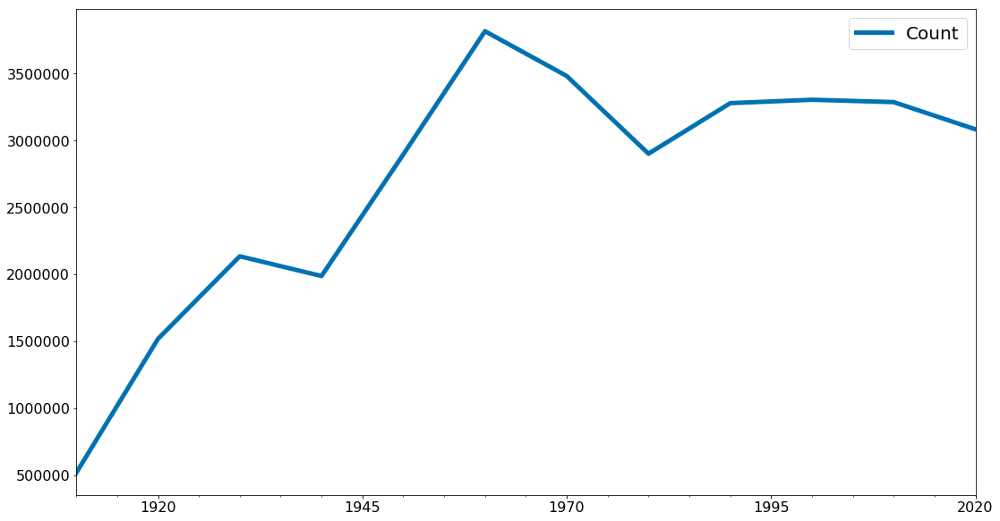


### matplotlib

Existe uma grande variedade de ferramentas para visualizar dados. 

Nós usaremos a biblioteca `matplotlib`, que é amplamente utilizada (embora mostre sua idade). 

Se você estiver interessado em produzir visualizações interativas elaboradas para a Web, provavelmente não é a escolha certa, mas para gráficos de barras simples, gráficos de linhas e diagramas de dispersão, funciona muito bem.

Em particular, estamos usando o módulo `matplotlib.pyplot`.

Em seu uso mais simples, o `pyplot` mantém um estado interno no qual você constrói uma visualização passo a passo. 

Quando terminar, você poderá salvá-lo (com `savefig()`) ou exibi-lo (com `show()`).

Vamos iniciar com duas listas simples de dados.


```python
anos = [1950, 1960, 1970, 1980, 1990, 2000, 2010]
pib = [300.2, 543.3, 1075.9, 2862.5, 5979.6, 10289.7, 14958.3]
```


```python
# cria um gráfico de linhas, com os anos no eixo x e o pib no eixo y
plt.plot(anos, pib)

# Adiciona um título
plt.title('Nominal GDP')

# Label nos eixos
plt.ylabel('Billions of USD')
plt.xlabel('Ano')

plt.show()
```


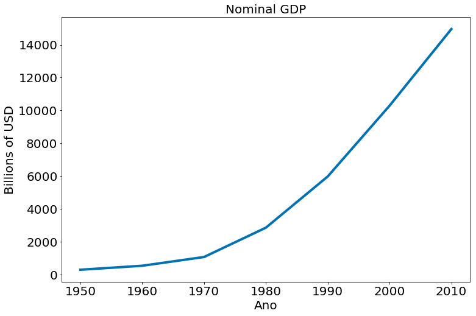


Podemos mudar a aparência usando estilos.


```python
# comentado para não mudar, mas essa é chamada.
plt.style.use('seaborn')
```


```python
# cria um gráfico de linhas, com os anos no eixo x e o pib no eixo y
plt.plot(anos, pib)

# Adiciona um título
plt.title('Nominal GDP')

# Label nos eixos
plt.ylabel('Billions of USD')
plt.xlabel('Ano')

plt.show()
```


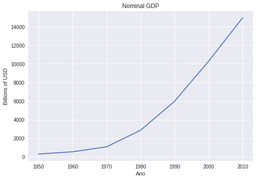


Em particular, eu acho bom usar os estilos colorblind. Ajudam a fazer artigos científicos e garantir que todos entendam eu plot.


```python
plt.style.available
```


    ['bmh',
     'fivethirtyeight',
     'seaborn-pastel',
     'seaborn-white',
     'seaborn-bright',
     'tableau-colorblind10',
     'classic',
     'seaborn-whitegrid',
     'grayscale',
     'seaborn-ticks',
     'seaborn-darkgrid',
     'dark_background',
     'seaborn-talk',
     'seaborn-paper',
     'ggplot',
     'fast',
     'seaborn-colorblind',
     'seaborn-muted',
     'seaborn-dark-palette',
     'Solarize_Light2',
     'seaborn-deep',
     'seaborn',
     '_classic_test',
     'seaborn-poster',
     'seaborn-notebook',
     'seaborn-dark']


```python
# Voltando
plt.style.use('seaborn-colorblind')
plt.rcParams['figure.figsize']  = (12, 8) # não sei o motivo, mas o use acima reseta o size.
```

Podemos também usar vetores numpy sem problemas


```python
x = np.linspace(-100, 100, 100) * 0.1
x
```


    array([-10.        ,  -9.7979798 ,  -9.5959596 ,  -9.39393939,
            -9.19191919,  -8.98989899,  -8.78787879,  -8.58585859,
            -8.38383838,  -8.18181818,  -7.97979798,  -7.77777778,
            -7.57575758,  -7.37373737,  -7.17171717,  -6.96969697,
            -6.76767677,  -6.56565657,  -6.36363636,  -6.16161616,
            -5.95959596,  -5.75757576,  -5.55555556,  -5.35353535,
            -5.15151515,  -4.94949495,  -4.74747475,  -4.54545455,
            -4.34343434,  -4.14141414,  -3.93939394,  -3.73737374,
            -3.53535354,  -3.33333333,  -3.13131313,  -2.92929293,
            -2.72727273,  -2.52525253,  -2.32323232,  -2.12121212,
            -1.91919192,  -1.71717172,  -1.51515152,  -1.31313131,
            -1.11111111,  -0.90909091,  -0.70707071,  -0.50505051,
            -0.3030303 ,  -0.1010101 ,   0.1010101 ,   0.3030303 ,
             0.50505051,   0.70707071,   0.90909091,   1.11111111,
             1.31313131,   1.51515152,   1.71717172,   1.91919192,
             2.12121212,   2.32323232,   2.52525253,   2.72727273,
             2.92929293,   3.13131313,   3.33333333,   3.53535354,
             3.73737374,   3.93939394,   4.14141414,   4.34343434,
             4.54545455,   4.74747475,   4.94949495,   5.15151515,
             5.35353535,   5.55555556,   5.75757576,   5.95959596,
             6.16161616,   6.36363636,   6.56565657,   6.76767677,
             6.96969697,   7.17171717,   7.37373737,   7.57575758,
             7.77777778,   7.97979798,   8.18181818,   8.38383838,
             8.58585859,   8.78787879,   8.98989899,   9.19191919,
             9.39393939,   9.5959596 ,   9.7979798 ,  10.        ])


```python
plt.figure(figsize=(18, 10))

plt.plot(x, np.sin(x), label='Sine')
plt.plot(x, np.cos(x), label='Cosine')
plt.legend()

ax = plt.gca()
for item in ([ax.title, ax.xaxis.label, ax.yaxis.label] +
             ax.get_xticklabels() + ax.get_yticklabels()):
    item.set_fontsize(20)
    
```


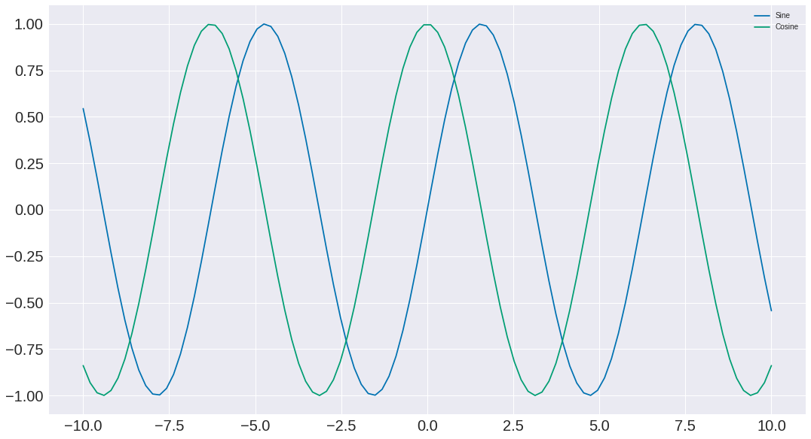


```python
plt.plot(np.sin(x), np.cos(x))
plt.xlabel('Sine')
plt.ylabel('Cosine')
```


    Text(0, 0.5, 'Cosine')


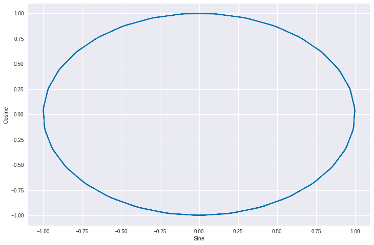


## Movies Dataset

Vamos olhar para mais ou menos 50 atores e algumas métricas dos filmes que os mesmos fazem parte. Em particular, vamos iniciar explorando uma forma de visualizar dados que é o histograma.


```python
df = pd.read_csv('https://media.githubusercontent.com/media/icd-ufmg/material/master/aulas/04-EDA-e-Vis/top_movies.csv')
```


```python
df.head(6)
```


<div>
<style scoped>
    .dataframe tbody tr th:only-of-type {
        vertical-align: middle;
    }

    .dataframe tbody tr th {
        vertical-align: top;
    }

    .dataframe thead th {
        text-align: right;
    }
</style>
<table border="1" class="dataframe">
  <thead>
    <tr style="text-align: right;">
      <th></th>
      <th>Title</th>
      <th>Studio</th>
      <th>Gross</th>
      <th>Gross (Adjusted)</th>
      <th>Year</th>
    </tr>
  </thead>
  <tbody>
    <tr>
      <th>0</th>
      <td>Star Wars: The Force Awakens</td>
      <td>Buena Vista (Disney)</td>
      <td>906723418</td>
      <td>906723400</td>
      <td>2015</td>
    </tr>
    <tr>
      <th>1</th>
      <td>Avatar</td>
      <td>Fox</td>
      <td>760507625</td>
      <td>846120800</td>
      <td>2009</td>
    </tr>
    <tr>
      <th>2</th>
      <td>Titanic</td>
      <td>Paramount</td>
      <td>658672302</td>
      <td>1178627900</td>
      <td>1997</td>
    </tr>
    <tr>
      <th>3</th>
      <td>Jurassic World</td>
      <td>Universal</td>
      <td>652270625</td>
      <td>687728000</td>
      <td>2015</td>
    </tr>
    <tr>
      <th>4</th>
      <td>Marvel's The Avengers</td>
      <td>Buena Vista (Disney)</td>
      <td>623357910</td>
      <td>668866600</td>
      <td>2012</td>
    </tr>
    <tr>
      <th>5</th>
      <td>The Dark Knight</td>
      <td>Warner Bros.</td>
      <td>534858444</td>
      <td>647761600</td>
      <td>2008</td>
    </tr>
  </tbody>
</table>
</div>


```python
mean_g = df.groupby('Studio').mean()['Gross (Adjusted)']
```


```python
mean_g.sort_values()[::-1].plot.bar(edgecolor='k');
```


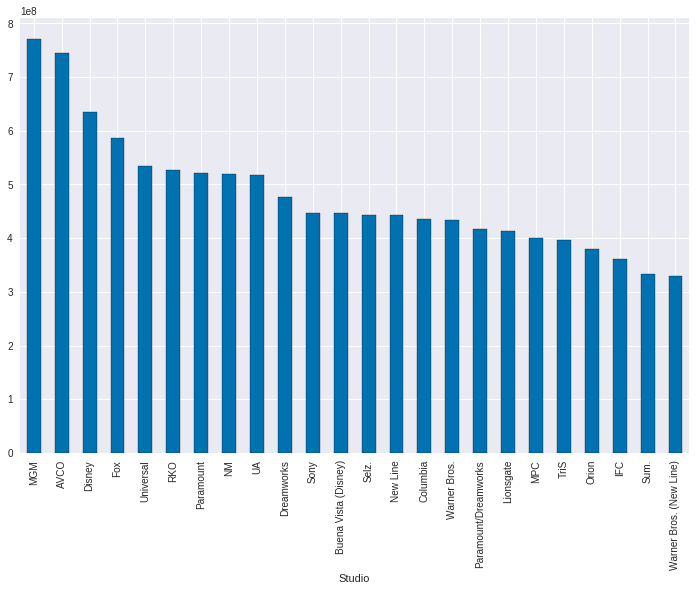


```python
plt.figure(figsize=(18, 10))
mean_g = df.groupby('Studio').mean()['Gross (Adjusted)']
mean_g /= 1e8
ax = mean_g.sort_values()[::-1].plot.bar(fontsize=20, edgecolor='r')
plt.ylabel('Média de Lucro em Milhões')
for item in ([ax.title, ax.xaxis.label, ax.yaxis.label] +
             ax.get_xticklabels() + ax.get_yticklabels()):
    item.set_fontsize(20)
```


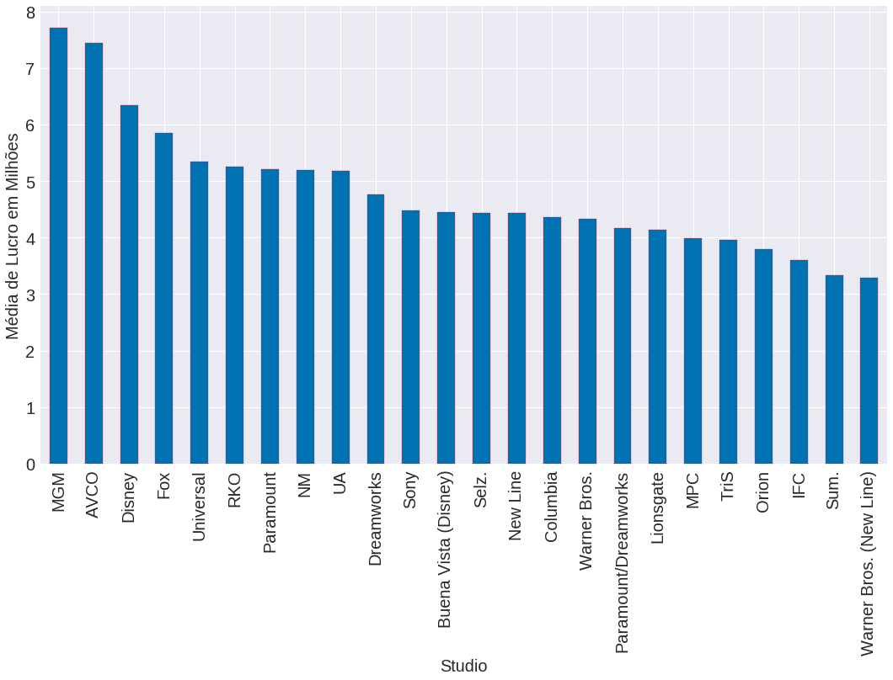


```python
mean_g = df.groupby('Studio').mean()['Gross (Adjusted)']
mean_g /= 1e8
plt.figure(figsize=(18, 10))
plt.hist(mean_g, edgecolor='k')
plt.xlabel('Millions of Dollars')
plt.ylabel('# of Studios')

ax = plt.gca()
for item in ([ax.title, ax.xaxis.label, ax.yaxis.label] +
             ax.get_xticklabels() + ax.get_yticklabels()):
    item.set_fontsize(20)
```


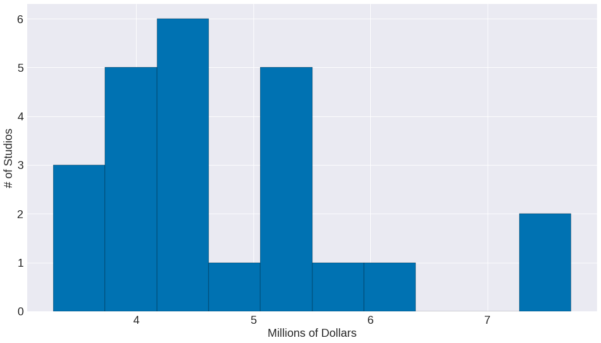


## Base de actors


```python
df = pd.read_csv('https://media.githubusercontent.com/media/icd-ufmg/material/master/aulas/04-EDA-e-Vis/actors.csv')
df
```


<div>
<style scoped>
    .dataframe tbody tr th:only-of-type {
        vertical-align: middle;
    }

    .dataframe tbody tr th {
        vertical-align: top;
    }

    .dataframe thead th {
        text-align: right;
    }
</style>
<table border="1" class="dataframe">
  <thead>
    <tr style="text-align: right;">
      <th></th>
      <th>Actor</th>
      <th>Total Gross</th>
      <th>Number of Movies</th>
      <th>Average per Movie</th>
      <th>#1 Movie</th>
      <th>Gross</th>
    </tr>
  </thead>
  <tbody>
    <tr>
      <th>0</th>
      <td>Harrison Ford</td>
      <td>4871.7</td>
      <td>41</td>
      <td>118.8</td>
      <td>Star Wars: The Force Awakens</td>
      <td>936.7</td>
    </tr>
    <tr>
      <th>1</th>
      <td>Samuel L. Jackson</td>
      <td>4772.8</td>
      <td>69</td>
      <td>69.2</td>
      <td>The Avengers</td>
      <td>623.4</td>
    </tr>
    <tr>
      <th>2</th>
      <td>Morgan Freeman</td>
      <td>4468.3</td>
      <td>61</td>
      <td>73.3</td>
      <td>The Dark Knight</td>
      <td>534.9</td>
    </tr>
    <tr>
      <th>3</th>
      <td>Tom Hanks</td>
      <td>4340.8</td>
      <td>44</td>
      <td>98.7</td>
      <td>Toy Story 3</td>
      <td>415.0</td>
    </tr>
    <tr>
      <th>4</th>
      <td>Robert Downey, Jr.</td>
      <td>3947.3</td>
      <td>53</td>
      <td>74.5</td>
      <td>The Avengers</td>
      <td>623.4</td>
    </tr>
    <tr>
      <th>5</th>
      <td>Eddie Murphy</td>
      <td>3810.4</td>
      <td>38</td>
      <td>100.3</td>
      <td>Shrek 2</td>
      <td>441.2</td>
    </tr>
    <tr>
      <th>6</th>
      <td>Tom Cruise</td>
      <td>3587.2</td>
      <td>36</td>
      <td>99.6</td>
      <td>War of the Worlds</td>
      <td>234.3</td>
    </tr>
    <tr>
      <th>7</th>
      <td>Johnny Depp</td>
      <td>3368.6</td>
      <td>45</td>
      <td>74.9</td>
      <td>Dead Man's Chest</td>
      <td>423.3</td>
    </tr>
    <tr>
      <th>8</th>
      <td>Michael Caine</td>
      <td>3351.5</td>
      <td>58</td>
      <td>57.8</td>
      <td>The Dark Knight</td>
      <td>534.9</td>
    </tr>
    <tr>
      <th>9</th>
      <td>Scarlett Johansson</td>
      <td>3341.2</td>
      <td>37</td>
      <td>90.3</td>
      <td>The Avengers</td>
      <td>623.4</td>
    </tr>
    <tr>
      <th>10</th>
      <td>Gary Oldman</td>
      <td>3294.0</td>
      <td>38</td>
      <td>86.7</td>
      <td>The Dark Knight</td>
      <td>534.9</td>
    </tr>
    <tr>
      <th>11</th>
      <td>Robin Williams</td>
      <td>3279.3</td>
      <td>49</td>
      <td>66.9</td>
      <td>Night at the Museum</td>
      <td>250.9</td>
    </tr>
    <tr>
      <th>12</th>
      <td>Bruce Willis</td>
      <td>3189.4</td>
      <td>60</td>
      <td>53.2</td>
      <td>Sixth Sense</td>
      <td>293.5</td>
    </tr>
    <tr>
      <th>13</th>
      <td>Stellan Skarsgard</td>
      <td>3175.0</td>
      <td>43</td>
      <td>73.8</td>
      <td>The Avengers</td>
      <td>623.4</td>
    </tr>
    <tr>
      <th>14</th>
      <td>Anthony Daniels</td>
      <td>3162.9</td>
      <td>7</td>
      <td>451.8</td>
      <td>Star Wars: The Force Awakens</td>
      <td>936.7</td>
    </tr>
    <tr>
      <th>15</th>
      <td>Ian McKellen</td>
      <td>3150.4</td>
      <td>31</td>
      <td>101.6</td>
      <td>Return of the King</td>
      <td>377.8</td>
    </tr>
    <tr>
      <th>16</th>
      <td>Will Smith</td>
      <td>3149.1</td>
      <td>24</td>
      <td>131.2</td>
      <td>Independence Day</td>
      <td>306.2</td>
    </tr>
    <tr>
      <th>17</th>
      <td>Stanley Tucci</td>
      <td>3123.9</td>
      <td>50</td>
      <td>62.5</td>
      <td>Catching Fire</td>
      <td>424.7</td>
    </tr>
    <tr>
      <th>18</th>
      <td>Matt Damon</td>
      <td>3107.3</td>
      <td>39</td>
      <td>79.7</td>
      <td>The Martian</td>
      <td>228.4</td>
    </tr>
    <tr>
      <th>19</th>
      <td>Robert DeNiro</td>
      <td>3081.3</td>
      <td>79</td>
      <td>39.0</td>
      <td>Meet the Fockers</td>
      <td>279.3</td>
    </tr>
    <tr>
      <th>20</th>
      <td>Cameron Diaz</td>
      <td>3031.7</td>
      <td>34</td>
      <td>89.2</td>
      <td>Shrek 2</td>
      <td>441.2</td>
    </tr>
    <tr>
      <th>21</th>
      <td>Liam Neeson</td>
      <td>2942.7</td>
      <td>63</td>
      <td>46.7</td>
      <td>The Phantom Menace</td>
      <td>474.5</td>
    </tr>
    <tr>
      <th>22</th>
      <td>Andy Serkis</td>
      <td>2890.6</td>
      <td>23</td>
      <td>125.7</td>
      <td>Star Wars: The Force Awakens</td>
      <td>936.7</td>
    </tr>
    <tr>
      <th>23</th>
      <td>Don Cheadle</td>
      <td>2885.4</td>
      <td>34</td>
      <td>84.9</td>
      <td>Avengers: Age of Ultron</td>
      <td>459.0</td>
    </tr>
    <tr>
      <th>24</th>
      <td>Ben Stiller</td>
      <td>2827.0</td>
      <td>37</td>
      <td>76.4</td>
      <td>Meet the Fockers</td>
      <td>279.3</td>
    </tr>
    <tr>
      <th>25</th>
      <td>Helena Bonham Carter</td>
      <td>2822.0</td>
      <td>36</td>
      <td>78.4</td>
      <td>Harry Potter / Deathly Hallows (P2)</td>
      <td>381.0</td>
    </tr>
    <tr>
      <th>26</th>
      <td>Orlando Bloom</td>
      <td>2815.8</td>
      <td>17</td>
      <td>165.6</td>
      <td>Dead Man's Chest</td>
      <td>423.3</td>
    </tr>
    <tr>
      <th>27</th>
      <td>Woody Harrelson</td>
      <td>2815.8</td>
      <td>50</td>
      <td>56.3</td>
      <td>Catching Fire</td>
      <td>424.7</td>
    </tr>
    <tr>
      <th>28</th>
      <td>Cate Blanchett</td>
      <td>2802.6</td>
      <td>39</td>
      <td>71.9</td>
      <td>Return of the King</td>
      <td>377.8</td>
    </tr>
    <tr>
      <th>29</th>
      <td>Julia Roberts</td>
      <td>2735.3</td>
      <td>42</td>
      <td>65.1</td>
      <td>Ocean's Eleven</td>
      <td>183.4</td>
    </tr>
    <tr>
      <th>30</th>
      <td>Elizabeth Banks</td>
      <td>2726.3</td>
      <td>35</td>
      <td>77.9</td>
      <td>Catching Fire</td>
      <td>424.7</td>
    </tr>
    <tr>
      <th>31</th>
      <td>Ralph Fiennes</td>
      <td>2715.3</td>
      <td>36</td>
      <td>75.4</td>
      <td>Harry Potter / Deathly Hallows (P2)</td>
      <td>381.0</td>
    </tr>
    <tr>
      <th>32</th>
      <td>Emma Watson</td>
      <td>2681.9</td>
      <td>17</td>
      <td>157.8</td>
      <td>Harry Potter / Deathly Hallows (P2)</td>
      <td>381.0</td>
    </tr>
    <tr>
      <th>33</th>
      <td>Tommy Lee Jones</td>
      <td>2681.3</td>
      <td>46</td>
      <td>58.3</td>
      <td>Men in Black</td>
      <td>250.7</td>
    </tr>
    <tr>
      <th>34</th>
      <td>Brad Pitt</td>
      <td>2680.9</td>
      <td>40</td>
      <td>67.0</td>
      <td>World War Z</td>
      <td>202.4</td>
    </tr>
    <tr>
      <th>35</th>
      <td>Adam Sandler</td>
      <td>2661.0</td>
      <td>32</td>
      <td>83.2</td>
      <td>Hotel Transylvania 2</td>
      <td>169.7</td>
    </tr>
    <tr>
      <th>36</th>
      <td>Daniel Radcliffe</td>
      <td>2634.4</td>
      <td>17</td>
      <td>155.0</td>
      <td>Harry Potter / Deathly Hallows (P2)</td>
      <td>381.0</td>
    </tr>
    <tr>
      <th>37</th>
      <td>Jonah Hill</td>
      <td>2605.1</td>
      <td>29</td>
      <td>89.8</td>
      <td>The LEGO Movie</td>
      <td>257.8</td>
    </tr>
    <tr>
      <th>38</th>
      <td>Owen Wilson</td>
      <td>2602.3</td>
      <td>39</td>
      <td>66.7</td>
      <td>Night at the Museum</td>
      <td>250.9</td>
    </tr>
    <tr>
      <th>39</th>
      <td>Idris Elba</td>
      <td>2580.6</td>
      <td>26</td>
      <td>99.3</td>
      <td>Avengers: Age of Ultron</td>
      <td>459.0</td>
    </tr>
    <tr>
      <th>40</th>
      <td>Bradley Cooper</td>
      <td>2557.7</td>
      <td>25</td>
      <td>102.3</td>
      <td>American Sniper</td>
      <td>350.1</td>
    </tr>
    <tr>
      <th>41</th>
      <td>Mark Wahlberg</td>
      <td>2549.8</td>
      <td>36</td>
      <td>70.8</td>
      <td>Transformers 4</td>
      <td>245.4</td>
    </tr>
    <tr>
      <th>42</th>
      <td>Jim Carrey</td>
      <td>2545.2</td>
      <td>27</td>
      <td>94.3</td>
      <td>The Grinch</td>
      <td>260.0</td>
    </tr>
    <tr>
      <th>43</th>
      <td>Dustin Hoffman</td>
      <td>2522.1</td>
      <td>43</td>
      <td>58.7</td>
      <td>Meet the Fockers</td>
      <td>279.3</td>
    </tr>
    <tr>
      <th>44</th>
      <td>Leonardo DiCaprio</td>
      <td>2518.3</td>
      <td>25</td>
      <td>100.7</td>
      <td>Titanic</td>
      <td>658.7</td>
    </tr>
    <tr>
      <th>45</th>
      <td>Jeremy Renner</td>
      <td>2500.3</td>
      <td>21</td>
      <td>119.1</td>
      <td>The Avengers</td>
      <td>623.4</td>
    </tr>
    <tr>
      <th>46</th>
      <td>Philip Seymour Hoffman</td>
      <td>2463.7</td>
      <td>40</td>
      <td>61.6</td>
      <td>Catching Fire</td>
      <td>424.7</td>
    </tr>
    <tr>
      <th>47</th>
      <td>Sandra Bullock</td>
      <td>2462.6</td>
      <td>35</td>
      <td>70.4</td>
      <td>Minions</td>
      <td>336.0</td>
    </tr>
    <tr>
      <th>48</th>
      <td>Chris Evans</td>
      <td>2457.8</td>
      <td>23</td>
      <td>106.9</td>
      <td>The Avengers</td>
      <td>623.4</td>
    </tr>
    <tr>
      <th>49</th>
      <td>Anne Hathaway</td>
      <td>2416.5</td>
      <td>25</td>
      <td>96.7</td>
      <td>The Dark Knight Rises</td>
      <td>448.1</td>
    </tr>
  </tbody>
</table>
</div>


```python
plt.figure(figsize=(18, 10))
plt.hist(df['Average per Movie'], edgecolor='k')
plt.xlabel('Média por Filme')
plt.ylabel('Número de linhas')
ax = plt.gca()
for item in ([ax.title, ax.xaxis.label, ax.yaxis.label] +
             ax.get_xticklabels() + ax.get_yticklabels()):
    item.set_fontsize(20)
```


Obtendo a densidade de pontos em cada barra. Note que isto nem sempre vai traduzir para um valor entre `[0, 1]`. Depende do eixo-x. 


```python
plt.figure(figsize=(18, 10))
plt.hist(df['Average per Movie'], edgecolor='k')
plt.xlabel('Média por Filme')
plt.ylabel('P(x)')
ax = plt.gca()
for item in ([ax.title, ax.xaxis.label, ax.yaxis.label] +
             ax.get_xticklabels() + ax.get_yticklabels()):
    item.set_fontsize(20)
```


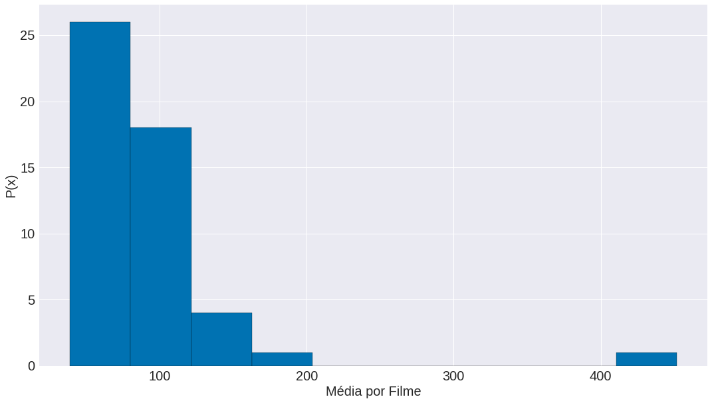


```python
plt.figure(figsize=(18, 10))
data = df['Average per Movie'][df['Average per Movie'] < 100]
plt.xlabel('Média por Filme')
plt.ylabel('P(x)')
plt.hist(data, edgecolor='k')
ax = plt.gca()
for item in ([ax.title, ax.xaxis.label, ax.yaxis.label] +
             ax.get_xticklabels() + ax.get_yticklabels()):
    item.set_fontsize(20)
```


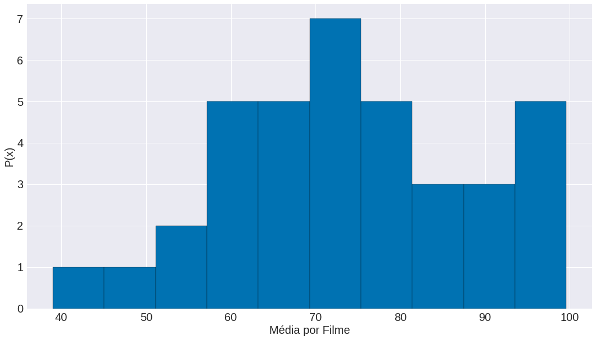


```python
plt.figure(figsize=(18, 10))
data = df['Average per Movie']
plt.xlabel('Média por Filme')
plt.ylabel('P(x)')
plt.hist(data, bins=50, edgecolor='k')
ax = plt.gca()
for item in ([ax.title, ax.xaxis.label, ax.yaxis.label] +
             ax.get_xticklabels() + ax.get_yticklabels()):
    item.set_fontsize(20)
```


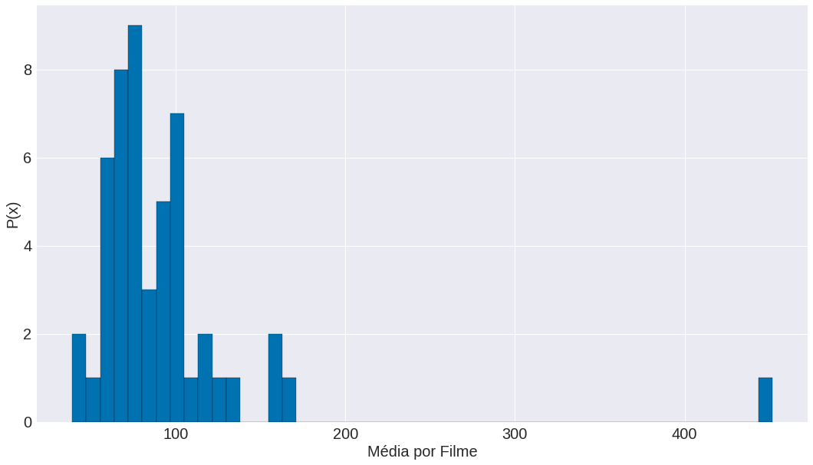


# Problemas de escala


```python
plt.figure(figsize=(18, 10))
mentions = [500, 505]
years = [2013, 2014]

plt.bar(years, mentions, edgecolor='k')

plt.xticks(years)
plt.ylabel("# de vezes que escutei alguém dizer 'data science'")

# define o os limites do eixo y:
plt.ylim(499,506)

plt.title("Wow! Vejam que aumento!")

ax = plt.gca()
for item in ([ax.title, ax.xaxis.label, ax.yaxis.label] +
             ax.get_xticklabels() + ax.get_yticklabels()):
    item.set_fontsize(20)
```


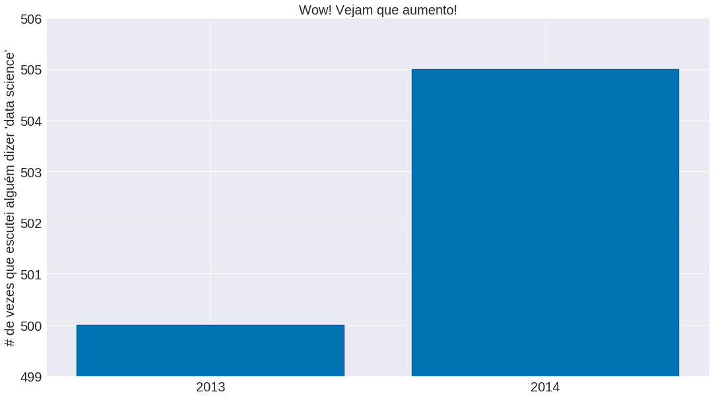


```python
plt.figure(figsize=(18, 10))

plt.bar(years, mentions)

plt.xticks(years)
plt.ylabel("# de vezes que escutei alguém dizer 'data science'")

plt.ylim(0, max(mentions)*1.1)
plt.title("Humm... Até que o aumento não foi tão grande.")

ax = plt.gca()
for item in ([ax.title, ax.xaxis.label, ax.yaxis.label] +
             ax.get_xticklabels() + ax.get_yticklabels()):
    item.set_fontsize(20)
```


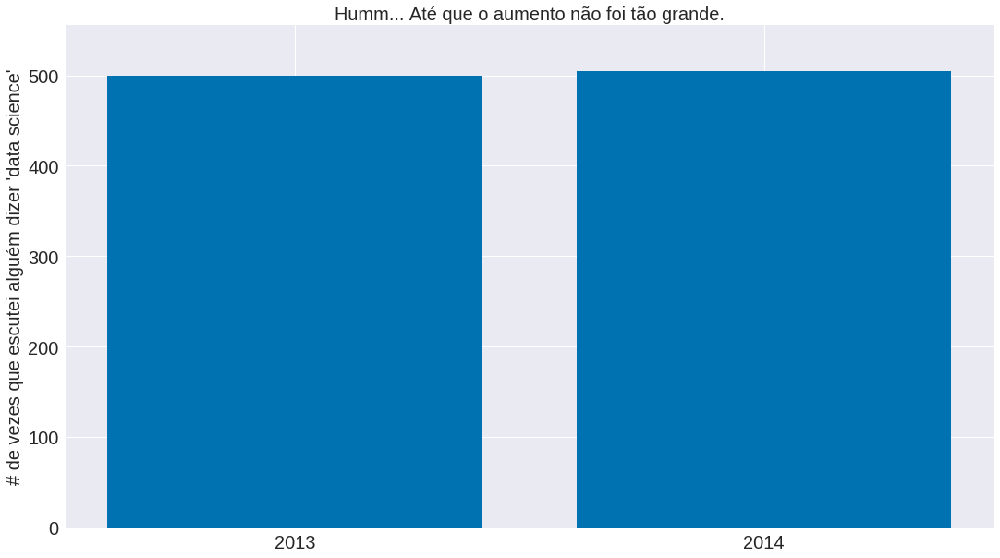


# Dados 2d com e leitura de JSON

O pandas também sabe ler dados em json! Vamos tentar.


```python
df = pd.read_json('capital.json')
```


```python
df
```


<div>
<style scoped>
    .dataframe tbody tr th:only-of-type {
        vertical-align: middle;
    }

    .dataframe tbody tr th {
        vertical-align: top;
    }

    .dataframe thead th {
        text-align: right;
    }
</style>
<table border="1" class="dataframe">
  <thead>
    <tr style="text-align: right;">
      <th></th>
      <th>ano_dois</th>
      <th>ano_um</th>
      <th>cargo_pleiteado_1</th>
      <th>cargo_pleiteado_2</th>
      <th>cod_unidade_eleitoral_1</th>
      <th>cod_unidade_eleitoral_2</th>
      <th>cpf</th>
      <th>estado</th>
      <th>nome_urna</th>
      <th>patrimonio_eleicao_1</th>
      <th>patrimonio_eleicao_2</th>
      <th>sequencial_candidato_1</th>
      <th>sequencial_candidato_2</th>
      <th>sigla_partido</th>
      <th>situacao_eleicao_1</th>
      <th>situacao_eleicao_2</th>
      <th>unidade_eleitoral</th>
    </tr>
  </thead>
  <tbody>
    <tr>
      <th>0</th>
      <td>2018</td>
      <td>2014</td>
      <td>DEPUTADO FEDERAL</td>
      <td>DEPUTADO FEDERAL</td>
      <td>MG</td>
      <td>MG</td>
      <td>1608657</td>
      <td>MG</td>
      <td>Stefano Aguiar</td>
      <td>2326963.85</td>
      <td>2890296.74</td>
      <td>130000001189</td>
      <td>130000613225</td>
      <td>PSD</td>
      <td>ELEITO</td>
      <td>ELEITO</td>
      <td>Minas Gerais</td>
    </tr>
    <tr>
      <th>1</th>
      <td>2018</td>
      <td>2014</td>
      <td>DEPUTADO FEDERAL</td>
      <td>DEPUTADO FEDERAL</td>
      <td>RJ</td>
      <td>RJ</td>
      <td>7487738</td>
      <td>RJ</td>
      <td>Altineu Cortes</td>
      <td>4239563.82</td>
      <td>3943907.61</td>
      <td>190000001858</td>
      <td>190000604181</td>
      <td>PR</td>
      <td>ELEITO</td>
      <td>ELEITO</td>
      <td>Rio De Janeiro</td>
    </tr>
    <tr>
      <th>2</th>
      <td>2018</td>
      <td>2014</td>
      <td>DEPUTADO FEDERAL</td>
      <td>DEPUTADO FEDERAL</td>
      <td>BA</td>
      <td>BA</td>
      <td>31226540</td>
      <td>BA</td>
      <td>Mário Negromonte Jr</td>
      <td>1077668.74</td>
      <td>2281417.64</td>
      <td>50000000167</td>
      <td>50000605225</td>
      <td>PP</td>
      <td>ELEITO</td>
      <td>ELEITO</td>
      <td>Bahia</td>
    </tr>
    <tr>
      <th>3</th>
      <td>2018</td>
      <td>2014</td>
      <td>VICE-GOVERNADOR</td>
      <td>DEPUTADO FEDERAL</td>
      <td>CE</td>
      <td>CE</td>
      <td>113735391</td>
      <td>CE</td>
      <td>Roberto Pessoa</td>
      <td>14399524.97</td>
      <td>13160762.14</td>
      <td>60000000604</td>
      <td>60000611570</td>
      <td>PSDB</td>
      <td>NÃO ELEITO</td>
      <td>ELEITO</td>
      <td>Ceará</td>
    </tr>
    <tr>
      <th>4</th>
      <td>2018</td>
      <td>2014</td>
      <td>DEPUTADO FEDERAL</td>
      <td>DEPUTADO FEDERAL</td>
      <td>SP</td>
      <td>SP</td>
      <td>168780860</td>
      <td>SP</td>
      <td>Vitor Lippi</td>
      <td>713217.64</td>
      <td>972916.79</td>
      <td>250000001354</td>
      <td>250000605413</td>
      <td>PSDB</td>
      <td>ELEITO</td>
      <td>ELEITO</td>
      <td>São Paulo</td>
    </tr>
    <tr>
      <th>5</th>
      <td>2018</td>
      <td>2014</td>
      <td>DEPUTADO ESTADUAL</td>
      <td>DEPUTADO FEDERAL</td>
      <td>RS</td>
      <td>RS</td>
      <td>213461005</td>
      <td>RS</td>
      <td>Fernanda Melchionna</td>
      <td>106070.38</td>
      <td>96319.25</td>
      <td>210000000014</td>
      <td>210000600043</td>
      <td>PSOL</td>
      <td>NÃO ELEITO</td>
      <td>ELEITO</td>
      <td>Rio Grande Do Sul</td>
    </tr>
    <tr>
      <th>6</th>
      <td>2018</td>
      <td>2014</td>
      <td>DEPUTADO FEDERAL</td>
      <td>DEPUTADO FEDERAL</td>
      <td>RJ</td>
      <td>RJ</td>
      <td>262905701</td>
      <td>RJ</td>
      <td>Pedro Paulo</td>
      <td>553144.11</td>
      <td>341805.65</td>
      <td>190000001428</td>
      <td>190000607425</td>
      <td>DEM</td>
      <td>ELEITO</td>
      <td>ELEITO</td>
      <td>Rio De Janeiro</td>
    </tr>
    <tr>
      <th>7</th>
      <td>2018</td>
      <td>2014</td>
      <td>DEPUTADO FEDERAL</td>
      <td>DEPUTADO FEDERAL</td>
      <td>MS</td>
      <td>MS</td>
      <td>263382893</td>
      <td>MS</td>
      <td>Dagoberto</td>
      <td>2712509.62</td>
      <td>3093645.23</td>
      <td>120000000508</td>
      <td>120000602218</td>
      <td>PDT</td>
      <td>ELEITO</td>
      <td>ELEITO</td>
      <td>Mato Grosso Do Sul</td>
    </tr>
    <tr>
      <th>8</th>
      <td>2018</td>
      <td>2014</td>
      <td>DEPUTADO FEDERAL</td>
      <td>DEPUTADO FEDERAL</td>
      <td>SP</td>
      <td>SP</td>
      <td>398099863</td>
      <td>SP</td>
      <td>Carlos Zarattini</td>
      <td>600772.54</td>
      <td>1051302.81</td>
      <td>250000000618</td>
      <td>250000623897</td>
      <td>PT</td>
      <td>ELEITO</td>
      <td>ELEITO</td>
      <td>São Paulo</td>
    </tr>
    <tr>
      <th>9</th>
      <td>2018</td>
      <td>2014</td>
      <td>DEPUTADO FEDERAL</td>
      <td>DEPUTADO FEDERAL</td>
      <td>MA</td>
      <td>MA</td>
      <td>441514383</td>
      <td>MA</td>
      <td>Rubens Junior</td>
      <td>653912.76</td>
      <td>801591.36</td>
      <td>100000000627</td>
      <td>100000601890</td>
      <td>PC do B</td>
      <td>ELEITO</td>
      <td>ELEITO</td>
      <td>Maranhão</td>
    </tr>
    <tr>
      <th>10</th>
      <td>2018</td>
      <td>2014</td>
      <td>DEPUTADO FEDERAL</td>
      <td>DEPUTADO FEDERAL</td>
      <td>SP</td>
      <td>SP</td>
      <td>480584400</td>
      <td>SP</td>
      <td>Luiza Erundina</td>
      <td>897323.15</td>
      <td>1293077.73</td>
      <td>250000001476</td>
      <td>250000601478</td>
      <td>PSOL</td>
      <td>ELEITO</td>
      <td>ELEITO</td>
      <td>São Paulo</td>
    </tr>
    <tr>
      <th>11</th>
      <td>2018</td>
      <td>2014</td>
      <td>DEPUTADO ESTADUAL</td>
      <td>DEPUTADO FEDERAL</td>
      <td>SC</td>
      <td>SC</td>
      <td>503190942</td>
      <td>SC</td>
      <td>Carlos Chiodini</td>
      <td>141030.05</td>
      <td>94134.28</td>
      <td>240000000273</td>
      <td>240000609546</td>
      <td>MDB</td>
      <td>ELEITO</td>
      <td>ELEITO</td>
      <td>Santa Catarina</td>
    </tr>
    <tr>
      <th>12</th>
      <td>2018</td>
      <td>2014</td>
      <td>DEPUTADO ESTADUAL</td>
      <td>DEPUTADO FEDERAL</td>
      <td>PR</td>
      <td>PR</td>
      <td>506342913</td>
      <td>PR</td>
      <td>Aline Sleutjes</td>
      <td>123173.75</td>
      <td>132498.54</td>
      <td>160000001104</td>
      <td>160000626150</td>
      <td>PSL</td>
      <td>NÃO ELEITO</td>
      <td>ELEITO</td>
      <td>Paraná</td>
    </tr>
    <tr>
      <th>13</th>
      <td>2018</td>
      <td>2014</td>
      <td>DEPUTADO FEDERAL</td>
      <td>DEPUTADO FEDERAL</td>
      <td>SP</td>
      <td>SP</td>
      <td>551632895</td>
      <td>SP</td>
      <td>Herculano Passos</td>
      <td>5197664.86</td>
      <td>4991933.06</td>
      <td>250000002189</td>
      <td>250000604091</td>
      <td>MDB</td>
      <td>ELEITO</td>
      <td>ELEITO</td>
      <td>São Paulo</td>
    </tr>
    <tr>
      <th>14</th>
      <td>2018</td>
      <td>2014</td>
      <td>DEPUTADO FEDERAL</td>
      <td>DEPUTADO FEDERAL</td>
      <td>RJ</td>
      <td>RJ</td>
      <td>590048783</td>
      <td>RJ</td>
      <td>Rodrigo Maia</td>
      <td>736000.00</td>
      <td>730615.48</td>
      <td>190000001114</td>
      <td>190000607414</td>
      <td>DEM</td>
      <td>ELEITO</td>
      <td>ELEITO</td>
      <td>Rio De Janeiro</td>
    </tr>
    <tr>
      <th>15</th>
      <td>2018</td>
      <td>2014</td>
      <td>DEPUTADO FEDERAL</td>
      <td>DEPUTADO FEDERAL</td>
      <td>PA</td>
      <td>PA</td>
      <td>605387249</td>
      <td>PA</td>
      <td>Elcione</td>
      <td>5173997.99</td>
      <td>3613643.30</td>
      <td>140000000455</td>
      <td>140000606359</td>
      <td>MDB</td>
      <td>ELEITO</td>
      <td>ELEITO</td>
      <td>Pará</td>
    </tr>
    <tr>
      <th>16</th>
      <td>2018</td>
      <td>2014</td>
      <td>DEPUTADO FEDERAL</td>
      <td>DEPUTADO FEDERAL</td>
      <td>MG</td>
      <td>MG</td>
      <td>649039661</td>
      <td>MG</td>
      <td>Marcelo Alvaro Antonio</td>
      <td>455000.00</td>
      <td>773125.00</td>
      <td>130000001127</td>
      <td>130000616635</td>
      <td>PSL</td>
      <td>ELEITO</td>
      <td>ELEITO</td>
      <td>Minas Gerais</td>
    </tr>
    <tr>
      <th>17</th>
      <td>2018</td>
      <td>2014</td>
      <td>DEPUTADO FEDERAL</td>
      <td>DEPUTADO FEDERAL</td>
      <td>AM</td>
      <td>AM</td>
      <td>694584215</td>
      <td>AM</td>
      <td>Atila Lins</td>
      <td>1880767.00</td>
      <td>2434990.10</td>
      <td>40000000356</td>
      <td>40000610407</td>
      <td>PP</td>
      <td>ELEITO</td>
      <td>ELEITO</td>
      <td>Amazonas</td>
    </tr>
    <tr>
      <th>18</th>
      <td>2018</td>
      <td>2014</td>
      <td>DEPUTADO FEDERAL</td>
      <td>DEPUTADO FEDERAL</td>
      <td>PB</td>
      <td>PB</td>
      <td>770338410</td>
      <td>PB</td>
      <td>Efraim Filho</td>
      <td>893609.42</td>
      <td>873721.28</td>
      <td>150000000207</td>
      <td>150000608820</td>
      <td>DEM</td>
      <td>ELEITO</td>
      <td>ELEITO</td>
      <td>Paraíba</td>
    </tr>
    <tr>
      <th>19</th>
      <td>2018</td>
      <td>2014</td>
      <td>DEPUTADO FEDERAL</td>
      <td>DEPUTADO FEDERAL</td>
      <td>MT</td>
      <td>MT</td>
      <td>834939134</td>
      <td>MT</td>
      <td>Carlos Bezerra</td>
      <td>2137746.28</td>
      <td>1519519.15</td>
      <td>110000000304</td>
      <td>110000622434</td>
      <td>MDB</td>
      <td>ELEITO</td>
      <td>ELEITO</td>
      <td>Mato Grosso</td>
    </tr>
    <tr>
      <th>20</th>
      <td>2018</td>
      <td>2014</td>
      <td>DEPUTADO FEDERAL</td>
      <td>DEPUTADO FEDERAL</td>
      <td>PI</td>
      <td>PI</td>
      <td>1102125334</td>
      <td>PI</td>
      <td>Júlio Cesar</td>
      <td>2008505.41</td>
      <td>2183156.52</td>
      <td>180000000054</td>
      <td>180000613937</td>
      <td>PSD</td>
      <td>ELEITO</td>
      <td>ELEITO</td>
      <td>Piauí</td>
    </tr>
    <tr>
      <th>21</th>
      <td>2018</td>
      <td>2014</td>
      <td>DEPUTADO FEDERAL</td>
      <td>DEPUTADO FEDERAL</td>
      <td>AL</td>
      <td>AL</td>
      <td>1117690199</td>
      <td>AL</td>
      <td>Jhc</td>
      <td>3129526.00</td>
      <td>2399418.33</td>
      <td>20000000183</td>
      <td>20000616803</td>
      <td>PSB</td>
      <td>ELEITO</td>
      <td>ELEITO</td>
      <td>Alagoas</td>
    </tr>
    <tr>
      <th>22</th>
      <td>2018</td>
      <td>2014</td>
      <td>DEPUTADO FEDERAL</td>
      <td>DEPUTADO FEDERAL</td>
      <td>RS</td>
      <td>RS</td>
      <td>1171688075</td>
      <td>RS</td>
      <td>Covatti Filho</td>
      <td>472496.08</td>
      <td>956901.59</td>
      <td>210000000638</td>
      <td>210000604833</td>
      <td>PP</td>
      <td>ELEITO</td>
      <td>ELEITO</td>
      <td>Rio Grande Do Sul</td>
    </tr>
    <tr>
      <th>23</th>
      <td>2018</td>
      <td>2014</td>
      <td>DEPUTADO FEDERAL</td>
      <td>DEPUTADO FEDERAL</td>
      <td>SP</td>
      <td>SP</td>
      <td>1252958803</td>
      <td>SP</td>
      <td>Celso Russomanno</td>
      <td>1748539.86</td>
      <td>1797223.56</td>
      <td>250000001257</td>
      <td>250000606220</td>
      <td>PRB</td>
      <td>ELEITO</td>
      <td>ELEITO</td>
      <td>São Paulo</td>
    </tr>
    <tr>
      <th>24</th>
      <td>2018</td>
      <td>2014</td>
      <td>DEPUTADO FEDERAL</td>
      <td>DEPUTADO FEDERAL</td>
      <td>MG</td>
      <td>MG</td>
      <td>1266637699</td>
      <td>MG</td>
      <td>Newton Cardoso Jr</td>
      <td>1797026.57</td>
      <td>2030880.92</td>
      <td>130000000886</td>
      <td>130000620820</td>
      <td>MDB</td>
      <td>ELEITO</td>
      <td>ELEITO</td>
      <td>Minas Gerais</td>
    </tr>
    <tr>
      <th>25</th>
      <td>2018</td>
      <td>2014</td>
      <td>DEPUTADO FEDERAL</td>
      <td>DEPUTADO FEDERAL</td>
      <td>RJ</td>
      <td>RJ</td>
      <td>1416576770</td>
      <td>RJ</td>
      <td>Alessandro Molon</td>
      <td>26012.85</td>
      <td>1680523.07</td>
      <td>190000000614</td>
      <td>190000615553</td>
      <td>PSB</td>
      <td>ELEITO</td>
      <td>ELEITO</td>
      <td>Rio De Janeiro</td>
    </tr>
    <tr>
      <th>26</th>
      <td>2018</td>
      <td>2014</td>
      <td>DEPUTADO ESTADUAL</td>
      <td>DEPUTADO FEDERAL</td>
      <td>TO</td>
      <td>TO</td>
      <td>1657051161</td>
      <td>TO</td>
      <td>Tiago Dimas</td>
      <td>193600.00</td>
      <td>328357.81</td>
      <td>270000000266</td>
      <td>270000618825</td>
      <td>SOLIDARIED</td>
      <td>NÃO ELEITO</td>
      <td>ELEITO</td>
      <td>Tocantins</td>
    </tr>
    <tr>
      <th>27</th>
      <td>2018</td>
      <td>2014</td>
      <td>DEPUTADO ESTADUAL</td>
      <td>DEPUTADO FEDERAL</td>
      <td>RS</td>
      <td>RS</td>
      <td>1738506002</td>
      <td>RS</td>
      <td>Liziane Bayer</td>
      <td>219796.27</td>
      <td>212200.35</td>
      <td>210000000550</td>
      <td>210000600965</td>
      <td>PSB</td>
      <td>ELEITO</td>
      <td>ELEITO</td>
      <td>Rio Grande Do Sul</td>
    </tr>
    <tr>
      <th>28</th>
      <td>2018</td>
      <td>2014</td>
      <td>DEPUTADO ESTADUAL</td>
      <td>DEPUTADO FEDERAL</td>
      <td>RO</td>
      <td>RO</td>
      <td>1739396782</td>
      <td>RO</td>
      <td>Silvia Cristina</td>
      <td>165820.85</td>
      <td>293762.30</td>
      <td>220000000260</td>
      <td>220000611027</td>
      <td>PDT</td>
      <td>NÃO ELEITO</td>
      <td>ELEITO</td>
      <td>Rondônia</td>
    </tr>
    <tr>
      <th>29</th>
      <td>2018</td>
      <td>2014</td>
      <td>DEPUTADO ESTADUAL</td>
      <td>DEPUTADO FEDERAL</td>
      <td>PI</td>
      <td>PI</td>
      <td>1742564348</td>
      <td>PI</td>
      <td>Marcos Aurelio Sampaio</td>
      <td>84490.00</td>
      <td>319437.69</td>
      <td>180000000098</td>
      <td>180000613906</td>
      <td>MDB</td>
      <td>NÃO ELEITO</td>
      <td>ELEITO</td>
      <td>Piauí</td>
    </tr>
    <tr>
      <th>...</th>
      <td>...</td>
      <td>...</td>
      <td>...</td>
      <td>...</td>
      <td>...</td>
      <td>...</td>
      <td>...</td>
      <td>...</td>
      <td>...</td>
      <td>...</td>
      <td>...</td>
      <td>...</td>
      <td>...</td>
      <td>...</td>
      <td>...</td>
      <td>...</td>
      <td>...</td>
    </tr>
    <tr>
      <th>324</th>
      <td>2018</td>
      <td>2014</td>
      <td>DEPUTADO FEDERAL</td>
      <td>DEPUTADO FEDERAL</td>
      <td>MG</td>
      <td>MG</td>
      <td>83035605653</td>
      <td>MG</td>
      <td>Rodrigo De Castro</td>
      <td>1860637.47</td>
      <td>1664606.19</td>
      <td>130000000661</td>
      <td>130000613203</td>
      <td>PSDB</td>
      <td>ELEITO</td>
      <td>ELEITO</td>
      <td>Minas Gerais</td>
    </tr>
    <tr>
      <th>325</th>
      <td>2018</td>
      <td>2014</td>
      <td>DEPUTADO FEDERAL</td>
      <td>DEPUTADO FEDERAL</td>
      <td>PE</td>
      <td>PE</td>
      <td>83146270463</td>
      <td>PE</td>
      <td>Fernando Monteiro</td>
      <td>1276791.72</td>
      <td>529371.45</td>
      <td>170000000069</td>
      <td>170000614072</td>
      <td>PP</td>
      <td>NÃO ELEITO</td>
      <td>ELEITO</td>
      <td>Pernambuco</td>
    </tr>
    <tr>
      <th>326</th>
      <td>2018</td>
      <td>2014</td>
      <td>DEPUTADO FEDERAL</td>
      <td>DEPUTADO FEDERAL</td>
      <td>RO</td>
      <td>RO</td>
      <td>83577572272</td>
      <td>RO</td>
      <td>Mariana Carvalho</td>
      <td>497883.84</td>
      <td>2718054.52</td>
      <td>220000000030</td>
      <td>220000609734</td>
      <td>PSDB</td>
      <td>ELEITO</td>
      <td>ELEITO</td>
      <td>Rondônia</td>
    </tr>
    <tr>
      <th>327</th>
      <td>2018</td>
      <td>2014</td>
      <td>DEPUTADO ESTADUAL</td>
      <td>DEPUTADO FEDERAL</td>
      <td>MA</td>
      <td>MA</td>
      <td>83762116334</td>
      <td>MA</td>
      <td>Edilazio</td>
      <td>2013926.36</td>
      <td>5362203.08</td>
      <td>100000000742</td>
      <td>100000609118</td>
      <td>PSD</td>
      <td>ELEITO</td>
      <td>ELEITO</td>
      <td>Maranhão</td>
    </tr>
    <tr>
      <th>328</th>
      <td>2018</td>
      <td>2014</td>
      <td>DEPUTADO FEDERAL</td>
      <td>DEPUTADO FEDERAL</td>
      <td>MG</td>
      <td>MG</td>
      <td>84470666653</td>
      <td>MG</td>
      <td>Eros Biondini</td>
      <td>1052050.00</td>
      <td>1380234.85</td>
      <td>130000000120</td>
      <td>130000620684</td>
      <td>PROS</td>
      <td>ELEITO</td>
      <td>ELEITO</td>
      <td>Minas Gerais</td>
    </tr>
    <tr>
      <th>329</th>
      <td>2018</td>
      <td>2014</td>
      <td>DEPUTADO FEDERAL</td>
      <td>DEPUTADO FEDERAL</td>
      <td>MG</td>
      <td>MG</td>
      <td>84719850634</td>
      <td>MG</td>
      <td>Weliton Prado</td>
      <td>927149.04</td>
      <td>1726477.26</td>
      <td>130000000907</td>
      <td>130000620691</td>
      <td>PROS</td>
      <td>ELEITO</td>
      <td>ELEITO</td>
      <td>Minas Gerais</td>
    </tr>
    <tr>
      <th>330</th>
      <td>2018</td>
      <td>2014</td>
      <td>DEPUTADO FEDERAL</td>
      <td>DEPUTADO FEDERAL</td>
      <td>MA</td>
      <td>MA</td>
      <td>85290211349</td>
      <td>MA</td>
      <td>Juscelino Filho</td>
      <td>3249116.66</td>
      <td>3930767.09</td>
      <td>100000000505</td>
      <td>100000601901</td>
      <td>DEM</td>
      <td>ELEITO</td>
      <td>ELEITO</td>
      <td>Maranhão</td>
    </tr>
    <tr>
      <th>331</th>
      <td>2018</td>
      <td>2014</td>
      <td>VICE-GOVERNADOR</td>
      <td>DEPUTADO FEDERAL</td>
      <td>DF</td>
      <td>DF</td>
      <td>85773875187</td>
      <td>DF</td>
      <td>Flavia Arruda</td>
      <td>940613.01</td>
      <td>774926.00</td>
      <td>70000001546</td>
      <td>70000625528</td>
      <td>PR</td>
      <td>NÃO ELEITO</td>
      <td>ELEITO</td>
      <td>Distrito Federal</td>
    </tr>
    <tr>
      <th>332</th>
      <td>2018</td>
      <td>2014</td>
      <td>DEPUTADO FEDERAL</td>
      <td>DEPUTADO FEDERAL</td>
      <td>PE</td>
      <td>PE</td>
      <td>86488023420</td>
      <td>PE</td>
      <td>Felipe Carreras</td>
      <td>11707580.13</td>
      <td>5975619.27</td>
      <td>170000000047</td>
      <td>170000610285</td>
      <td>PSB</td>
      <td>ELEITO</td>
      <td>ELEITO</td>
      <td>Pernambuco</td>
    </tr>
    <tr>
      <th>333</th>
      <td>2018</td>
      <td>2014</td>
      <td>DEPUTADO ESTADUAL</td>
      <td>DEPUTADO FEDERAL</td>
      <td>MG</td>
      <td>MG</td>
      <td>86753991620</td>
      <td>MG</td>
      <td>Paulo Guedes</td>
      <td>918767.05</td>
      <td>1301221.35</td>
      <td>130000000978</td>
      <td>130000626968</td>
      <td>PT</td>
      <td>ELEITO</td>
      <td>ELEITO</td>
      <td>Minas Gerais</td>
    </tr>
    <tr>
      <th>334</th>
      <td>2018</td>
      <td>2014</td>
      <td>DEPUTADO ESTADUAL</td>
      <td>DEPUTADO FEDERAL</td>
      <td>BA</td>
      <td>BA</td>
      <td>87594749120</td>
      <td>BA</td>
      <td>Leur Lomanto Jr</td>
      <td>497825.73</td>
      <td>341660.21</td>
      <td>50000000748</td>
      <td>50000608636</td>
      <td>DEM</td>
      <td>ELEITO</td>
      <td>ELEITO</td>
      <td>Bahia</td>
    </tr>
    <tr>
      <th>335</th>
      <td>2018</td>
      <td>2014</td>
      <td>DEPUTADO ESTADUAL</td>
      <td>DEPUTADO FEDERAL</td>
      <td>PB</td>
      <td>PB</td>
      <td>88623327420</td>
      <td>PB</td>
      <td>Gervásio Maia</td>
      <td>2722915.88</td>
      <td>2893556.70</td>
      <td>150000000162</td>
      <td>150000608801</td>
      <td>PSB</td>
      <td>ELEITO</td>
      <td>ELEITO</td>
      <td>Paraíba</td>
    </tr>
    <tr>
      <th>336</th>
      <td>2018</td>
      <td>2014</td>
      <td>DEPUTADO ESTADUAL</td>
      <td>DEPUTADO FEDERAL</td>
      <td>RS</td>
      <td>RS</td>
      <td>89718925015</td>
      <td>RS</td>
      <td>Marlon Santos</td>
      <td>152950.00</td>
      <td>1233329.40</td>
      <td>210000000201</td>
      <td>210000604635</td>
      <td>PDT</td>
      <td>ELEITO</td>
      <td>ELEITO</td>
      <td>Rio Grande Do Sul</td>
    </tr>
    <tr>
      <th>337</th>
      <td>2018</td>
      <td>2014</td>
      <td>DEPUTADO FEDERAL</td>
      <td>DEPUTADO FEDERAL</td>
      <td>MG</td>
      <td>MG</td>
      <td>90330862634</td>
      <td>MG</td>
      <td>Reginaldo Lopes</td>
      <td>788253.65</td>
      <td>622916.10</td>
      <td>130000000894</td>
      <td>130000626978</td>
      <td>PT</td>
      <td>ELEITO</td>
      <td>ELEITO</td>
      <td>Minas Gerais</td>
    </tr>
    <tr>
      <th>338</th>
      <td>2018</td>
      <td>2014</td>
      <td>DEPUTADO FEDERAL</td>
      <td>DEPUTADO FEDERAL</td>
      <td>SP</td>
      <td>SP</td>
      <td>91311233849</td>
      <td>SP</td>
      <td>General Peternelli</td>
      <td>7453000.00</td>
      <td>2245633.50</td>
      <td>250000000418</td>
      <td>250000613307</td>
      <td>PSL</td>
      <td>NÃO ELEITO</td>
      <td>ELEITO</td>
      <td>São Paulo</td>
    </tr>
    <tr>
      <th>339</th>
      <td>2018</td>
      <td>2014</td>
      <td>VICE-GOVERNADOR</td>
      <td>DEPUTADO FEDERAL</td>
      <td>MS</td>
      <td>MS</td>
      <td>93132620106</td>
      <td>MS</td>
      <td>Rose Modesto</td>
      <td>139356.74</td>
      <td>283563.76</td>
      <td>120000000023</td>
      <td>120000613457</td>
      <td>PSDB</td>
      <td>ELEITO</td>
      <td>ELEITO</td>
      <td>Mato Grosso Do Sul</td>
    </tr>
    <tr>
      <th>340</th>
      <td>2018</td>
      <td>2014</td>
      <td>DEPUTADO FEDERAL</td>
      <td>DEPUTADO FEDERAL</td>
      <td>RO</td>
      <td>RO</td>
      <td>93279493234</td>
      <td>RO</td>
      <td>Expedito Netto</td>
      <td>1775000.00</td>
      <td>88550.63</td>
      <td>220000000037</td>
      <td>220000609735</td>
      <td>PSD</td>
      <td>ELEITO</td>
      <td>ELEITO</td>
      <td>Rondônia</td>
    </tr>
    <tr>
      <th>341</th>
      <td>2018</td>
      <td>2014</td>
      <td>DEPUTADO FEDERAL</td>
      <td>DEPUTADO FEDERAL</td>
      <td>SP</td>
      <td>SP</td>
      <td>93876912849</td>
      <td>SP</td>
      <td>Paulo Freire Costa</td>
      <td>987534.04</td>
      <td>1154699.85</td>
      <td>250000000700</td>
      <td>250000619412</td>
      <td>PR</td>
      <td>ELEITO</td>
      <td>ELEITO</td>
      <td>São Paulo</td>
    </tr>
    <tr>
      <th>342</th>
      <td>2018</td>
      <td>2014</td>
      <td>DEPUTADO FEDERAL</td>
      <td>DEPUTADO FEDERAL</td>
      <td>MG</td>
      <td>MG</td>
      <td>94892393649</td>
      <td>MG</td>
      <td>Odair Cunha</td>
      <td>642000.00</td>
      <td>1352083.52</td>
      <td>130000000889</td>
      <td>130000626966</td>
      <td>PT</td>
      <td>ELEITO</td>
      <td>ELEITO</td>
      <td>Minas Gerais</td>
    </tr>
    <tr>
      <th>343</th>
      <td>2018</td>
      <td>2014</td>
      <td>DEPUTADO ESTADUAL</td>
      <td>DEPUTADO FEDERAL</td>
      <td>SC</td>
      <td>SC</td>
      <td>95128140997</td>
      <td>SC</td>
      <td>Ricardo Guidi</td>
      <td>1046651.72</td>
      <td>1209274.36</td>
      <td>240000000567</td>
      <td>240000627211</td>
      <td>PSD</td>
      <td>ELEITO</td>
      <td>ELEITO</td>
      <td>Santa Catarina</td>
    </tr>
    <tr>
      <th>344</th>
      <td>2018</td>
      <td>2014</td>
      <td>DEPUTADO FEDERAL</td>
      <td>DEPUTADO FEDERAL</td>
      <td>RJ</td>
      <td>RJ</td>
      <td>95188100606</td>
      <td>RJ</td>
      <td>Sóstenes</td>
      <td>67500.00</td>
      <td>134689.48</td>
      <td>190000001488</td>
      <td>190000607427</td>
      <td>DEM</td>
      <td>ELEITO</td>
      <td>ELEITO</td>
      <td>Rio De Janeiro</td>
    </tr>
    <tr>
      <th>345</th>
      <td>2018</td>
      <td>2014</td>
      <td>DEPUTADO ESTADUAL</td>
      <td>DEPUTADO FEDERAL</td>
      <td>RJ</td>
      <td>RJ</td>
      <td>95622780772</td>
      <td>RJ</td>
      <td>Marcelo Freixo</td>
      <td>29749.02</td>
      <td>13918.01</td>
      <td>190000000419</td>
      <td>190000602109</td>
      <td>PSOL</td>
      <td>ELEITO</td>
      <td>ELEITO</td>
      <td>Rio De Janeiro</td>
    </tr>
    <tr>
      <th>346</th>
      <td>2018</td>
      <td>2014</td>
      <td>DEPUTADO ESTADUAL</td>
      <td>DEPUTADO FEDERAL</td>
      <td>RS</td>
      <td>RS</td>
      <td>95887105020</td>
      <td>RS</td>
      <td>Maurício Dziedricki</td>
      <td>455300.42</td>
      <td>308989.06</td>
      <td>210000000830</td>
      <td>210000604804</td>
      <td>PTB</td>
      <td>ELEITO</td>
      <td>ELEITO</td>
      <td>Rio Grande Do Sul</td>
    </tr>
    <tr>
      <th>347</th>
      <td>2018</td>
      <td>2014</td>
      <td>DEPUTADO DISTRITAL</td>
      <td>DEPUTADO FEDERAL</td>
      <td>DF</td>
      <td>DF</td>
      <td>96311380110</td>
      <td>DF</td>
      <td>Professor Israel</td>
      <td>72994.19</td>
      <td>171623.00</td>
      <td>70000000265</td>
      <td>70000614421</td>
      <td>PV</td>
      <td>ELEITO</td>
      <td>ELEITO</td>
      <td>Distrito Federal</td>
    </tr>
    <tr>
      <th>348</th>
      <td>2018</td>
      <td>2014</td>
      <td>DEPUTADO ESTADUAL</td>
      <td>DEPUTADO FEDERAL</td>
      <td>RS</td>
      <td>RS</td>
      <td>96520418072</td>
      <td>RS</td>
      <td>Marcelo Moraes</td>
      <td>434486.29</td>
      <td>658577.08</td>
      <td>210000000825</td>
      <td>210000604803</td>
      <td>PTB</td>
      <td>ELEITO</td>
      <td>ELEITO</td>
      <td>Rio Grande Do Sul</td>
    </tr>
    <tr>
      <th>349</th>
      <td>2018</td>
      <td>2014</td>
      <td>DEPUTADO ESTADUAL</td>
      <td>DEPUTADO FEDERAL</td>
      <td>ES</td>
      <td>ES</td>
      <td>98042734700</td>
      <td>ES</td>
      <td>Da Vitoria</td>
      <td>1067048.16</td>
      <td>1230601.08</td>
      <td>80000000377</td>
      <td>80000611885</td>
      <td>PPS</td>
      <td>ELEITO</td>
      <td>ELEITO</td>
      <td>Espírito Santo</td>
    </tr>
    <tr>
      <th>350</th>
      <td>2018</td>
      <td>2014</td>
      <td>DEPUTADO FEDERAL</td>
      <td>DEPUTADO FEDERAL</td>
      <td>MS</td>
      <td>MS</td>
      <td>98303651749</td>
      <td>MS</td>
      <td>Fabio Trad</td>
      <td>1011914.88</td>
      <td>1696699.51</td>
      <td>120000000109</td>
      <td>120000613463</td>
      <td>PSD</td>
      <td>NÃO ELEITO</td>
      <td>ELEITO</td>
      <td>Mato Grosso Do Sul</td>
    </tr>
    <tr>
      <th>351</th>
      <td>2018</td>
      <td>2014</td>
      <td>DEPUTADO ESTADUAL</td>
      <td>DEPUTADO FEDERAL</td>
      <td>PR</td>
      <td>PR</td>
      <td>98451278949</td>
      <td>PR</td>
      <td>Ney Leprevost</td>
      <td>376567.41</td>
      <td>1131122.02</td>
      <td>160000000566</td>
      <td>160000619715</td>
      <td>PSD</td>
      <td>ELEITO</td>
      <td>ELEITO</td>
      <td>Paraná</td>
    </tr>
    <tr>
      <th>352</th>
      <td>2018</td>
      <td>2014</td>
      <td>DEPUTADO FEDERAL</td>
      <td>DEPUTADO FEDERAL</td>
      <td>MG</td>
      <td>MG</td>
      <td>99316552672</td>
      <td>MG</td>
      <td>Diego Andrade</td>
      <td>1647125.17</td>
      <td>1289581.91</td>
      <td>130000000716</td>
      <td>130000613218</td>
      <td>PSD</td>
      <td>ELEITO</td>
      <td>ELEITO</td>
      <td>Minas Gerais</td>
    </tr>
    <tr>
      <th>353</th>
      <td>2018</td>
      <td>2014</td>
      <td>DEPUTADO FEDERAL</td>
      <td>DEPUTADO FEDERAL</td>
      <td>TO</td>
      <td>TO</td>
      <td>99898659149</td>
      <td>TO</td>
      <td>Vicentinho Junior</td>
      <td>2476968.31</td>
      <td>3110990.70</td>
      <td>270000000292</td>
      <td>270000610948</td>
      <td>PR</td>
      <td>ELEITO</td>
      <td>ELEITO</td>
      <td>Tocantins</td>
    </tr>
  </tbody>
</table>
<p>354 rows × 17 columns</p>
</div>


```python
plt.figure(figsize=(18, 10))
plt.scatter(df['patrimonio_eleicao_1'], df['patrimonio_eleicao_2'], s=80, edgecolor='k')
linha45 = np.unique(df['patrimonio_eleicao_1'])
plt.plot(linha45, linha45)

plt.xlabel('Capital em 2014')
plt.ylabel('Capital em 2018')
ax = plt.gca()
for item in ([ax.title, ax.xaxis.label, ax.yaxis.label] +
             ax.get_xticklabels() + ax.get_yticklabels()):
    item.set_fontsize(20)
```


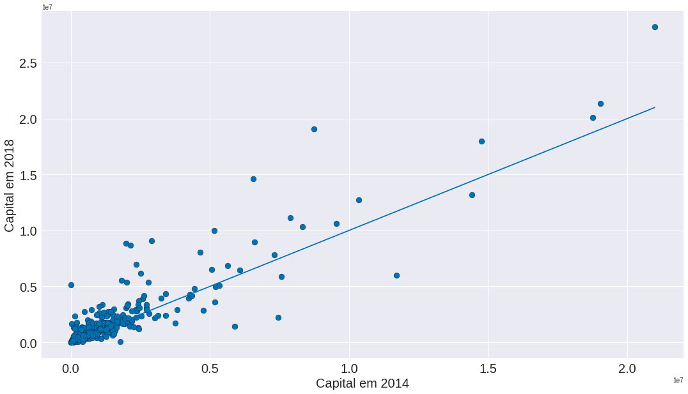

