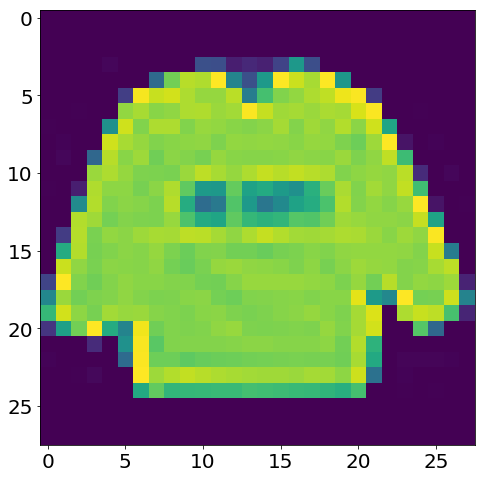
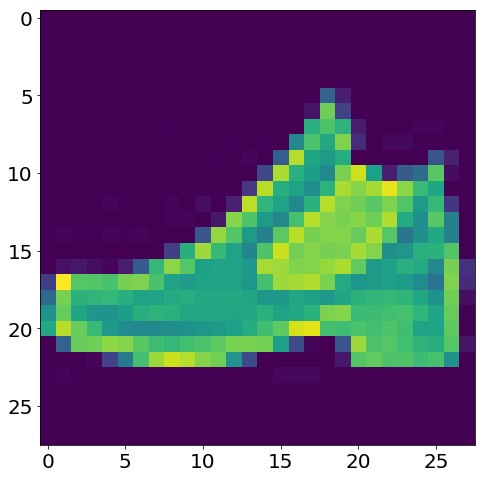
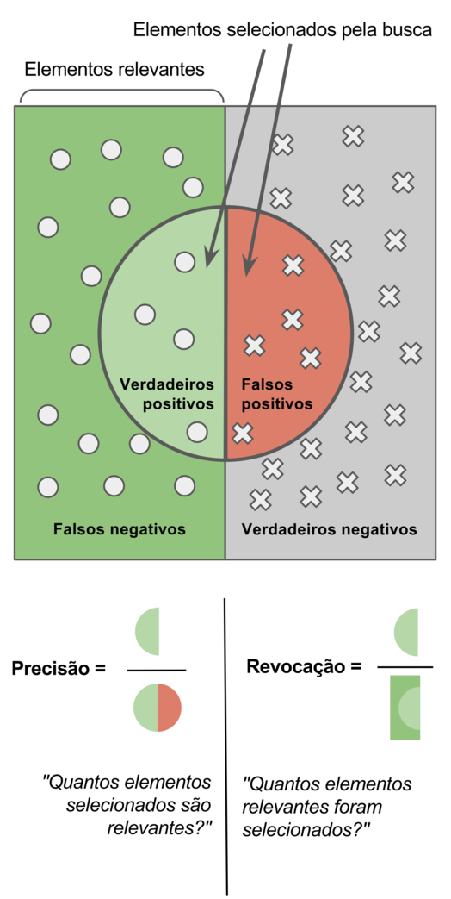
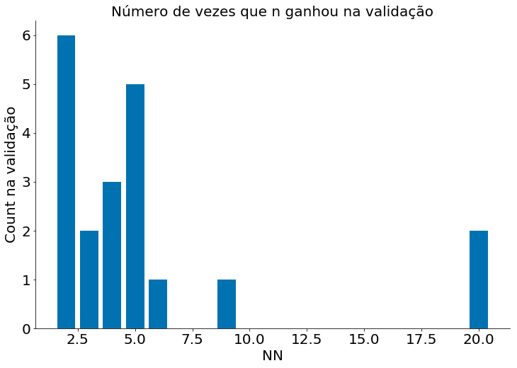
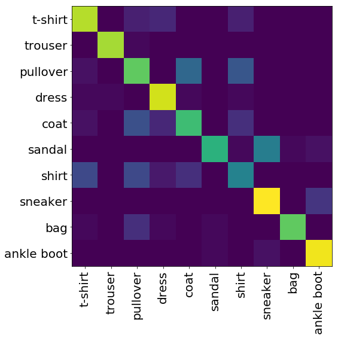
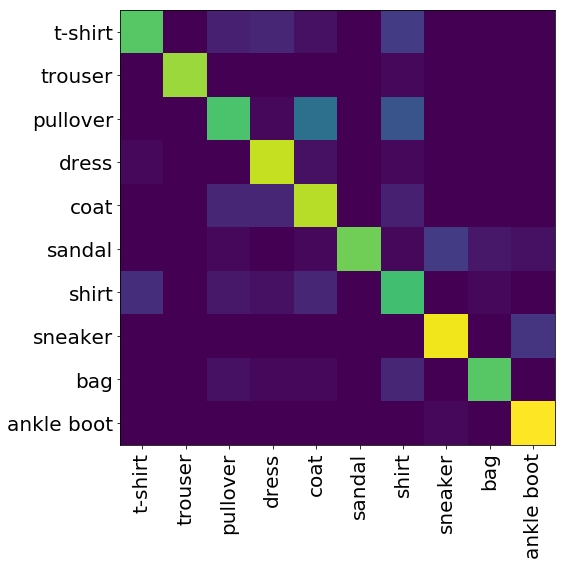

```python
# -*- coding: utf8

from scipy import stats as ss

import seaborn as sns
import numpy as np
import matplotlib.pyplot as plt
import pandas as pd

plt.rcParams['figure.figsize']  = (18, 10)
plt.rcParams['axes.labelsize']  = 20
plt.rcParams['axes.titlesize']  = 20
plt.rcParams['legend.fontsize'] = 20
plt.rcParams['xtick.labelsize'] = 20
plt.rcParams['ytick.labelsize'] = 20
plt.rcParams['lines.linewidth'] = 4
```


```python
plt.ion()
plt.style.use('seaborn-colorblind')
plt.rcParams['figure.figsize']  = (12, 8)
```


```python
def despine(ax=None):
    if ax is None:
        ax = plt.gca()
    # Hide the right and top spines
    ax.spines['right'].set_visible(False)
    ax.spines['top'].set_visible(False)

    # Only show ticks on the left and bottom spines
    ax.yaxis.set_ticks_position('left')
    ax.xaxis.set_ticks_position('bottom')
```


```python
def load_mnist(path, kind='train'):
    import os
    import gzip
    import numpy as np

    """Load MNIST data from `path`"""
    labels_path = os.path.join(path,
                               '%s-labels-idx1-ubyte.gz'
                               % kind)
    images_path = os.path.join(path,
                               '%s-images-idx3-ubyte.gz'
                               % kind)

    with gzip.open(labels_path, 'rb') as lbpath:
        labels = np.frombuffer(lbpath.read(), dtype=np.uint8,
                               offset=8)

    with gzip.open(images_path, 'rb') as imgpath:
        images = np.frombuffer(imgpath.read(), dtype=np.uint8,
                               offset=16).reshape(len(labels), 784)

    return images, labels
```

# Aula 23 - Aprendizado na Prática

Nesta aula vamos explorar aprendizado de máquina na prática. Em particular, vamos iniciar por algoritmos de classificação na base Fashion MNIST. Depois disso vamos explorar regressão.

## Classificação

Acima, temos alguns códigos auxiliares para carregar a base. Nesta, cada ponto é um vetor de 784 posições. Ao redimensionar os mesmos com:

```python
x.reshape((28, 28))
```

Temos uma imagem de alguma peça de vestimento. Código para carregar os dados abaixo. Vamos usar apenas 500 instâncias para treino e teste. Lento usar muito mais do que isso no meu computador.


```python
X_train, y_train = load_mnist('fashion', kind='train')
X_test, y_test = load_mnist('fashion', kind='t10k')
```


```python
X_train = X_train[:500]
y_train = y_train[:500]

X_test = X_test[:500]
y_test = y_test[:500]
```


```python
np.unique(y_test, return_counts=True)
```


    (array([0, 1, 2, 3, 4, 5, 6, 7, 8, 9], dtype=uint8),
     array([53, 40, 63, 46, 55, 52, 49, 52, 43, 47]))


Observe como cada instância é um vetor. Cada valor é um tom de cinza. 0 == branco; 256 == preto.


```python
X_train[10]
```


    array([  0,   0,   0,   0,   1,   0,   0,   0,   0,  41, 162, 167,  84,
            30,  38,  94, 177, 176,  26,   0,   0,   0,   1,   0,   0,   0,
             0,   0,   0,   0,   0,   1,   0,   0,  41, 147, 228, 242, 228,
           236, 251, 251, 251, 255, 242, 230, 247, 221, 125,   0,   0,   0,
             0,   0,   0,   0,   0,   0,   0,   0,   0,  91, 216, 228, 222,
           219, 219, 218, 222, 200, 224, 230, 221, 222, 222, 227, 237, 183,
             0,   0,   0,   0,   0,   0,   0,   0,   0,   0,   4, 202, 208,
           212, 217, 219, 222, 222, 219, 219, 220, 218, 222, 224, 224, 221,
           210, 227, 163,   0,   0,   0,   0,   0,   0,   0,   0,   0, 102,
           225, 210, 216, 218, 222, 221, 219, 225, 225, 221, 222, 224, 222,
           224, 224, 215, 215, 218,  28,   0,   0,   0,   0,   0,   0,   0,
             0, 189, 222, 220, 213, 219, 220, 218, 221, 220, 219, 222, 226,
           222, 220, 221, 216, 215, 218, 229, 148,   0,   0,   0,   0,   0,
             0,   0,  11, 240, 210, 227, 213, 214, 220, 217, 220, 224, 220,
           221, 217, 206, 209, 208, 212, 220, 224, 218, 234,   0,   0,   0,
             0,   0,   0,   0, 118, 214, 208, 224, 216, 211, 226, 212, 219,
           213, 193, 192, 179, 194, 213, 216, 216, 217, 227, 216, 221,  91,
             0,   0,   0,   0,   0,   0, 170, 221, 205, 225, 219, 217, 232,
           232, 226, 182, 182, 211, 226, 220, 212, 217, 216, 216, 225, 213,
           226, 184,   0,   0,   0,   0,   0,   0,   0, 181, 229, 219, 220,
           213, 227, 226, 222, 214, 222, 220, 216, 215, 213, 214, 216, 215,
           220, 233, 211,   0,   0,   0,   0,   0,   0,   0,   0,   0, 164,
           242, 222, 210, 214, 211, 215, 215, 216, 217, 215, 215, 215, 215,
           213, 222, 238, 184,   0,   0,   0,   0,   0,   0,   0,   0,   2,
             0,   0,  60, 222, 217, 214, 214, 215, 219, 202, 217, 210, 203,
           216, 212, 221, 200,  60,   0,   0,   0,   0,   0,   0,   0,   0,
             0,   0,   0,   0,   0, 193, 222, 208, 216, 215, 216, 218, 220,
           219, 215, 216, 204, 222, 148,   0,   0,   0,   0,   0,   0,   0,
             0,   0,   0,   0,   0,   0,   0, 194, 222, 206, 216, 216, 217,
           218, 217, 218, 216, 218, 208, 219, 179,   0,   0,   0,   0,   0,
             0,   0,   0,   0,   0,   0,   1,   0,   0, 192, 224, 213, 217,
           217, 218, 217, 217, 217, 215, 216, 209, 215, 176,   0,   0,   0,
             0,   0,   0,   0,   0,   0,   0,   0,   1,   0,   0, 194, 221,
           214, 217, 216, 216, 217, 217, 217, 216, 214, 210, 214, 177,   0,
             0,   0,   0,   0,   0,   0,   0,   0,   0,   0,   1,   0,   0,
           193, 220, 214, 218, 217, 216, 217, 217, 216, 216, 215, 212, 214,
           183,   0,   0,   0,   0,   0,   0,   0,   0,   0,   0,   0,   1,
             0,   0, 197, 220, 214, 219, 218, 218, 218, 218, 217, 217, 219,
           214, 217, 189,   0,   0,   1,   0,   0,   0,   0,   0,   0,   0,
             0,   0,   0,   0, 201, 222, 214, 219, 218, 219, 219, 218, 218,
           217, 219, 216, 220, 196,   0,   0,   1,   0,   0,   0,   0,   0,
             0,   0,   0,   0,   0,   0, 209, 222, 216, 220, 219, 219, 220,
           220, 218, 217, 219, 216, 222, 203,   0,   0,   1,   0,   0,   0,
             0,   0,   0,   0,   0,   0,   0,   0, 209, 221, 216, 220, 219,
           219, 221, 221, 219, 219, 221, 217, 222, 210,   0,   0,   1,   0,
             0,   0,   0,   0,   0,   0,   0,   0,   0,   0, 208, 222, 218,
           221, 220, 220, 221, 222, 220, 220, 222, 219, 222, 216,   0,   0,
             1,   0,   0,   0,   0,   0,   0,   0,   0,   1,   0,   0, 210,
           226, 220, 221, 220, 221, 222, 222, 220, 220, 224, 221, 224, 221,
             0,   0,   0,   0,   0,   0,   0,   0,   0,   0,   0,   1,   0,
             0, 217, 227, 219, 222, 224, 219, 219, 221, 222, 220, 221, 222,
           225, 220,   0,   0,   0,   0,   0,   0,   0,   0,   0,   0,   0,
             1,   0,   0, 183, 228, 221, 225, 221, 215, 217, 221, 222, 221,
           222, 224, 224, 193,   0,   0,   1,   0,   0,   0,   0,   0,   0,
             0,   0,   1,   0,   0, 179, 225, 218, 221, 219, 213, 213, 217,
           220, 219, 218, 221, 222, 197,   0,   0,   2,   0,   0,   0,   0,
             0,   0,   0,   0,   1,   0,   0, 240, 233, 228, 235, 232, 229,
           228, 229, 231, 231, 231, 228, 229, 212,   0,   0,   1,   0,   0,
             0,   0,   0,   0,   0,   0,   0,   0,   0, 101, 157, 148, 148,
           167, 180, 182, 179, 176, 172, 171, 164, 177, 163,   0,   0,   1,
             0,   0,   0,   0], dtype=uint8)


Ao redimensionar temos uma peça de roupa! Fashion!


```python
I = X_train[0].reshape(28, 28)
print(I.shape)
```

    (28, 28)


```python
plt.imshow(X_train[0].reshape(28, 28))
```


    <matplotlib.image.AxesImage at 0x7f9bfc4c3588>





```python
plt.imshow(X_train[1].reshape(28, 28))
```


    <matplotlib.image.AxesImage at 0x7f9bfc04f748>





```python
M = np.array([[1, 2], [2, 3]])
M.ravel()
```


    array([1, 2, 2, 3])


Temos 10 classes. 


```python
len(set(y_train))
```


    10


```python
text_labels = ['t-shirt', 'trouser', 'pullover', 'dress', 'coat', 'sandal', 'shirt', 'sneaker', 'bag', 'ankle boot']
index = np.arange(len(text_labels))
labels = pd.Series(text_labels, index=index)
labels
```


    0       t-shirt
    1       trouser
    2      pullover
    3         dress
    4          coat
    5        sandal
    6         shirt
    7       sneaker
    8           bag
    9    ankle boot
    dtype: object


## Executando o Scikit-Learn

Agora, vamos executar o código do sklearn na nossa base. Lembrando que temos que separar a mesma em Treino, Validação e Teste. Para tal, vamos fazer uso da classe `StratifiedKFold`. A mesma serve para realizar n-fold cross validation. A biblioteca sklearn não cria grupos de validação para você, a mesma só usa o conceito de treino/teste. De qualquer forma, validação nada mais é do que um conjunto a mais de teste. Então, vamos fazer 5-fold no nosso treino, separando em treino/validação. Note que NUNCA avaliamos nada no teste, apenas reportamos os números no fim!!


```python
from sklearn.model_selection import StratifiedKFold
```

Ao gerar o split, tereos 20 conjuntos (muito eu sei).


```python
skf = StratifiedKFold(n_splits=20, shuffle=True)
```

Cada passo do laço retorna indices do vetor


```python
for treino, validacao in skf.split(X_train, y_train):
    count_train = np.unique(y_train[validacao], return_counts=True)
    break
```

Vamos quebrar nos conjuntos e avaliar o KNN. De um mundo de métricas, vamos fazer uso de 4 neste notebook:

1. Precisão
2. Revocação
3. F1
4. Acurácia



Na figura acima, assuma que o termo `busca` indica as previsões do seu classificador (sem tempo para alterar a figura irmão). Sendo `y_p (y-pred)` um conjunto de elementos da previsão e `y_t (y-true)` os rótulos reais. Por clareza, vamos assumir duas classes `1 e 0`. Afinal, o caso multiclasse pode ser reduzido para este. Assim, cada elemento dos vetores `y_p` e `y_t` $\in \{0, 1\}$. Os verdadeiros positivos, __true positive (TP)__, é o conjunto de previsões da classe `1` que foram corretas. Podemos formalizar como:

$$TP = \sum_i \mathbb{1}_{y_t[i] = 1} \mathbb{1}_{y_p[i] = 1}$$

$\mathbb{1}_{y_t[i] = 1}$ retorna 1 quando $y_t[i] = 1$, 0 caso contrário. O mesmo vale para $\mathbb{1}_{y_t[i] = y_p[i]}$ que retorna um quando $y_p[i] = 1$. Usando a mesma notação, os verdadeiros negativos é definido como:

$$TN = \sum_i \mathbb{1}_{y_t[i] = 0} \mathbb{1}_{y_t[i] = 0}$$

Os falsos positivos e negativos capturam os erros da previsão. Note que nos dois a previsão é o oposto do real:

$$FP = \sum_i \mathbb{1}_{y_t[i] = 0} \mathbb{1}_{y_p[i] = 1}$$

$$FN = \sum_i \mathbb{1}_{y_t[i] = 1} \mathbb{1}_{y_p[i] = 0}$$

Assim, a acurácia do classificador é definida como a fração total de acertos:

$$Acuracia = \frac{TP + TN}{TP + TN + FP + FN}$$

A precisão é definida como a fração dos elementos classificados como 1 que foram corretos:

$$Precisão = \frac{TP}{TP + FP}$$

A revocação é a fração de todos os elementos do conjunto 1 que foram acertados. Diferente da precisão, aqui focamos nos elementos reais! Na precisão focamos nas previsões.

$$Revocação = \frac{TP}{TP + FN}$$

Tanto a previsão quanto a revocação importam. Na primeira, precisão, queremos saber o quão bom o classificador é em retornar acertos. Na segunda, o quanto de elementos reais o classificador captura. Observe como um classificador que sempre retorna 1 tem revocação máxima, porém precisão baixa. Um classificador que sempre retorna 0 tem precisão máxima e revocação baixa. Para captura a média harmônica dos dois usamos o F1-score:

$$F1 = MediaHarmonica(Precisao, Revocacao)$$

Dependendo do problema uma métrica pode importar mais do que a outra. Aqui, trabalhamos com classes balanceadas, então a acurácia já é boa suficiente. Vamos avaliar a acurácia nos conjuntos abaixo:


```python
from sklearn.neighbors import KNeighborsClassifier
from sklearn.metrics import accuracy_score
```

Observe como o laço abaixo guarda o melhor valor de n para cada fold de validação!


```python
fold = 0
melhores = []
for treino, validacao in skf.split(X_train, y_train):
    X_tt = X_train[treino]
    y_tt = y_train[treino]
    X_v = X_train[validacao]
    y_v = y_train[validacao]
    
    best = (0, 0)
    for nn in [2, 3, 4, 5, 6, 7, 8, 9, 10, 20, 30, 40, 50, 100]: # Vamos testar tais valores de n
        model = KNeighborsClassifier(n_neighbors=nn)
        model.fit(X_tt, y_tt) # treina no conjunto de treino
        y_pv = model.predict(X_v) # previsões no conjunto de validação
        
        # Resultado com melhor acurácia!
        accuracy = accuracy_score(y_v, y_pv)
        if accuracy > best[0]:
            best = (accuracy, nn)
    
    melhores.append(best[1])
    fold += 1
    print('Fold-{}, melhor n = {}, acc = {}'.format(fold, best[1], best[0]))
```

    Fold-1, melhor n = 3, acc = 0.6774193548387096
    Fold-2, melhor n = 2, acc = 0.7931034482758621
    Fold-3, melhor n = 20, acc = 0.7241379310344828
    Fold-4, melhor n = 3, acc = 0.7586206896551724
    Fold-5, melhor n = 4, acc = 0.7931034482758621
    Fold-6, melhor n = 5, acc = 0.8076923076923077
    Fold-7, melhor n = 5, acc = 0.7692307692307693
    Fold-8, melhor n = 2, acc = 0.8076923076923077
    Fold-9, melhor n = 4, acc = 0.8461538461538461
    Fold-10, melhor n = 4, acc = 0.7307692307692307
    Fold-11, melhor n = 20, acc = 0.68
    Fold-12, melhor n = 2, acc = 0.8333333333333334
    Fold-13, melhor n = 2, acc = 0.7272727272727273
    Fold-14, melhor n = 5, acc = 0.9090909090909091
    Fold-15, melhor n = 6, acc = 0.7272727272727273
    Fold-16, melhor n = 9, acc = 0.7727272727272727
    Fold-17, melhor n = 2, acc = 0.6363636363636364
    Fold-18, melhor n = 5, acc = 0.6818181818181818
    Fold-19, melhor n = 2, acc = 0.8095238095238095
    Fold-20, melhor n = 5, acc = 0.6666666666666666


Vamos ver quantas vezes cada escolha de número de vizinhos, nn, ganhou na validação.


```python
unique, counts = np.unique(melhores, return_counts=True)
plt.bar(unique, counts)
despine()
plt.title('Número de vezes que n ganhou na validação')
plt.xlabel('NN')
plt.ylabel('Count na validação')
```


    Text(0, 0.5, 'Count na validação')





Agora, podemos finalmente avaliar o modelo no conjunto de teste! Vamos escolher n como a médiana dos folds.


```python
print(np.median(melhores))
```

    4.0


Vamos verificar as outras métricas e todas as classes.


```python
from sklearn.metrics import classification_report

model = KNeighborsClassifier(n_neighbors=6)
model.fit(X_train, y_train)

print(classification_report(y_test, model.predict(X_test)))
```

                  precision    recall  f1-score   support
    
               0       0.71      0.75      0.73        53
               1       0.97      0.97      0.97        40
               2       0.52      0.54      0.53        63
               3       0.75      0.91      0.82        46
               4       0.58      0.56      0.57        55
               5       0.94      0.56      0.70        52
               6       0.45      0.41      0.43        49
               7       0.68      0.87      0.76        52
               8       0.97      0.79      0.87        43
               9       0.83      0.94      0.88        47
    
       micro avg       0.72      0.72      0.72       500
       macro avg       0.74      0.73      0.73       500
    weighted avg       0.73      0.72      0.71       500
    


Parece que erramos muito a classe 4, coat. Casacos se parecem com camisas, vestidos etc. Podemos investigar isto usando a matriz de confusão.


```python
from sklearn.metrics import confusion_matrix
plt.imshow(confusion_matrix(y_test, model.predict(X_test)))
plt.xticks(labels.index, labels, rotation=90)
plt.yticks(labels.index, labels)
```


    ([<matplotlib.axis.YTick at 0x7f9bf5f60be0>,
      <matplotlib.axis.YTick at 0x7f9bf5f605f8>,
      <matplotlib.axis.YTick at 0x7f9bf5f48400>,
      <matplotlib.axis.YTick at 0x7f9bf5f0a7f0>,
      <matplotlib.axis.YTick at 0x7f9bf5f02940>,
      <matplotlib.axis.YTick at 0x7f9bf5efb470>,
      <matplotlib.axis.YTick at 0x7f9bf5f0abe0>,
      <matplotlib.axis.YTick at 0x7f9bf5f14160>,
      <matplotlib.axis.YTick at 0x7f9bf5f14630>,
      <matplotlib.axis.YTick at 0x7f9bf5f14b38>],
     <a list of 10 Text yticklabel objects>)





## Logística

Vamos repetir tudo para a regressão logística. Felizmente, o sklearn tem uma versão da logística que já faz treino/validação internamente. Para alguns modelos, existem atalhos para fazer isto. Caso queira entender, leia:

https://robjhyndman.com/hyndsight/crossvalidation/


```python
from sklearn.linear_model import LogisticRegressionCV
```


```python
# O LogisticCV tenta várias regularizações.
model = LogisticRegressionCV(Cs=100,
                             penalty='l2',   #ridge
                             cv=5,           #5 folds internos
                             fit_intercept=False,
                             multi_class='ovr')
model.fit(X_train, y_train)
```

    /home/flaviovdf/miniconda3/envs/teaching/lib/python3.6/site-packages/sklearn/linear_model/logistic.py:758: ConvergenceWarning: lbfgs failed to converge. Increase the number of iterations.
      "of iterations.", ConvergenceWarning)
    /home/flaviovdf/miniconda3/envs/teaching/lib/python3.6/site-packages/sklearn/linear_model/logistic.py:758: ConvergenceWarning: lbfgs failed to converge. Increase the number of iterations.
      "of iterations.", ConvergenceWarning)
    /home/flaviovdf/miniconda3/envs/teaching/lib/python3.6/site-packages/sklearn/linear_model/logistic.py:758: ConvergenceWarning: lbfgs failed to converge. Increase the number of iterations.
      "of iterations.", ConvergenceWarning)
    /home/flaviovdf/miniconda3/envs/teaching/lib/python3.6/site-packages/sklearn/linear_model/logistic.py:758: ConvergenceWarning: lbfgs failed to converge. Increase the number of iterations.
      "of iterations.", ConvergenceWarning)
    /home/flaviovdf/miniconda3/envs/teaching/lib/python3.6/site-packages/sklearn/linear_model/logistic.py:758: ConvergenceWarning: lbfgs failed to converge. Increase the number of iterations.
      "of iterations.", ConvergenceWarning)
    /home/flaviovdf/miniconda3/envs/teaching/lib/python3.6/site-packages/sklearn/linear_model/logistic.py:758: ConvergenceWarning: lbfgs failed to converge. Increase the number of iterations.
      "of iterations.", ConvergenceWarning)
    /home/flaviovdf/miniconda3/envs/teaching/lib/python3.6/site-packages/sklearn/linear_model/logistic.py:758: ConvergenceWarning: lbfgs failed to converge. Increase the number of iterations.
      "of iterations.", ConvergenceWarning)
    /home/flaviovdf/miniconda3/envs/teaching/lib/python3.6/site-packages/sklearn/linear_model/logistic.py:758: ConvergenceWarning: lbfgs failed to converge. Increase the number of iterations.
      "of iterations.", ConvergenceWarning)
    /home/flaviovdf/miniconda3/envs/teaching/lib/python3.6/site-packages/sklearn/linear_model/logistic.py:758: ConvergenceWarning: lbfgs failed to converge. Increase the number of iterations.
      "of iterations.", ConvergenceWarning)
    /home/flaviovdf/miniconda3/envs/teaching/lib/python3.6/site-packages/sklearn/linear_model/logistic.py:758: ConvergenceWarning: lbfgs failed to converge. Increase the number of iterations.
      "of iterations.", ConvergenceWarning)
    /home/flaviovdf/miniconda3/envs/teaching/lib/python3.6/site-packages/sklearn/linear_model/logistic.py:758: ConvergenceWarning: lbfgs failed to converge. Increase the number of iterations.
      "of iterations.", ConvergenceWarning)
    /home/flaviovdf/miniconda3/envs/teaching/lib/python3.6/site-packages/sklearn/linear_model/logistic.py:758: ConvergenceWarning: lbfgs failed to converge. Increase the number of iterations.
      "of iterations.", ConvergenceWarning)
    /home/flaviovdf/miniconda3/envs/teaching/lib/python3.6/site-packages/sklearn/linear_model/logistic.py:758: ConvergenceWarning: lbfgs failed to converge. Increase the number of iterations.
      "of iterations.", ConvergenceWarning)
    /home/flaviovdf/miniconda3/envs/teaching/lib/python3.6/site-packages/sklearn/linear_model/logistic.py:758: ConvergenceWarning: lbfgs failed to converge. Increase the number of iterations.
      "of iterations.", ConvergenceWarning)
    /home/flaviovdf/miniconda3/envs/teaching/lib/python3.6/site-packages/sklearn/linear_model/logistic.py:758: ConvergenceWarning: lbfgs failed to converge. Increase the number of iterations.
      "of iterations.", ConvergenceWarning)
    /home/flaviovdf/miniconda3/envs/teaching/lib/python3.6/site-packages/sklearn/linear_model/logistic.py:758: ConvergenceWarning: lbfgs failed to converge. Increase the number of iterations.
      "of iterations.", ConvergenceWarning)
    /home/flaviovdf/miniconda3/envs/teaching/lib/python3.6/site-packages/sklearn/linear_model/logistic.py:758: ConvergenceWarning: lbfgs failed to converge. Increase the number of iterations.
      "of iterations.", ConvergenceWarning)
    /home/flaviovdf/miniconda3/envs/teaching/lib/python3.6/site-packages/sklearn/linear_model/logistic.py:758: ConvergenceWarning: lbfgs failed to converge. Increase the number of iterations.
      "of iterations.", ConvergenceWarning)
    /home/flaviovdf/miniconda3/envs/teaching/lib/python3.6/site-packages/sklearn/linear_model/logistic.py:758: ConvergenceWarning: lbfgs failed to converge. Increase the number of iterations.
      "of iterations.", ConvergenceWarning)
    /home/flaviovdf/miniconda3/envs/teaching/lib/python3.6/site-packages/sklearn/linear_model/logistic.py:758: ConvergenceWarning: lbfgs failed to converge. Increase the number of iterations.
      "of iterations.", ConvergenceWarning)
    /home/flaviovdf/miniconda3/envs/teaching/lib/python3.6/site-packages/sklearn/linear_model/logistic.py:758: ConvergenceWarning: lbfgs failed to converge. Increase the number of iterations.
      "of iterations.", ConvergenceWarning)
    /home/flaviovdf/miniconda3/envs/teaching/lib/python3.6/site-packages/sklearn/linear_model/logistic.py:758: ConvergenceWarning: lbfgs failed to converge. Increase the number of iterations.
      "of iterations.", ConvergenceWarning)
    /home/flaviovdf/miniconda3/envs/teaching/lib/python3.6/site-packages/sklearn/linear_model/logistic.py:758: ConvergenceWarning: lbfgs failed to converge. Increase the number of iterations.
      "of iterations.", ConvergenceWarning)
    /home/flaviovdf/miniconda3/envs/teaching/lib/python3.6/site-packages/sklearn/linear_model/logistic.py:758: ConvergenceWarning: lbfgs failed to converge. Increase the number of iterations.
      "of iterations.", ConvergenceWarning)
    /home/flaviovdf/miniconda3/envs/teaching/lib/python3.6/site-packages/sklearn/linear_model/logistic.py:758: ConvergenceWarning: lbfgs failed to converge. Increase the number of iterations.
      "of iterations.", ConvergenceWarning)
    /home/flaviovdf/miniconda3/envs/teaching/lib/python3.6/site-packages/sklearn/linear_model/logistic.py:758: ConvergenceWarning: lbfgs failed to converge. Increase the number of iterations.
      "of iterations.", ConvergenceWarning)
    /home/flaviovdf/miniconda3/envs/teaching/lib/python3.6/site-packages/sklearn/linear_model/logistic.py:758: ConvergenceWarning: lbfgs failed to converge. Increase the number of iterations.
      "of iterations.", ConvergenceWarning)
    /home/flaviovdf/miniconda3/envs/teaching/lib/python3.6/site-packages/sklearn/linear_model/logistic.py:758: ConvergenceWarning: lbfgs failed to converge. Increase the number of iterations.
      "of iterations.", ConvergenceWarning)
    /home/flaviovdf/miniconda3/envs/teaching/lib/python3.6/site-packages/sklearn/linear_model/logistic.py:758: ConvergenceWarning: lbfgs failed to converge. Increase the number of iterations.
      "of iterations.", ConvergenceWarning)
    /home/flaviovdf/miniconda3/envs/teaching/lib/python3.6/site-packages/sklearn/linear_model/logistic.py:758: ConvergenceWarning: lbfgs failed to converge. Increase the number of iterations.
      "of iterations.", ConvergenceWarning)
    /home/flaviovdf/miniconda3/envs/teaching/lib/python3.6/site-packages/sklearn/linear_model/logistic.py:758: ConvergenceWarning: lbfgs failed to converge. Increase the number of iterations.
      "of iterations.", ConvergenceWarning)
    /home/flaviovdf/miniconda3/envs/teaching/lib/python3.6/site-packages/sklearn/linear_model/logistic.py:758: ConvergenceWarning: lbfgs failed to converge. Increase the number of iterations.
      "of iterations.", ConvergenceWarning)
    /home/flaviovdf/miniconda3/envs/teaching/lib/python3.6/site-packages/sklearn/linear_model/logistic.py:758: ConvergenceWarning: lbfgs failed to converge. Increase the number of iterations.
      "of iterations.", ConvergenceWarning)


    LogisticRegressionCV(Cs=100, class_weight=None, cv=5, dual=False,
               fit_intercept=False, intercept_scaling=1.0, max_iter=100,
               multi_class='ovr', n_jobs=None, penalty='l2', random_state=None,
               refit=True, scoring=None, solver='lbfgs', tol=0.0001, verbose=0)


```python
model.C_
```


    array([0.0001    , 0.0001    , 0.0001    , 0.00017475, 0.0001    ,
           0.0001    , 0.00017475, 0.0001    , 0.0001    , 0.01261857])


```python
print(classification_report(y_test, model.predict(X_test)))
```

                  precision    recall  f1-score   support
    
               0       0.83      0.64      0.72        53
               1       1.00      0.97      0.99        40
               2       0.69      0.52      0.59        63
               3       0.75      0.91      0.82        46
               4       0.59      0.75      0.66        55
               5       1.00      0.69      0.82        52
               6       0.50      0.65      0.57        49
               7       0.83      0.87      0.85        52
               8       0.89      0.79      0.84        43
               9       0.84      0.98      0.90        47
    
       micro avg       0.76      0.76      0.76       500
       macro avg       0.79      0.78      0.78       500
    weighted avg       0.78      0.76      0.76       500
    


```python
plt.imshow(confusion_matrix(y_test, model.predict(X_test)))
plt.xticks(labels.index, labels, rotation=90)
plt.yticks(labels.index, labels)
```


    ([<matplotlib.axis.YTick at 0x7f9bf4a27438>,
      <matplotlib.axis.YTick at 0x7f9bf4a22d30>,
      <matplotlib.axis.YTick at 0x7f9bf4a17d30>,
      <matplotlib.axis.YTick at 0x7f9bf2344be0>,
      <matplotlib.axis.YTick at 0x7f9bf4a43c18>,
      <matplotlib.axis.YTick at 0x7f9bf4a3d908>,
      <matplotlib.axis.YTick at 0x7f9bf234c4e0>,
      <matplotlib.axis.YTick at 0x7f9bf234c9e8>,
      <matplotlib.axis.YTick at 0x7f9bf234cef0>,
      <matplotlib.axis.YTick at 0x7f9bf2355438>],
     <a list of 10 Text yticklabel objects>)





## Lebron James

Agora vamos avalias os modelos em dados tabulares. Primeiro, vamos carregar os dados. Obsevre que cada atributo é diferente. Data, numéricos categóricos, etc...


```python
df = pd.read_csv('https://media.githubusercontent.com/media/icd-ufmg/material/master/aulas/23-MLPratica/lebron.csv')
df.head()
```


<div>
<style scoped>
    .dataframe tbody tr th:only-of-type {
        vertical-align: middle;
    }

    .dataframe tbody tr th {
        vertical-align: top;
    }

    .dataframe thead th {
        text-align: right;
    }
</style>
<table border="1" class="dataframe">
  <thead>
    <tr style="text-align: right;">
      <th></th>
      <th>game_date</th>
      <th>minute</th>
      <th>opponent</th>
      <th>action_type</th>
      <th>shot_type</th>
      <th>shot_distance</th>
      <th>shot_made</th>
    </tr>
  </thead>
  <tbody>
    <tr>
      <th>0</th>
      <td>20170415</td>
      <td>10</td>
      <td>IND</td>
      <td>Driving Layup Shot</td>
      <td>2PT Field Goal</td>
      <td>0</td>
      <td>0</td>
    </tr>
    <tr>
      <th>1</th>
      <td>20170415</td>
      <td>11</td>
      <td>IND</td>
      <td>Driving Layup Shot</td>
      <td>2PT Field Goal</td>
      <td>0</td>
      <td>1</td>
    </tr>
    <tr>
      <th>2</th>
      <td>20170415</td>
      <td>14</td>
      <td>IND</td>
      <td>Layup Shot</td>
      <td>2PT Field Goal</td>
      <td>0</td>
      <td>1</td>
    </tr>
    <tr>
      <th>3</th>
      <td>20170415</td>
      <td>15</td>
      <td>IND</td>
      <td>Driving Layup Shot</td>
      <td>2PT Field Goal</td>
      <td>0</td>
      <td>1</td>
    </tr>
    <tr>
      <th>4</th>
      <td>20170415</td>
      <td>18</td>
      <td>IND</td>
      <td>Alley Oop Dunk Shot</td>
      <td>2PT Field Goal</td>
      <td>0</td>
      <td>1</td>
    </tr>
  </tbody>
</table>
</div>


Primeiro temos que converter os atributos categóricos em colunas novas. Para isto, fazemos uso de one hot encoding. Cada categoria vira uma coluna de 1/0. Algoritmos como KNN e Logistic não sabem fazer uso de categorias por padrão. Mesmo se as categorias representarem números, faça uso de one hot. Sempre se pergunte: faz sentido computar uma distância nessa coluna? Se não, one-hot (ou outra abordagem).


```python
df = pd.get_dummies(df, columns=['opponent', 'action_type', 'shot_type'])
df.head()
```


<div>
<style scoped>
    .dataframe tbody tr th:only-of-type {
        vertical-align: middle;
    }

    .dataframe tbody tr th {
        vertical-align: top;
    }

    .dataframe thead th {
        text-align: right;
    }
</style>
<table border="1" class="dataframe">
  <thead>
    <tr style="text-align: right;">
      <th></th>
      <th>game_date</th>
      <th>minute</th>
      <th>shot_distance</th>
      <th>shot_made</th>
      <th>opponent_BOS</th>
      <th>opponent_GSW</th>
      <th>opponent_IND</th>
      <th>opponent_TOR</th>
      <th>action_type_Alley Oop Dunk Shot</th>
      <th>action_type_Alley Oop Layup shot</th>
      <th>...</th>
      <th>action_type_Running Pull-Up Jump Shot</th>
      <th>action_type_Running Reverse Layup Shot</th>
      <th>action_type_Step Back Jump shot</th>
      <th>action_type_Tip Layup Shot</th>
      <th>action_type_Turnaround Fadeaway Bank Jump Shot</th>
      <th>action_type_Turnaround Fadeaway shot</th>
      <th>action_type_Turnaround Hook Shot</th>
      <th>action_type_Turnaround Jump Shot</th>
      <th>shot_type_2PT Field Goal</th>
      <th>shot_type_3PT Field Goal</th>
    </tr>
  </thead>
  <tbody>
    <tr>
      <th>0</th>
      <td>20170415</td>
      <td>10</td>
      <td>0</td>
      <td>0</td>
      <td>0</td>
      <td>0</td>
      <td>1</td>
      <td>0</td>
      <td>0</td>
      <td>0</td>
      <td>...</td>
      <td>0</td>
      <td>0</td>
      <td>0</td>
      <td>0</td>
      <td>0</td>
      <td>0</td>
      <td>0</td>
      <td>0</td>
      <td>1</td>
      <td>0</td>
    </tr>
    <tr>
      <th>1</th>
      <td>20170415</td>
      <td>11</td>
      <td>0</td>
      <td>1</td>
      <td>0</td>
      <td>0</td>
      <td>1</td>
      <td>0</td>
      <td>0</td>
      <td>0</td>
      <td>...</td>
      <td>0</td>
      <td>0</td>
      <td>0</td>
      <td>0</td>
      <td>0</td>
      <td>0</td>
      <td>0</td>
      <td>0</td>
      <td>1</td>
      <td>0</td>
    </tr>
    <tr>
      <th>2</th>
      <td>20170415</td>
      <td>14</td>
      <td>0</td>
      <td>1</td>
      <td>0</td>
      <td>0</td>
      <td>1</td>
      <td>0</td>
      <td>0</td>
      <td>0</td>
      <td>...</td>
      <td>0</td>
      <td>0</td>
      <td>0</td>
      <td>0</td>
      <td>0</td>
      <td>0</td>
      <td>0</td>
      <td>0</td>
      <td>1</td>
      <td>0</td>
    </tr>
    <tr>
      <th>3</th>
      <td>20170415</td>
      <td>15</td>
      <td>0</td>
      <td>1</td>
      <td>0</td>
      <td>0</td>
      <td>1</td>
      <td>0</td>
      <td>0</td>
      <td>0</td>
      <td>...</td>
      <td>0</td>
      <td>0</td>
      <td>0</td>
      <td>0</td>
      <td>0</td>
      <td>0</td>
      <td>0</td>
      <td>0</td>
      <td>1</td>
      <td>0</td>
    </tr>
    <tr>
      <th>4</th>
      <td>20170415</td>
      <td>18</td>
      <td>0</td>
      <td>1</td>
      <td>0</td>
      <td>0</td>
      <td>1</td>
      <td>0</td>
      <td>1</td>
      <td>0</td>
      <td>...</td>
      <td>0</td>
      <td>0</td>
      <td>0</td>
      <td>0</td>
      <td>0</td>
      <td>0</td>
      <td>0</td>
      <td>0</td>
      <td>1</td>
      <td>0</td>
    </tr>
  </tbody>
</table>
<p>5 rows × 44 columns</p>
</div>


```python
df.shape
```


    (384, 44)


Agora vamos converter a data. Note que a mesma existe em uma escala completamente diferente do resto.


```python
datas = pd.to_datetime(df['game_date'], format='%Y%m%d')
datas
```


    0     2017-04-15
    1     2017-04-15
    2     2017-04-15
    3     2017-04-15
    4     2017-04-15
    5     2017-04-15
    6     2017-04-15
    7     2017-04-15
    8     2017-04-15
    9     2017-04-15
    10    2017-04-15
    11    2017-04-15
    12    2017-04-15
    13    2017-04-15
    14    2017-04-15
    15    2017-04-15
    16    2017-04-15
    17    2017-04-15
    18    2017-04-15
    19    2017-04-15
    20    2017-04-17
    21    2017-04-17
    22    2017-04-17
    23    2017-04-17
    24    2017-04-17
    25    2017-04-17
    26    2017-04-17
    27    2017-04-17
    28    2017-04-17
    29    2017-04-17
             ...    
    354   2017-06-12
    355   2017-06-12
    356   2017-06-12
    357   2017-06-12
    358   2017-06-12
    359   2017-06-12
    360   2017-06-12
    361   2017-06-12
    362   2017-06-12
    363   2017-06-12
    364   2017-06-12
    365   2017-06-12
    366   2017-06-12
    367   2017-06-12
    368   2017-06-12
    369   2017-06-12
    370   2017-06-12
    371   2017-06-12
    372   2017-06-12
    373   2017-06-12
    374   2017-06-12
    375   2017-06-12
    376   2017-06-12
    377   2017-06-12
    378   2017-06-12
    379   2017-06-12
    380   2017-06-12
    381   2017-06-12
    382   2017-06-12
    383   2017-06-12
    Name: game_date, Length: 384, dtype: datetime64[ns]


Como trabalhar com esse mundo de valores distintos? Solução!? Normalizar!


```python
df['game_date'] = np.array(datas, dtype='d') # nano segundos, valores gigantes, vamos normalizar
df.head()
```


<div>
<style scoped>
    .dataframe tbody tr th:only-of-type {
        vertical-align: middle;
    }

    .dataframe tbody tr th {
        vertical-align: top;
    }

    .dataframe thead th {
        text-align: right;
    }
</style>
<table border="1" class="dataframe">
  <thead>
    <tr style="text-align: right;">
      <th></th>
      <th>game_date</th>
      <th>minute</th>
      <th>shot_distance</th>
      <th>shot_made</th>
      <th>opponent_BOS</th>
      <th>opponent_GSW</th>
      <th>opponent_IND</th>
      <th>opponent_TOR</th>
      <th>action_type_Alley Oop Dunk Shot</th>
      <th>action_type_Alley Oop Layup shot</th>
      <th>...</th>
      <th>action_type_Running Pull-Up Jump Shot</th>
      <th>action_type_Running Reverse Layup Shot</th>
      <th>action_type_Step Back Jump shot</th>
      <th>action_type_Tip Layup Shot</th>
      <th>action_type_Turnaround Fadeaway Bank Jump Shot</th>
      <th>action_type_Turnaround Fadeaway shot</th>
      <th>action_type_Turnaround Hook Shot</th>
      <th>action_type_Turnaround Jump Shot</th>
      <th>shot_type_2PT Field Goal</th>
      <th>shot_type_3PT Field Goal</th>
    </tr>
  </thead>
  <tbody>
    <tr>
      <th>0</th>
      <td>1.492214e+18</td>
      <td>10</td>
      <td>0</td>
      <td>0</td>
      <td>0</td>
      <td>0</td>
      <td>1</td>
      <td>0</td>
      <td>0</td>
      <td>0</td>
      <td>...</td>
      <td>0</td>
      <td>0</td>
      <td>0</td>
      <td>0</td>
      <td>0</td>
      <td>0</td>
      <td>0</td>
      <td>0</td>
      <td>1</td>
      <td>0</td>
    </tr>
    <tr>
      <th>1</th>
      <td>1.492214e+18</td>
      <td>11</td>
      <td>0</td>
      <td>1</td>
      <td>0</td>
      <td>0</td>
      <td>1</td>
      <td>0</td>
      <td>0</td>
      <td>0</td>
      <td>...</td>
      <td>0</td>
      <td>0</td>
      <td>0</td>
      <td>0</td>
      <td>0</td>
      <td>0</td>
      <td>0</td>
      <td>0</td>
      <td>1</td>
      <td>0</td>
    </tr>
    <tr>
      <th>2</th>
      <td>1.492214e+18</td>
      <td>14</td>
      <td>0</td>
      <td>1</td>
      <td>0</td>
      <td>0</td>
      <td>1</td>
      <td>0</td>
      <td>0</td>
      <td>0</td>
      <td>...</td>
      <td>0</td>
      <td>0</td>
      <td>0</td>
      <td>0</td>
      <td>0</td>
      <td>0</td>
      <td>0</td>
      <td>0</td>
      <td>1</td>
      <td>0</td>
    </tr>
    <tr>
      <th>3</th>
      <td>1.492214e+18</td>
      <td>15</td>
      <td>0</td>
      <td>1</td>
      <td>0</td>
      <td>0</td>
      <td>1</td>
      <td>0</td>
      <td>0</td>
      <td>0</td>
      <td>...</td>
      <td>0</td>
      <td>0</td>
      <td>0</td>
      <td>0</td>
      <td>0</td>
      <td>0</td>
      <td>0</td>
      <td>0</td>
      <td>1</td>
      <td>0</td>
    </tr>
    <tr>
      <th>4</th>
      <td>1.492214e+18</td>
      <td>18</td>
      <td>0</td>
      <td>1</td>
      <td>0</td>
      <td>0</td>
      <td>1</td>
      <td>0</td>
      <td>1</td>
      <td>0</td>
      <td>...</td>
      <td>0</td>
      <td>0</td>
      <td>0</td>
      <td>0</td>
      <td>0</td>
      <td>0</td>
      <td>0</td>
      <td>0</td>
      <td>1</td>
      <td>0</td>
    </tr>
  </tbody>
</table>
<p>5 rows × 44 columns</p>
</div>


Vamos criar nosso treino e teste.


```python
copy = df.copy()
y = copy['shot_made']
del copy['shot_made']
X = copy
```


```python
X_train = X[:200]
y_train = y[:200]

X_test = X[200:]
y_test = y[200:]
```

Existe uma classe no sklearn que normaliza dados.

**IMPORTANTE SÓ NORMALIZE O TREINO!!! DEPOIS USE A MÉDIA E DESVIO DO TREINO PARA NORMALIZAR O TESTE!!**

**O TESTE É UM FUTURO! NÃO EXISTE, VOCÊ NÃO SABE NADA DO MESMO**


```python
from sklearn.preprocessing import StandardScaler
scaler = StandardScaler()
X_new_train = scaler.fit_transform(X_train)
```

    /home/flaviovdf/miniconda3/envs/teaching/lib/python3.6/site-packages/sklearn/preprocessing/data.py:645: DataConversionWarning: Data with input dtype uint8, int64, float64 were all converted to float64 by StandardScaler.
      return self.partial_fit(X, y)
    /home/flaviovdf/miniconda3/envs/teaching/lib/python3.6/site-packages/sklearn/base.py:464: DataConversionWarning: Data with input dtype uint8, int64, float64 were all converted to float64 by StandardScaler.
      return self.fit(X, **fit_params).transform(X)


```python
X_new_train
```


    array([[-1.3241922 , -1.07998356, -1.01672335, ..., -0.20412415,
             0.61588176, -0.61588176],
           [-1.3241922 , -1.00649029, -1.01672335, ..., -0.20412415,
             0.61588176, -0.61588176],
           [-1.3241922 , -0.78601049, -1.01672335, ..., -0.20412415,
             0.61588176, -0.61588176],
           ...,
           [ 1.80999052, -0.71251722, -0.92121153, ..., -0.20412415,
             0.61588176, -0.61588176],
           [ 1.80999052, -0.63902396,  0.98902492, ..., -0.20412415,
             0.61588176, -0.61588176],
           [ 1.80999052, -0.56553069,  1.08453674, ..., -0.20412415,
            -1.62368828,  1.62368828]])


Vamos fazer penalização l1, lasso. A mesma tende a zerar os fatores não importantes.


```python
model = LogisticRegressionCV(Cs=100, fit_intercept=True,
                             cv=3,
                             multi_class='ovr',
                             penalty='l1',
                             solver='liblinear')
model.fit(X_new_train, y_train)
```


    LogisticRegressionCV(Cs=100, class_weight=None, cv=3, dual=False,
               fit_intercept=True, intercept_scaling=1.0, max_iter=100,
               multi_class='ovr', n_jobs=None, penalty='l1', random_state=None,
               refit=True, scoring=None, solver='liblinear', tol=0.0001,
               verbose=0)


Ao executar o scaler no teste usamos a média e desvio do treino para converter.


```python
(X_test - X_train.mean()) / X_train.std(ddof=1)
```


<div>
<style scoped>
    .dataframe tbody tr th:only-of-type {
        vertical-align: middle;
    }

    .dataframe tbody tr th {
        vertical-align: top;
    }

    .dataframe thead th {
        text-align: right;
    }
</style>
<table border="1" class="dataframe">
  <thead>
    <tr style="text-align: right;">
      <th></th>
      <th>game_date</th>
      <th>minute</th>
      <th>shot_distance</th>
      <th>opponent_BOS</th>
      <th>opponent_GSW</th>
      <th>opponent_IND</th>
      <th>opponent_TOR</th>
      <th>action_type_Alley Oop Dunk Shot</th>
      <th>action_type_Alley Oop Layup shot</th>
      <th>action_type_Cutting Dunk Shot</th>
      <th>...</th>
      <th>action_type_Running Pull-Up Jump Shot</th>
      <th>action_type_Running Reverse Layup Shot</th>
      <th>action_type_Step Back Jump shot</th>
      <th>action_type_Tip Layup Shot</th>
      <th>action_type_Turnaround Fadeaway Bank Jump Shot</th>
      <th>action_type_Turnaround Fadeaway shot</th>
      <th>action_type_Turnaround Hook Shot</th>
      <th>action_type_Turnaround Jump Shot</th>
      <th>shot_type_2PT Field Goal</th>
      <th>shot_type_3PT Field Goal</th>
    </tr>
  </thead>
  <tbody>
    <tr>
      <th>200</th>
      <td>1.805460</td>
      <td>-0.490806</td>
      <td>1.367640</td>
      <td>2.243948</td>
      <td>NaN</td>
      <td>-0.920648</td>
      <td>-0.772658</td>
      <td>-0.100252</td>
      <td>-0.070711</td>
      <td>NaN</td>
      <td>...</td>
      <td>-0.100252</td>
      <td>NaN</td>
      <td>-0.203613</td>
      <td>-0.070711</td>
      <td>-0.070711</td>
      <td>-0.252013</td>
      <td>-0.070711</td>
      <td>-0.203613</td>
      <td>-1.619624</td>
      <td>1.619624</td>
    </tr>
    <tr>
      <th>201</th>
      <td>1.805460</td>
      <td>-0.417496</td>
      <td>0.796004</td>
      <td>2.243948</td>
      <td>NaN</td>
      <td>-0.920648</td>
      <td>-0.772658</td>
      <td>-0.100252</td>
      <td>-0.070711</td>
      <td>NaN</td>
      <td>...</td>
      <td>-0.100252</td>
      <td>NaN</td>
      <td>-0.203613</td>
      <td>-0.070711</td>
      <td>-0.070711</td>
      <td>3.948206</td>
      <td>-0.070711</td>
      <td>-0.203613</td>
      <td>0.614340</td>
      <td>-0.614340</td>
    </tr>
    <tr>
      <th>202</th>
      <td>1.805460</td>
      <td>-0.344187</td>
      <td>-0.061451</td>
      <td>2.243948</td>
      <td>NaN</td>
      <td>-0.920648</td>
      <td>-0.772658</td>
      <td>-0.100252</td>
      <td>-0.070711</td>
      <td>NaN</td>
      <td>...</td>
      <td>-0.100252</td>
      <td>NaN</td>
      <td>-0.203613</td>
      <td>-0.070711</td>
      <td>-0.070711</td>
      <td>-0.252013</td>
      <td>-0.070711</td>
      <td>-0.203613</td>
      <td>0.614340</td>
      <td>-0.614340</td>
    </tr>
    <tr>
      <th>203</th>
      <td>1.805460</td>
      <td>-0.270878</td>
      <td>-0.823633</td>
      <td>2.243948</td>
      <td>NaN</td>
      <td>-0.920648</td>
      <td>-0.772658</td>
      <td>-0.100252</td>
      <td>-0.070711</td>
      <td>NaN</td>
      <td>...</td>
      <td>-0.100252</td>
      <td>NaN</td>
      <td>-0.203613</td>
      <td>-0.070711</td>
      <td>-0.070711</td>
      <td>-0.252013</td>
      <td>-0.070711</td>
      <td>-0.203613</td>
      <td>0.614340</td>
      <td>-0.614340</td>
    </tr>
    <tr>
      <th>204</th>
      <td>1.805460</td>
      <td>-0.124259</td>
      <td>-0.728360</td>
      <td>2.243948</td>
      <td>NaN</td>
      <td>-0.920648</td>
      <td>-0.772658</td>
      <td>-0.100252</td>
      <td>-0.070711</td>
      <td>NaN</td>
      <td>...</td>
      <td>-0.100252</td>
      <td>NaN</td>
      <td>-0.203613</td>
      <td>-0.070711</td>
      <td>-0.070711</td>
      <td>-0.252013</td>
      <td>14.071425</td>
      <td>-0.203613</td>
      <td>0.614340</td>
      <td>-0.614340</td>
    </tr>
    <tr>
      <th>205</th>
      <td>1.805460</td>
      <td>0.022359</td>
      <td>1.367640</td>
      <td>2.243948</td>
      <td>NaN</td>
      <td>-0.920648</td>
      <td>-0.772658</td>
      <td>-0.100252</td>
      <td>-0.070711</td>
      <td>NaN</td>
      <td>...</td>
      <td>-0.100252</td>
      <td>NaN</td>
      <td>-0.203613</td>
      <td>-0.070711</td>
      <td>-0.070711</td>
      <td>-0.252013</td>
      <td>-0.070711</td>
      <td>-0.203613</td>
      <td>-1.619624</td>
      <td>1.619624</td>
    </tr>
    <tr>
      <th>206</th>
      <td>1.805460</td>
      <td>0.242287</td>
      <td>1.367640</td>
      <td>2.243948</td>
      <td>NaN</td>
      <td>-0.920648</td>
      <td>-0.772658</td>
      <td>-0.100252</td>
      <td>-0.070711</td>
      <td>NaN</td>
      <td>...</td>
      <td>-0.100252</td>
      <td>NaN</td>
      <td>-0.203613</td>
      <td>-0.070711</td>
      <td>-0.070711</td>
      <td>-0.252013</td>
      <td>-0.070711</td>
      <td>-0.203613</td>
      <td>-1.619624</td>
      <td>1.619624</td>
    </tr>
    <tr>
      <th>207</th>
      <td>1.805460</td>
      <td>0.242287</td>
      <td>1.462913</td>
      <td>2.243948</td>
      <td>NaN</td>
      <td>-0.920648</td>
      <td>-0.772658</td>
      <td>-0.100252</td>
      <td>-0.070711</td>
      <td>NaN</td>
      <td>...</td>
      <td>-0.100252</td>
      <td>NaN</td>
      <td>-0.203613</td>
      <td>-0.070711</td>
      <td>-0.070711</td>
      <td>-0.252013</td>
      <td>-0.070711</td>
      <td>-0.203613</td>
      <td>-1.619624</td>
      <td>1.619624</td>
    </tr>
    <tr>
      <th>208</th>
      <td>1.805460</td>
      <td>0.315597</td>
      <td>-0.823633</td>
      <td>2.243948</td>
      <td>NaN</td>
      <td>-0.920648</td>
      <td>-0.772658</td>
      <td>-0.100252</td>
      <td>-0.070711</td>
      <td>NaN</td>
      <td>...</td>
      <td>-0.100252</td>
      <td>NaN</td>
      <td>-0.203613</td>
      <td>-0.070711</td>
      <td>-0.070711</td>
      <td>-0.252013</td>
      <td>-0.070711</td>
      <td>-0.203613</td>
      <td>0.614340</td>
      <td>-0.614340</td>
    </tr>
    <tr>
      <th>209</th>
      <td>1.989362</td>
      <td>-1.590445</td>
      <td>1.367640</td>
      <td>2.243948</td>
      <td>NaN</td>
      <td>-0.920648</td>
      <td>-0.772658</td>
      <td>-0.100252</td>
      <td>-0.070711</td>
      <td>NaN</td>
      <td>...</td>
      <td>-0.100252</td>
      <td>NaN</td>
      <td>-0.203613</td>
      <td>-0.070711</td>
      <td>-0.070711</td>
      <td>-0.252013</td>
      <td>-0.070711</td>
      <td>-0.203613</td>
      <td>-1.619624</td>
      <td>1.619624</td>
    </tr>
    <tr>
      <th>210</th>
      <td>1.989362</td>
      <td>-1.297208</td>
      <td>0.510186</td>
      <td>2.243948</td>
      <td>NaN</td>
      <td>-0.920648</td>
      <td>-0.772658</td>
      <td>-0.100252</td>
      <td>-0.070711</td>
      <td>NaN</td>
      <td>...</td>
      <td>-0.100252</td>
      <td>NaN</td>
      <td>-0.203613</td>
      <td>-0.070711</td>
      <td>-0.070711</td>
      <td>-0.252013</td>
      <td>-0.070711</td>
      <td>-0.203613</td>
      <td>0.614340</td>
      <td>-0.614340</td>
    </tr>
    <tr>
      <th>211</th>
      <td>1.989362</td>
      <td>-1.077280</td>
      <td>1.367640</td>
      <td>2.243948</td>
      <td>NaN</td>
      <td>-0.920648</td>
      <td>-0.772658</td>
      <td>-0.100252</td>
      <td>-0.070711</td>
      <td>NaN</td>
      <td>...</td>
      <td>-0.100252</td>
      <td>NaN</td>
      <td>-0.203613</td>
      <td>-0.070711</td>
      <td>-0.070711</td>
      <td>-0.252013</td>
      <td>-0.070711</td>
      <td>-0.203613</td>
      <td>-1.619624</td>
      <td>1.619624</td>
    </tr>
    <tr>
      <th>212</th>
      <td>1.989362</td>
      <td>-0.637424</td>
      <td>-1.014178</td>
      <td>2.243948</td>
      <td>NaN</td>
      <td>-0.920648</td>
      <td>-0.772658</td>
      <td>9.924969</td>
      <td>-0.070711</td>
      <td>NaN</td>
      <td>...</td>
      <td>-0.100252</td>
      <td>NaN</td>
      <td>-0.203613</td>
      <td>-0.070711</td>
      <td>-0.070711</td>
      <td>-0.252013</td>
      <td>-0.070711</td>
      <td>-0.203613</td>
      <td>0.614340</td>
      <td>-0.614340</td>
    </tr>
    <tr>
      <th>213</th>
      <td>1.989362</td>
      <td>-0.050950</td>
      <td>-1.014178</td>
      <td>2.243948</td>
      <td>NaN</td>
      <td>-0.920648</td>
      <td>-0.772658</td>
      <td>-0.100252</td>
      <td>-0.070711</td>
      <td>NaN</td>
      <td>...</td>
      <td>-0.100252</td>
      <td>NaN</td>
      <td>-0.203613</td>
      <td>-0.070711</td>
      <td>-0.070711</td>
      <td>-0.252013</td>
      <td>-0.070711</td>
      <td>-0.203613</td>
      <td>0.614340</td>
      <td>-0.614340</td>
    </tr>
    <tr>
      <th>214</th>
      <td>1.989362</td>
      <td>0.242287</td>
      <td>0.986549</td>
      <td>2.243948</td>
      <td>NaN</td>
      <td>-0.920648</td>
      <td>-0.772658</td>
      <td>-0.100252</td>
      <td>-0.070711</td>
      <td>NaN</td>
      <td>...</td>
      <td>-0.100252</td>
      <td>NaN</td>
      <td>-0.203613</td>
      <td>-0.070711</td>
      <td>-0.070711</td>
      <td>-0.252013</td>
      <td>-0.070711</td>
      <td>-0.203613</td>
      <td>0.614340</td>
      <td>-0.614340</td>
    </tr>
    <tr>
      <th>215</th>
      <td>1.989362</td>
      <td>0.315597</td>
      <td>-0.823633</td>
      <td>2.243948</td>
      <td>NaN</td>
      <td>-0.920648</td>
      <td>-0.772658</td>
      <td>-0.100252</td>
      <td>-0.070711</td>
      <td>NaN</td>
      <td>...</td>
      <td>-0.100252</td>
      <td>NaN</td>
      <td>-0.203613</td>
      <td>-0.070711</td>
      <td>-0.070711</td>
      <td>-0.252013</td>
      <td>-0.070711</td>
      <td>-0.203613</td>
      <td>0.614340</td>
      <td>-0.614340</td>
    </tr>
    <tr>
      <th>216</th>
      <td>1.989362</td>
      <td>0.388906</td>
      <td>0.605458</td>
      <td>2.243948</td>
      <td>NaN</td>
      <td>-0.920648</td>
      <td>-0.772658</td>
      <td>-0.100252</td>
      <td>-0.070711</td>
      <td>NaN</td>
      <td>...</td>
      <td>-0.100252</td>
      <td>NaN</td>
      <td>-0.203613</td>
      <td>-0.070711</td>
      <td>-0.070711</td>
      <td>3.948206</td>
      <td>-0.070711</td>
      <td>-0.203613</td>
      <td>0.614340</td>
      <td>-0.614340</td>
    </tr>
    <tr>
      <th>217</th>
      <td>1.989362</td>
      <td>0.535524</td>
      <td>-0.728360</td>
      <td>2.243948</td>
      <td>NaN</td>
      <td>-0.920648</td>
      <td>-0.772658</td>
      <td>-0.100252</td>
      <td>-0.070711</td>
      <td>NaN</td>
      <td>...</td>
      <td>-0.100252</td>
      <td>NaN</td>
      <td>-0.203613</td>
      <td>-0.070711</td>
      <td>-0.070711</td>
      <td>-0.252013</td>
      <td>-0.070711</td>
      <td>-0.203613</td>
      <td>0.614340</td>
      <td>-0.614340</td>
    </tr>
    <tr>
      <th>218</th>
      <td>1.989362</td>
      <td>0.608834</td>
      <td>-1.014178</td>
      <td>2.243948</td>
      <td>NaN</td>
      <td>-0.920648</td>
      <td>-0.772658</td>
      <td>-0.100252</td>
      <td>-0.070711</td>
      <td>NaN</td>
      <td>...</td>
      <td>-0.100252</td>
      <td>NaN</td>
      <td>-0.203613</td>
      <td>-0.070711</td>
      <td>-0.070711</td>
      <td>-0.252013</td>
      <td>-0.070711</td>
      <td>-0.203613</td>
      <td>0.614340</td>
      <td>-0.614340</td>
    </tr>
    <tr>
      <th>219</th>
      <td>1.989362</td>
      <td>1.121999</td>
      <td>1.272367</td>
      <td>2.243948</td>
      <td>NaN</td>
      <td>-0.920648</td>
      <td>-0.772658</td>
      <td>-0.100252</td>
      <td>-0.070711</td>
      <td>NaN</td>
      <td>...</td>
      <td>-0.100252</td>
      <td>NaN</td>
      <td>-0.203613</td>
      <td>-0.070711</td>
      <td>-0.070711</td>
      <td>-0.252013</td>
      <td>-0.070711</td>
      <td>-0.203613</td>
      <td>-1.619624</td>
      <td>1.619624</td>
    </tr>
    <tr>
      <th>220</th>
      <td>1.989362</td>
      <td>1.341927</td>
      <td>-0.442542</td>
      <td>2.243948</td>
      <td>NaN</td>
      <td>-0.920648</td>
      <td>-0.772658</td>
      <td>-0.100252</td>
      <td>-0.070711</td>
      <td>NaN</td>
      <td>...</td>
      <td>-0.100252</td>
      <td>NaN</td>
      <td>-0.203613</td>
      <td>-0.070711</td>
      <td>-0.070711</td>
      <td>-0.252013</td>
      <td>-0.070711</td>
      <td>-0.203613</td>
      <td>0.614340</td>
      <td>-0.614340</td>
    </tr>
    <tr>
      <th>221</th>
      <td>1.989362</td>
      <td>1.488545</td>
      <td>1.748731</td>
      <td>2.243948</td>
      <td>NaN</td>
      <td>-0.920648</td>
      <td>-0.772658</td>
      <td>-0.100252</td>
      <td>-0.070711</td>
      <td>NaN</td>
      <td>...</td>
      <td>-0.100252</td>
      <td>NaN</td>
      <td>-0.203613</td>
      <td>-0.070711</td>
      <td>-0.070711</td>
      <td>-0.252013</td>
      <td>-0.070711</td>
      <td>-0.203613</td>
      <td>-1.619624</td>
      <td>1.619624</td>
    </tr>
    <tr>
      <th>222</th>
      <td>2.173264</td>
      <td>-1.663755</td>
      <td>0.891277</td>
      <td>2.243948</td>
      <td>NaN</td>
      <td>-0.920648</td>
      <td>-0.772658</td>
      <td>-0.100252</td>
      <td>-0.070711</td>
      <td>NaN</td>
      <td>...</td>
      <td>-0.100252</td>
      <td>NaN</td>
      <td>-0.203613</td>
      <td>-0.070711</td>
      <td>-0.070711</td>
      <td>-0.252013</td>
      <td>-0.070711</td>
      <td>-0.203613</td>
      <td>0.614340</td>
      <td>-0.614340</td>
    </tr>
    <tr>
      <th>223</th>
      <td>2.173264</td>
      <td>-1.443827</td>
      <td>1.081822</td>
      <td>2.243948</td>
      <td>NaN</td>
      <td>-0.920648</td>
      <td>-0.772658</td>
      <td>-0.100252</td>
      <td>-0.070711</td>
      <td>NaN</td>
      <td>...</td>
      <td>-0.100252</td>
      <td>NaN</td>
      <td>-0.203613</td>
      <td>-0.070711</td>
      <td>-0.070711</td>
      <td>-0.252013</td>
      <td>-0.070711</td>
      <td>-0.203613</td>
      <td>-1.619624</td>
      <td>1.619624</td>
    </tr>
    <tr>
      <th>224</th>
      <td>2.173264</td>
      <td>-1.443827</td>
      <td>-0.823633</td>
      <td>2.243948</td>
      <td>NaN</td>
      <td>-0.920648</td>
      <td>-0.772658</td>
      <td>-0.100252</td>
      <td>-0.070711</td>
      <td>NaN</td>
      <td>...</td>
      <td>-0.100252</td>
      <td>NaN</td>
      <td>-0.203613</td>
      <td>-0.070711</td>
      <td>-0.070711</td>
      <td>-0.252013</td>
      <td>-0.070711</td>
      <td>-0.203613</td>
      <td>0.614340</td>
      <td>-0.614340</td>
    </tr>
    <tr>
      <th>225</th>
      <td>2.173264</td>
      <td>-1.223899</td>
      <td>1.272367</td>
      <td>2.243948</td>
      <td>NaN</td>
      <td>-0.920648</td>
      <td>-0.772658</td>
      <td>-0.100252</td>
      <td>-0.070711</td>
      <td>NaN</td>
      <td>...</td>
      <td>-0.100252</td>
      <td>NaN</td>
      <td>-0.203613</td>
      <td>-0.070711</td>
      <td>-0.070711</td>
      <td>-0.252013</td>
      <td>-0.070711</td>
      <td>-0.203613</td>
      <td>-1.619624</td>
      <td>1.619624</td>
    </tr>
    <tr>
      <th>226</th>
      <td>2.173264</td>
      <td>-1.223899</td>
      <td>-1.014178</td>
      <td>2.243948</td>
      <td>NaN</td>
      <td>-0.920648</td>
      <td>-0.772658</td>
      <td>-0.100252</td>
      <td>-0.070711</td>
      <td>NaN</td>
      <td>...</td>
      <td>-0.100252</td>
      <td>NaN</td>
      <td>-0.203613</td>
      <td>-0.070711</td>
      <td>-0.070711</td>
      <td>-0.252013</td>
      <td>-0.070711</td>
      <td>-0.203613</td>
      <td>0.614340</td>
      <td>-0.614340</td>
    </tr>
    <tr>
      <th>227</th>
      <td>2.173264</td>
      <td>-1.150590</td>
      <td>-0.251996</td>
      <td>2.243948</td>
      <td>NaN</td>
      <td>-0.920648</td>
      <td>-0.772658</td>
      <td>-0.100252</td>
      <td>-0.070711</td>
      <td>NaN</td>
      <td>...</td>
      <td>-0.100252</td>
      <td>NaN</td>
      <td>-0.203613</td>
      <td>-0.070711</td>
      <td>-0.070711</td>
      <td>-0.252013</td>
      <td>-0.070711</td>
      <td>-0.203613</td>
      <td>0.614340</td>
      <td>-0.614340</td>
    </tr>
    <tr>
      <th>228</th>
      <td>2.173264</td>
      <td>-1.077280</td>
      <td>-1.014178</td>
      <td>2.243948</td>
      <td>NaN</td>
      <td>-0.920648</td>
      <td>-0.772658</td>
      <td>-0.100252</td>
      <td>-0.070711</td>
      <td>NaN</td>
      <td>...</td>
      <td>-0.100252</td>
      <td>NaN</td>
      <td>-0.203613</td>
      <td>-0.070711</td>
      <td>-0.070711</td>
      <td>-0.252013</td>
      <td>-0.070711</td>
      <td>-0.203613</td>
      <td>0.614340</td>
      <td>-0.614340</td>
    </tr>
    <tr>
      <th>229</th>
      <td>2.173264</td>
      <td>-0.857352</td>
      <td>-0.918906</td>
      <td>2.243948</td>
      <td>NaN</td>
      <td>-0.920648</td>
      <td>-0.772658</td>
      <td>-0.100252</td>
      <td>-0.070711</td>
      <td>NaN</td>
      <td>...</td>
      <td>-0.100252</td>
      <td>NaN</td>
      <td>-0.203613</td>
      <td>-0.070711</td>
      <td>-0.070711</td>
      <td>-0.252013</td>
      <td>-0.070711</td>
      <td>-0.203613</td>
      <td>0.614340</td>
      <td>-0.614340</td>
    </tr>
    <tr>
      <th>...</th>
      <td>...</td>
      <td>...</td>
      <td>...</td>
      <td>...</td>
      <td>...</td>
      <td>...</td>
      <td>...</td>
      <td>...</td>
      <td>...</td>
      <td>...</td>
      <td>...</td>
      <td>...</td>
      <td>...</td>
      <td>...</td>
      <td>...</td>
      <td>...</td>
      <td>...</td>
      <td>...</td>
      <td>...</td>
      <td>...</td>
      <td>...</td>
    </tr>
    <tr>
      <th>354</th>
      <td>4.012286</td>
      <td>-1.737064</td>
      <td>-0.251996</td>
      <td>-0.443415</td>
      <td>inf</td>
      <td>-0.920648</td>
      <td>-0.772658</td>
      <td>-0.100252</td>
      <td>-0.070711</td>
      <td>NaN</td>
      <td>...</td>
      <td>-0.100252</td>
      <td>NaN</td>
      <td>-0.203613</td>
      <td>-0.070711</td>
      <td>-0.070711</td>
      <td>-0.252013</td>
      <td>-0.070711</td>
      <td>-0.203613</td>
      <td>0.614340</td>
      <td>-0.614340</td>
    </tr>
    <tr>
      <th>355</th>
      <td>4.012286</td>
      <td>-1.517136</td>
      <td>-0.918906</td>
      <td>-0.443415</td>
      <td>inf</td>
      <td>-0.920648</td>
      <td>-0.772658</td>
      <td>-0.100252</td>
      <td>-0.070711</td>
      <td>NaN</td>
      <td>...</td>
      <td>-0.100252</td>
      <td>NaN</td>
      <td>-0.203613</td>
      <td>-0.070711</td>
      <td>-0.070711</td>
      <td>-0.252013</td>
      <td>-0.070711</td>
      <td>-0.203613</td>
      <td>0.614340</td>
      <td>-0.614340</td>
    </tr>
    <tr>
      <th>356</th>
      <td>4.012286</td>
      <td>-1.517136</td>
      <td>0.033822</td>
      <td>-0.443415</td>
      <td>inf</td>
      <td>-0.920648</td>
      <td>-0.772658</td>
      <td>-0.100252</td>
      <td>-0.070711</td>
      <td>NaN</td>
      <td>...</td>
      <td>-0.100252</td>
      <td>NaN</td>
      <td>-0.203613</td>
      <td>-0.070711</td>
      <td>-0.070711</td>
      <td>-0.252013</td>
      <td>-0.070711</td>
      <td>-0.203613</td>
      <td>0.614340</td>
      <td>-0.614340</td>
    </tr>
    <tr>
      <th>357</th>
      <td>4.012286</td>
      <td>-1.443827</td>
      <td>-0.918906</td>
      <td>-0.443415</td>
      <td>inf</td>
      <td>-0.920648</td>
      <td>-0.772658</td>
      <td>-0.100252</td>
      <td>-0.070711</td>
      <td>NaN</td>
      <td>...</td>
      <td>-0.100252</td>
      <td>NaN</td>
      <td>-0.203613</td>
      <td>-0.070711</td>
      <td>-0.070711</td>
      <td>-0.252013</td>
      <td>-0.070711</td>
      <td>-0.203613</td>
      <td>0.614340</td>
      <td>-0.614340</td>
    </tr>
    <tr>
      <th>358</th>
      <td>4.012286</td>
      <td>-1.443827</td>
      <td>1.272367</td>
      <td>-0.443415</td>
      <td>inf</td>
      <td>-0.920648</td>
      <td>-0.772658</td>
      <td>-0.100252</td>
      <td>-0.070711</td>
      <td>NaN</td>
      <td>...</td>
      <td>-0.100252</td>
      <td>NaN</td>
      <td>-0.203613</td>
      <td>-0.070711</td>
      <td>-0.070711</td>
      <td>-0.252013</td>
      <td>-0.070711</td>
      <td>-0.203613</td>
      <td>-1.619624</td>
      <td>1.619624</td>
    </tr>
    <tr>
      <th>359</th>
      <td>4.012286</td>
      <td>-1.370517</td>
      <td>0.700731</td>
      <td>-0.443415</td>
      <td>inf</td>
      <td>-0.920648</td>
      <td>-0.772658</td>
      <td>-0.100252</td>
      <td>-0.070711</td>
      <td>NaN</td>
      <td>...</td>
      <td>-0.100252</td>
      <td>NaN</td>
      <td>-0.203613</td>
      <td>-0.070711</td>
      <td>-0.070711</td>
      <td>-0.252013</td>
      <td>-0.070711</td>
      <td>-0.203613</td>
      <td>0.614340</td>
      <td>-0.614340</td>
    </tr>
    <tr>
      <th>360</th>
      <td>4.012286</td>
      <td>-1.297208</td>
      <td>-0.156724</td>
      <td>-0.443415</td>
      <td>inf</td>
      <td>-0.920648</td>
      <td>-0.772658</td>
      <td>-0.100252</td>
      <td>-0.070711</td>
      <td>NaN</td>
      <td>...</td>
      <td>-0.100252</td>
      <td>NaN</td>
      <td>-0.203613</td>
      <td>-0.070711</td>
      <td>-0.070711</td>
      <td>-0.252013</td>
      <td>-0.070711</td>
      <td>-0.203613</td>
      <td>0.614340</td>
      <td>-0.614340</td>
    </tr>
    <tr>
      <th>361</th>
      <td>4.012286</td>
      <td>-1.223899</td>
      <td>0.700731</td>
      <td>-0.443415</td>
      <td>inf</td>
      <td>-0.920648</td>
      <td>-0.772658</td>
      <td>-0.100252</td>
      <td>-0.070711</td>
      <td>NaN</td>
      <td>...</td>
      <td>-0.100252</td>
      <td>NaN</td>
      <td>-0.203613</td>
      <td>-0.070711</td>
      <td>-0.070711</td>
      <td>-0.252013</td>
      <td>-0.070711</td>
      <td>-0.203613</td>
      <td>0.614340</td>
      <td>-0.614340</td>
    </tr>
    <tr>
      <th>362</th>
      <td>4.012286</td>
      <td>-1.077280</td>
      <td>-0.823633</td>
      <td>-0.443415</td>
      <td>inf</td>
      <td>-0.920648</td>
      <td>-0.772658</td>
      <td>-0.100252</td>
      <td>-0.070711</td>
      <td>NaN</td>
      <td>...</td>
      <td>-0.100252</td>
      <td>NaN</td>
      <td>-0.203613</td>
      <td>-0.070711</td>
      <td>-0.070711</td>
      <td>-0.252013</td>
      <td>-0.070711</td>
      <td>-0.203613</td>
      <td>0.614340</td>
      <td>-0.614340</td>
    </tr>
    <tr>
      <th>363</th>
      <td>4.012286</td>
      <td>-0.857352</td>
      <td>-1.014178</td>
      <td>-0.443415</td>
      <td>inf</td>
      <td>-0.920648</td>
      <td>-0.772658</td>
      <td>-0.100252</td>
      <td>-0.070711</td>
      <td>NaN</td>
      <td>...</td>
      <td>-0.100252</td>
      <td>NaN</td>
      <td>-0.203613</td>
      <td>-0.070711</td>
      <td>-0.070711</td>
      <td>-0.252013</td>
      <td>-0.070711</td>
      <td>-0.203613</td>
      <td>0.614340</td>
      <td>-0.614340</td>
    </tr>
    <tr>
      <th>364</th>
      <td>4.012286</td>
      <td>-0.857352</td>
      <td>0.796004</td>
      <td>-0.443415</td>
      <td>inf</td>
      <td>-0.920648</td>
      <td>-0.772658</td>
      <td>-0.100252</td>
      <td>-0.070711</td>
      <td>NaN</td>
      <td>...</td>
      <td>-0.100252</td>
      <td>NaN</td>
      <td>-0.203613</td>
      <td>-0.070711</td>
      <td>-0.070711</td>
      <td>3.948206</td>
      <td>-0.070711</td>
      <td>-0.203613</td>
      <td>0.614340</td>
      <td>-0.614340</td>
    </tr>
    <tr>
      <th>365</th>
      <td>4.012286</td>
      <td>-0.784043</td>
      <td>-1.014178</td>
      <td>-0.443415</td>
      <td>inf</td>
      <td>-0.920648</td>
      <td>-0.772658</td>
      <td>-0.100252</td>
      <td>-0.070711</td>
      <td>NaN</td>
      <td>...</td>
      <td>-0.100252</td>
      <td>NaN</td>
      <td>-0.203613</td>
      <td>-0.070711</td>
      <td>-0.070711</td>
      <td>-0.252013</td>
      <td>-0.070711</td>
      <td>-0.203613</td>
      <td>0.614340</td>
      <td>-0.614340</td>
    </tr>
    <tr>
      <th>366</th>
      <td>4.012286</td>
      <td>-0.710734</td>
      <td>-0.156724</td>
      <td>-0.443415</td>
      <td>inf</td>
      <td>-0.920648</td>
      <td>-0.772658</td>
      <td>-0.100252</td>
      <td>-0.070711</td>
      <td>NaN</td>
      <td>...</td>
      <td>-0.100252</td>
      <td>NaN</td>
      <td>-0.203613</td>
      <td>-0.070711</td>
      <td>-0.070711</td>
      <td>-0.252013</td>
      <td>-0.070711</td>
      <td>-0.203613</td>
      <td>0.614340</td>
      <td>-0.614340</td>
    </tr>
    <tr>
      <th>367</th>
      <td>4.012286</td>
      <td>-0.197569</td>
      <td>1.367640</td>
      <td>-0.443415</td>
      <td>inf</td>
      <td>-0.920648</td>
      <td>-0.772658</td>
      <td>-0.100252</td>
      <td>-0.070711</td>
      <td>NaN</td>
      <td>...</td>
      <td>-0.100252</td>
      <td>NaN</td>
      <td>-0.203613</td>
      <td>-0.070711</td>
      <td>-0.070711</td>
      <td>-0.252013</td>
      <td>-0.070711</td>
      <td>-0.203613</td>
      <td>-1.619624</td>
      <td>1.619624</td>
    </tr>
    <tr>
      <th>368</th>
      <td>4.012286</td>
      <td>-0.050950</td>
      <td>-0.918906</td>
      <td>-0.443415</td>
      <td>inf</td>
      <td>-0.920648</td>
      <td>-0.772658</td>
      <td>-0.100252</td>
      <td>-0.070711</td>
      <td>NaN</td>
      <td>...</td>
      <td>-0.100252</td>
      <td>NaN</td>
      <td>-0.203613</td>
      <td>-0.070711</td>
      <td>-0.070711</td>
      <td>-0.252013</td>
      <td>-0.070711</td>
      <td>-0.203613</td>
      <td>0.614340</td>
      <td>-0.614340</td>
    </tr>
    <tr>
      <th>369</th>
      <td>4.012286</td>
      <td>0.022359</td>
      <td>-0.251996</td>
      <td>-0.443415</td>
      <td>inf</td>
      <td>-0.920648</td>
      <td>-0.772658</td>
      <td>-0.100252</td>
      <td>-0.070711</td>
      <td>NaN</td>
      <td>...</td>
      <td>-0.100252</td>
      <td>NaN</td>
      <td>-0.203613</td>
      <td>-0.070711</td>
      <td>-0.070711</td>
      <td>3.948206</td>
      <td>-0.070711</td>
      <td>-0.203613</td>
      <td>0.614340</td>
      <td>-0.614340</td>
    </tr>
    <tr>
      <th>370</th>
      <td>4.012286</td>
      <td>0.168978</td>
      <td>1.653458</td>
      <td>-0.443415</td>
      <td>inf</td>
      <td>-0.920648</td>
      <td>-0.772658</td>
      <td>-0.100252</td>
      <td>-0.070711</td>
      <td>NaN</td>
      <td>...</td>
      <td>-0.100252</td>
      <td>NaN</td>
      <td>-0.203613</td>
      <td>-0.070711</td>
      <td>-0.070711</td>
      <td>-0.252013</td>
      <td>-0.070711</td>
      <td>-0.203613</td>
      <td>-1.619624</td>
      <td>1.619624</td>
    </tr>
    <tr>
      <th>371</th>
      <td>4.012286</td>
      <td>0.315597</td>
      <td>-0.823633</td>
      <td>-0.443415</td>
      <td>inf</td>
      <td>-0.920648</td>
      <td>-0.772658</td>
      <td>-0.100252</td>
      <td>-0.070711</td>
      <td>NaN</td>
      <td>...</td>
      <td>-0.100252</td>
      <td>NaN</td>
      <td>-0.203613</td>
      <td>-0.070711</td>
      <td>-0.070711</td>
      <td>-0.252013</td>
      <td>-0.070711</td>
      <td>-0.203613</td>
      <td>0.614340</td>
      <td>-0.614340</td>
    </tr>
    <tr>
      <th>372</th>
      <td>4.012286</td>
      <td>0.462215</td>
      <td>1.367640</td>
      <td>-0.443415</td>
      <td>inf</td>
      <td>-0.920648</td>
      <td>-0.772658</td>
      <td>-0.100252</td>
      <td>-0.070711</td>
      <td>NaN</td>
      <td>...</td>
      <td>-0.100252</td>
      <td>NaN</td>
      <td>-0.203613</td>
      <td>-0.070711</td>
      <td>-0.070711</td>
      <td>-0.252013</td>
      <td>-0.070711</td>
      <td>-0.203613</td>
      <td>-1.619624</td>
      <td>1.619624</td>
    </tr>
    <tr>
      <th>373</th>
      <td>4.012286</td>
      <td>0.608834</td>
      <td>-0.537815</td>
      <td>-0.443415</td>
      <td>inf</td>
      <td>-0.920648</td>
      <td>-0.772658</td>
      <td>-0.100252</td>
      <td>-0.070711</td>
      <td>NaN</td>
      <td>...</td>
      <td>-0.100252</td>
      <td>NaN</td>
      <td>-0.203613</td>
      <td>-0.070711</td>
      <td>-0.070711</td>
      <td>-0.252013</td>
      <td>-0.070711</td>
      <td>-0.203613</td>
      <td>0.614340</td>
      <td>-0.614340</td>
    </tr>
    <tr>
      <th>374</th>
      <td>4.012286</td>
      <td>0.902071</td>
      <td>-0.918906</td>
      <td>-0.443415</td>
      <td>inf</td>
      <td>-0.920648</td>
      <td>-0.772658</td>
      <td>-0.100252</td>
      <td>-0.070711</td>
      <td>NaN</td>
      <td>...</td>
      <td>-0.100252</td>
      <td>NaN</td>
      <td>-0.203613</td>
      <td>-0.070711</td>
      <td>-0.070711</td>
      <td>-0.252013</td>
      <td>-0.070711</td>
      <td>-0.203613</td>
      <td>0.614340</td>
      <td>-0.614340</td>
    </tr>
    <tr>
      <th>375</th>
      <td>4.012286</td>
      <td>1.195308</td>
      <td>-0.156724</td>
      <td>-0.443415</td>
      <td>inf</td>
      <td>-0.920648</td>
      <td>-0.772658</td>
      <td>-0.100252</td>
      <td>-0.070711</td>
      <td>NaN</td>
      <td>...</td>
      <td>-0.100252</td>
      <td>NaN</td>
      <td>-0.203613</td>
      <td>-0.070711</td>
      <td>-0.070711</td>
      <td>3.948206</td>
      <td>-0.070711</td>
      <td>-0.203613</td>
      <td>0.614340</td>
      <td>-0.614340</td>
    </tr>
    <tr>
      <th>376</th>
      <td>4.012286</td>
      <td>1.195308</td>
      <td>-1.014178</td>
      <td>-0.443415</td>
      <td>inf</td>
      <td>-0.920648</td>
      <td>-0.772658</td>
      <td>-0.100252</td>
      <td>-0.070711</td>
      <td>NaN</td>
      <td>...</td>
      <td>-0.100252</td>
      <td>NaN</td>
      <td>-0.203613</td>
      <td>-0.070711</td>
      <td>-0.070711</td>
      <td>-0.252013</td>
      <td>-0.070711</td>
      <td>-0.203613</td>
      <td>0.614340</td>
      <td>-0.614340</td>
    </tr>
    <tr>
      <th>377</th>
      <td>4.012286</td>
      <td>1.268617</td>
      <td>1.653458</td>
      <td>-0.443415</td>
      <td>inf</td>
      <td>-0.920648</td>
      <td>-0.772658</td>
      <td>-0.100252</td>
      <td>-0.070711</td>
      <td>NaN</td>
      <td>...</td>
      <td>-0.100252</td>
      <td>NaN</td>
      <td>-0.203613</td>
      <td>-0.070711</td>
      <td>-0.070711</td>
      <td>-0.252013</td>
      <td>-0.070711</td>
      <td>-0.203613</td>
      <td>-1.619624</td>
      <td>1.619624</td>
    </tr>
    <tr>
      <th>378</th>
      <td>4.012286</td>
      <td>1.268617</td>
      <td>-1.014178</td>
      <td>-0.443415</td>
      <td>inf</td>
      <td>-0.920648</td>
      <td>-0.772658</td>
      <td>-0.100252</td>
      <td>-0.070711</td>
      <td>NaN</td>
      <td>...</td>
      <td>-0.100252</td>
      <td>NaN</td>
      <td>-0.203613</td>
      <td>-0.070711</td>
      <td>-0.070711</td>
      <td>-0.252013</td>
      <td>-0.070711</td>
      <td>-0.203613</td>
      <td>0.614340</td>
      <td>-0.614340</td>
    </tr>
    <tr>
      <th>379</th>
      <td>4.012286</td>
      <td>1.415236</td>
      <td>-0.918906</td>
      <td>-0.443415</td>
      <td>inf</td>
      <td>-0.920648</td>
      <td>-0.772658</td>
      <td>-0.100252</td>
      <td>-0.070711</td>
      <td>NaN</td>
      <td>...</td>
      <td>-0.100252</td>
      <td>NaN</td>
      <td>-0.203613</td>
      <td>-0.070711</td>
      <td>-0.070711</td>
      <td>-0.252013</td>
      <td>-0.070711</td>
      <td>-0.203613</td>
      <td>0.614340</td>
      <td>-0.614340</td>
    </tr>
    <tr>
      <th>380</th>
      <td>4.012286</td>
      <td>1.488545</td>
      <td>-0.918906</td>
      <td>-0.443415</td>
      <td>inf</td>
      <td>-0.920648</td>
      <td>-0.772658</td>
      <td>-0.100252</td>
      <td>-0.070711</td>
      <td>NaN</td>
      <td>...</td>
      <td>-0.100252</td>
      <td>NaN</td>
      <td>-0.203613</td>
      <td>-0.070711</td>
      <td>-0.070711</td>
      <td>-0.252013</td>
      <td>-0.070711</td>
      <td>-0.203613</td>
      <td>0.614340</td>
      <td>-0.614340</td>
    </tr>
    <tr>
      <th>381</th>
      <td>4.012286</td>
      <td>1.561855</td>
      <td>-0.918906</td>
      <td>-0.443415</td>
      <td>inf</td>
      <td>-0.920648</td>
      <td>-0.772658</td>
      <td>-0.100252</td>
      <td>-0.070711</td>
      <td>NaN</td>
      <td>...</td>
      <td>-0.100252</td>
      <td>NaN</td>
      <td>-0.203613</td>
      <td>-0.070711</td>
      <td>-0.070711</td>
      <td>-0.252013</td>
      <td>-0.070711</td>
      <td>-0.203613</td>
      <td>0.614340</td>
      <td>-0.614340</td>
    </tr>
    <tr>
      <th>382</th>
      <td>4.012286</td>
      <td>1.635164</td>
      <td>0.319640</td>
      <td>-0.443415</td>
      <td>inf</td>
      <td>-0.920648</td>
      <td>-0.772658</td>
      <td>-0.100252</td>
      <td>-0.070711</td>
      <td>NaN</td>
      <td>...</td>
      <td>-0.100252</td>
      <td>NaN</td>
      <td>-0.203613</td>
      <td>-0.070711</td>
      <td>-0.070711</td>
      <td>3.948206</td>
      <td>-0.070711</td>
      <td>-0.203613</td>
      <td>0.614340</td>
      <td>-0.614340</td>
    </tr>
    <tr>
      <th>383</th>
      <td>4.012286</td>
      <td>1.708473</td>
      <td>-0.823633</td>
      <td>-0.443415</td>
      <td>inf</td>
      <td>-0.920648</td>
      <td>-0.772658</td>
      <td>-0.100252</td>
      <td>-0.070711</td>
      <td>NaN</td>
      <td>...</td>
      <td>-0.100252</td>
      <td>NaN</td>
      <td>-0.203613</td>
      <td>-0.070711</td>
      <td>-0.070711</td>
      <td>-0.252013</td>
      <td>-0.070711</td>
      <td>-0.203613</td>
      <td>0.614340</td>
      <td>-0.614340</td>
    </tr>
  </tbody>
</table>
<p>184 rows × 43 columns</p>
</div>


```python
X_test_new = scaler.transform(X_test)
print(classification_report(y_test, model.predict(X_test_new)))
```

                  precision    recall  f1-score   support
    
               0       0.64      0.57      0.61        80
               1       0.70      0.75      0.72       104
    
       micro avg       0.67      0.67      0.67       184
       macro avg       0.67      0.66      0.66       184
    weighted avg       0.67      0.67      0.67       184
    


    /home/flaviovdf/miniconda3/envs/teaching/lib/python3.6/site-packages/ipykernel_launcher.py:1: DataConversionWarning: Data with input dtype uint8, int64, float64 were all converted to float64 by StandardScaler.
      """Entry point for launching an IPython kernel.


Um fator interessante da logística é que o sinal do coeficiente pode ser interpretado. Quanto mais perto, mais chance de marcar uma cesta (peso negativo, menor disância leva para 1). Quando o lance é um `action_type_Fadeaway Jump Shot -0.20025856688`, maior chance de errar! No `action_type_Running Dunk Shot 0.118529302866` maior chance de acertar.


```python
for i, col in enumerate(copy.columns):
    print(col, model.coef_[0][i])
```

    game_date 0.0
    minute 0.0
    shot_distance -0.3253761841295736
    opponent_BOS 0.0
    opponent_GSW 0.0
    opponent_IND 0.0
    opponent_TOR 0.0
    action_type_Alley Oop Dunk Shot 0.0
    action_type_Alley Oop Layup shot 0.0
    action_type_Cutting Dunk Shot 0.0
    action_type_Cutting Finger Roll Layup Shot 0.015268067363295001
    action_type_Cutting Layup Shot 0.0
    action_type_Driving Bank shot 0.0
    action_type_Driving Dunk Shot 0.04017823533924235
    action_type_Driving Finger Roll Layup Shot 0.08470598116084402
    action_type_Driving Floating Bank Jump Shot 0.0
    action_type_Driving Floating Jump Shot 0.0
    action_type_Driving Hook Shot 0.0
    action_type_Driving Layup Shot 0.0
    action_type_Driving Reverse Layup Shot 0.0
    action_type_Dunk Shot 0.0
    action_type_Fadeaway Jump Shot -0.20025743329924137
    action_type_Floating Jump shot -0.03850846625480389
    action_type_Jump Bank Shot 0.0
    action_type_Jump Shot 0.0
    action_type_Layup Shot 0.0
    action_type_No Shot 0.0
    action_type_Pullup Jump shot 0.14941286798508308
    action_type_Putback Layup Shot 0.0
    action_type_Running Dunk Shot 0.11852392423362011
    action_type_Running Finger Roll Layup Shot 0.0
    action_type_Running Jump Shot 0.0
    action_type_Running Layup Shot 0.0
    action_type_Running Pull-Up Jump Shot -0.010338404027020095
    action_type_Running Reverse Layup Shot 0.0
    action_type_Step Back Jump shot -0.009061071684565996
    action_type_Tip Layup Shot 0.0
    action_type_Turnaround Fadeaway Bank Jump Shot 0.0
    action_type_Turnaround Fadeaway shot 0.0
    action_type_Turnaround Hook Shot 0.0
    action_type_Turnaround Jump Shot 0.0
    shot_type_2PT Field Goal 0.0
    shot_type_3PT Field Goal 0.0

